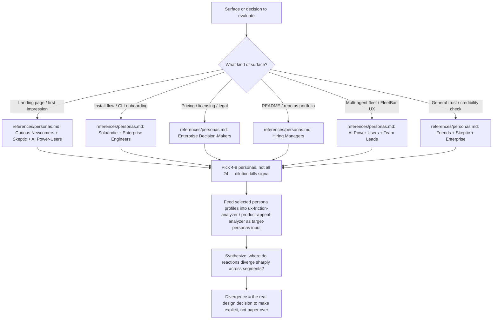

# Port Daddy Users

A catalog of 24 named personas standing in for Port Daddy's real audience spectrum — from a solo indie hacker running `brew install` at midnight, to an enterprise security officer reading the license file, to a friend of Erich's clicking the link because they were texted it. Use these as test subjects: walk a proposed change, page, or flow through 4-8 relevant personas and see where each one gets confused, bored, impressed, or suspicious.

**Core insight**: Port Daddy is not one product to one audience. The same install script reads as "finally, zero-config" to a solo dev and "who signs off on this touching my ports and network?" to an enterprise security reviewer. A change that delights one segment can be invisible or actively alarming to another — the point of this catalog is to make that visible before shipping, not after.

## When to Use

✅ **Use for:**
- Selecting which personas to run through `ux-friction-analyzer` or `product-appeal-analyzer` for a given surface (landing page, install flow, CLI onboarding, README, pricing/licensing, FleetBar UI)
- Sanity-checking a product/messaging decision against "would X actually feel this, or am I only imagining my own reaction?"
- Stress-testing claims and copy against a persona built to be skeptical (Victor)
- Framing a README/repo as a "hire me" signal for hiring-manager personas

❌ **NOT for:**
- Abstract job-story/opportunity mapping → use `agentic-coding-product-research`'s own audience-stories reference
- Actually scoring friction or appeal → use `ux-friction-analyzer` / `product-appeal-analyzer`; this skill only supplies the "who," not the scoring method
- A substitute for real user research — these are synthetic stand-ins for triage and pre-mortems, not evidence. If a decision is expensive or irreversible, validate with actual users before shipping.

## How to Use This Skill

1. **Identify the surface or decision** being evaluated (a page, a flow, a piece of copy, a feature).
2. **Pick 4-8 personas** from the Selection Matrix below — never all 24 for one check; more personas without a reason to pick them just averages away the signal you're looking for.
3. **Read only those personas' full profiles** in `references/personas.md` — don't load the whole file into context if only 4 are relevant.
4. **Hand the selected profiles to `ux-friction-analyzer` or `product-appeal-analyzer`** as the `target-personas` input those skills already expect.
5. **Look for divergence, not consensus.** If all 8 personas react the same way, the check probably wasn't discriminating. If Rachel (enterprise engineer) loves the CLI depth that makes Sophie (non-technical founder) bounce immediately, that tension is the actual product decision — name it, don't average it away.

## Persona Catalog

| # | Name | Segment | One-liner |
|---|------|---------|-----------|
| 1 | Priya Desai | Solo/Indie Dev | Runs 3 side projects at once, wants zero-config magic, zero patience for reading docs first |
| 2 | Marcus Webb | Solo/Indie Dev | Freelancer juggling 4 client repos, needs port conflicts solved yesterday |
| 3 | Yuki Tanaka | Solo/Indie Dev | OSS maintainer, skeptical of "yet another CLI tool," wants proof before trust |
| 4 | Jordan Ellis | Small Team | CTO of a 4-person seed startup, budget-conscious, no SRE to spare |
| 5 | Sam Okafor | Small Team | Team lead on 12 engineers, evaluating tools to standardize dev environments |
| 6 | Devon Cole | Small Team | Mid-level engineer, first to try new tools, evangelizes internally if it's good |
| 7 | Rachel Kim | Big Team Engineer | Staff engineer at 500+ eng org, won't install anything without a security review |
| 8 | Tomás Herrera | Big Team Engineer | Platform eng lead, wants to standardize agent tooling across 40 teams |
| 9 | Angela Brooks | Big Team Engineer | SRE at a Fortune 500, deeply skeptical of anything touching ports/networking |
| 10 | David Chen | Enterprise Decision-Maker | VP Engineering, cares about ROI, vendor risk, support SLAs |
| 11 | Fatima Al-Sayed | Enterprise Decision-Maker | Procurement/security officer, needs a compliance checklist before greenlight |
| 12 | Grace Liu | Hiring Manager | Found Port Daddy via GitHub, evaluating Erich's architecture thinking for a Staff role |
| 13 | Ben Sorensen | Hiring Manager | Startup founder scouting a contract CTO, wants proof Erich ships ambitious systems solo |
| 14 | Priyanka Rao | Hiring Manager | Technical recruiter, non-technical depth, pattern-matches polish and confidence |
| 15 | Jake Malone | Friend of Erich | Longtime friend, dabbles in scripting, rooting for Erich but brutally honest |
| 16 | Dr. Elena Vasquez | Friend of Erich | Grad-school friend, research scientist, sharp but outside dev-tools world |
| 17 | Theo Marsh | AI Power-User | Heavy Claude Code/ChatGPT user, always hunting the next multiplier tool |
| 18 | Nadia Petrov | AI Power-User | Runs an AI-coding-tools YouTube channel, wants a flashy demo-able feature |
| 19 | Chris Whitfield | AI Power-User | Prompt engineer/AI consultant, wants to understand the fleet model to reuse elsewhere |
| 20 | Morgan Reyes | Curious Newcomer | Bootcamp grad, 6 months into first job, dazzled by the landing page, unsure what "port management" means |
| 21 | Aisha Bello | Curious Newcomer | Non-engineer PM, heard "agent orchestration," needs it explained in plain English |
| 22 | Liam O'Connor | Curious Newcomer | CS student, found it on Hacker News, wants to know if it's resume-worthy |
| 23 | Sophie Turner | Curious Newcomer | Non-technical small-business owner, her hired dev mentioned it, judges the vibe of the site itself |
| 24 | Victor Aldana | Adversarial Skeptic | Has watched 100 dev tools die, actively hunts for reasons to dismiss this one |

Full profiles (background, goals, friction tolerance, dealbreakers, sample voice) are in `references/personas.md` — organized in the same segment order as this table.

## Selection Matrix

Use this to pick the 4-8 personas relevant to what's actually being evaluated. Don't run every check against all 24.

| Analysis scenario | Recommended personas |
|---|---|
| Landing page / first 5 seconds | Morgan, Aisha, Sophie, Victor, Theo |
| Install flow (`brew install`, `pd setup`) | Priya, Marcus, Angela, Fatima |
| CLI onboarding (`pd begin`, `pd claim`, first session) | Yuki, Sam, Tomás, Devon |
| Pricing / licensing / legal (FSL-1.1-MIT) | David, Fatima, Rachel |
| README / repo as a "hire me" signal | Grace, Ben, Priyanka |
| Multi-agent fleet / FleetBar UX | Theo, Nadia, Chris, Sam, Jordan |
| Documentation depth and completeness | Rachel, Tomás, Liam |
| General trust/credibility of a solo-maintainer project | Jake, Elena, Victor, Rachel |
| Messaging / positioning copy review | Victor, Aisha, Nadia, Grace |

## Anti-Patterns

### Running All 24 Every Time
**Novice**: "More personas = more thorough analysis."
**Expert**: Averaging 24 reactions together erases exactly the divergence you need to see. A landing-page check against all 24 will report a mushy "medium" score that hides the fact that enterprise buyers love the technical depth that terrifies curious newcomers. Pick the 4-8 personas the Selection Matrix names for the surface in question, or reason explicitly about why a different subset applies.

### Treating Persona Output as Real Evidence
**Novice**: "The persona said X, so that's what real users think."
**Expert**: These are synthetic, deliberately textured stand-ins for triage — good for catching obvious blind spots and framing pre-mortems before a decision ships, not for closing the loop on an expensive or irreversible call. When a finding matters enough to bet real cost on, validate it against actual users before acting.

### Writing New Personas From Pure Imagination Mid-Analysis
**Novice**: Inventing a one-off persona on the spot to justify a predetermined conclusion.
**Expert**: Use the 24 personas already defined in `references/personas.md` — they were built for range and to include perspectives that resist the obvious answer (Victor exists specifically to counter confirmation bias). If a genuinely new segment emerges repeatedly across analyses, add it to the catalog deliberately (with the same profile depth as the others) rather than ad-libbing a throwaway one.

## References

| File | Consult when |
|---|---|
| `references/personas.md` | Need a persona's full profile (background, goals, friction tolerance, dealbreakers, sample voice) before feeding it into `ux-friction-analyzer` or `product-appeal-analyzer`. |

<!-- BEGIN BUNDLE INDEX (auto: index_references.py) -->

## Skill Bundle Index

*Every file in this skill, and when to open it. Auto-generated; run `scripts/index_references.py --fix`.*

**root**
- [`CHANGELOG.md`](CHANGELOG.md) — Changelog — All notable changes to this skill will be documented here.
- [`README.md`](README.md) — Port Daddy Users — 24 named, textured personas standing in for Port Daddy's real audience spectrum — solo/indie developers, small and big engineering teams, en

**`references/`**
- [`references/personas.md`](references/personas.md) — Port Daddy Persona Profiles — Full profiles for the 24 personas indexed in `SKILL.md`.

<!-- END BUNDLE INDEX -->
