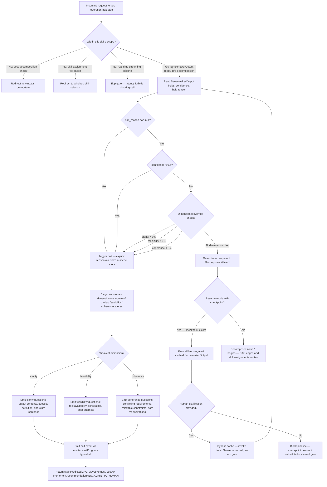

# Diagram 1: flowchart

```mermaid
flowchart TD
  A[Incoming request for pre-federation-halt-gate] --> B{Within this skill's scope?}
  B -->|No: post-decomposition check| C[Redirect to windags-premortem]
  B -->|No: skill assignment validation| D[Redirect to windags-skill-selector]
  B -->|No: real-time streaming pipeline| E[Skip gate — latency forbids blocking call]
  B -->|Yes: SensemakerOutput ready, pre-decomposition| F[Read SensemakerOutput fields: confidence, halt_reason]

  F --> G{halt_reason non-null?}
  G -->|Yes| H[Trigger halt — explicit reason overrides numeric score]
  G -->|No| I{confidence < 0.6?}

  I -->|No| J{Dimensional override checks}
  I -->|Yes| H

  J -->|clarity < 0.5| H
  J -->|feasibility < 0.4| H
  J -->|coherence < 0.4| H
  J -->|All dimensions clear| K[Gate cleared — pass to Decomposer Wave 1]

  H --> L[Diagnose weakest dimension via argmin of clarity / feasibility / coherence scores]

  L --> M{Weakest dimension?}
  M -->|clarity| N[Emit clarity questions: output contents, success definition, end-state sentence]
  M -->|feasibility| O[Emit feasibility questions: tool availability, constraints, prior attempts]
  M -->|coherence| P[Emit coherence questions: conflicting requirements, relaxable constraints, hard vs aspirational]

  N --> Q[Emit halt event via emitter.emitProgress type=halt]
  O --> Q
  P --> Q

  Q --> R[Return stub PredictedDAG: waves=empty, cost=0, premortem.recommendation=ESCALATE_TO_HUMAN]

  K --> S{Resume mode with checkpoint?}
  S -->|Yes — checkpoint exists| T[Gate still runs against cached SensemakerOutput]
  S -->|No| U[Decomposer Wave 1 begins — DAG edges and skill assignments written]
  T --> V{Human clarification provided?}
  V -->|Yes| W[Bypass cache — invoke fresh Sensemaker call, re-run gate]
  V -->|No| X[Block pipeline — checkpoint does not substitute for cleared gate]
  W --> F
```
