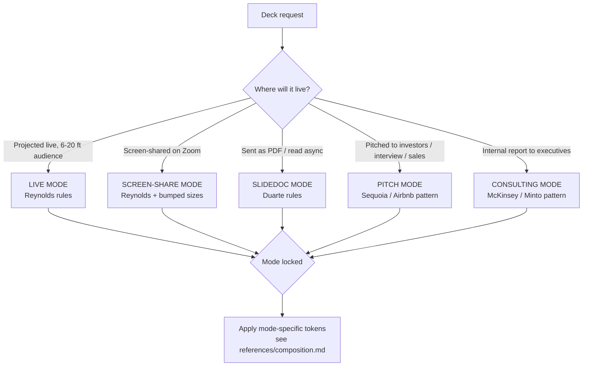

# Premium Deck Builder

Build slide decks that read from the back of the room and *feel* like the maker chose every margin on purpose. Encodes typography, composition, and aesthetic discipline drawn from Duarte, Reynolds, Tufte, Alley, Knaflic, and the visual conventions of high-end consulting and tech-pitch decks.

## When to load

- User says: "deck", "slides", "presentation", "pitch", "PowerPoint", "Keynote", "Reveal", "Marp", "slidedoc", "investor deck", "interview deck", "board deck".
- File evidence: `.pptx`, `.key`, `.md` with `marp:` frontmatter, `index.html` importing `reveal.js`, `python-pptx` in `requirements.txt`.
- Defect signals: "the deck feels cheap", "looks corporate", "title-and-bullets default", "can't read it on the projector", "feels busy", "client said unprofessional".
- Adjacent skill needs depth on slide design specifically (typography-expert is web-typography; this skill is its slide cousin).

Do **not** load for: building the website *about* the deck, choosing the brand, writing the underlying narrative, video production with kinetic typography, or coaching the human delivering it.

## Core decision: pick the deck MODE before any pixel



**The cardinal sin** is mixing modes in one deck: slidedoc density projected live, or one-idea-per-slide pitched as a takeaway memo. Decide first, design second.

## Operating rules

1. **Mode first, content second, slides third.** Don't open a template and start typing.
2. **One assertion per slide** in live mode. Replace "topic-phrase title + bullets" with Alley's **sentence-headline-as-title + visual evidence**. (Alley/Garner/Zappe, *IEEE Trans. Prof. Comm.* 2009 — assertion-evidence beat topic-bullets on comprehension AND retention.)
3. **Three colors maximum**: one neutral, one ink, **one** accent. Chart series get muted tints of the accent — never new hues.
4. **Margins ≥ 8–10% of slide width.** White space is taste. Filling the slide is the loudest tell of cheapness.
5. **Sentence case for titles longer than 3 words.** ALL CAPS is 13–20% slower to read (Tinker 1963; Arditi & Cho 2007). Reserve all-caps for short eyebrows (≤2 words, weight ≥600, letter-spacing ≥0.1em).
6. **Tabular figures + slashed zero on every numeric surface.** Prevents column jitter and 0/O confusion at glance distance.
7. **No "Thank you / Questions?" closer.** Highest-recall slot — use it for the single takeaway or the CTA.
8. **Live mode body ≥ 24pt.** Screen-share ≥ 28pt (the viewer sees you at 25–50% scale). Slidedoc body 10–12pt is the only context where sub-18pt is defensible — and tag the file so nobody projects it.
9. **Don't ship with embedded foundry fonts unless you control the playback machine.** Either embed-and-test, or export to PDF, or use a system-safe stack (Calibri / Aptos / SF Pro / Helvetica Neue).
10. **Verify by rendering.** Always `soffice --headless --convert-to pdf` + `pdftoppm` (see `scripts/render_deck.sh`) before declaring done. Reading the script is not the same as seeing the slide.

## The five modes (one-line summaries; see references/composition.md for details)

| Mode | Pattern | Body floor | Words/slide | Backgrounds | When |
|---|---|---|---|---|---|
| **LIVE** | Reynolds: one idea, image-led, speaker carries message | 24–32pt | 15–20 | warm off-white or near-black | conference, internal talk |
| **SCREEN-SHARE** | LIVE + bumped sizes for downsampled viewing | 28–36pt | 15–20 | warm off-white | Zoom / Teams / Meet |
| **SLIDEDOC** | Duarte: dense hybrid of slide + document, async read | 10–12pt | 75–150 | white or off-white | board memo, leave-behind |
| **PITCH** | Airbnb / Sequoia: 10–12 slides, sparkline narrative | 20–28pt | 20–40 | off-white or near-black | investor, interview, sales |
| **CONSULTING** | McKinsey: action-title + executive box + supporting exhibits, Minto's pyramid | 14–18pt | 60–100 | white | client deliverable, internal exec |

## Failure modes (high-frequency)

### FM-1. Web-grid translated to opaque PPTX → reads as "black on B&W texture"
**Symptom**: maker copied a portfolio's pale-blue alpha grid (`rgba(143,166,199,0.28)`) into the slide background and the rendered deck looks like text fighting a wireframe.
**Root cause**: PowerPoint shapes don't honor CSS alpha. A 28%-alpha blue line on warm paper composites to a soft pale blue on the web; the same hex baked into a `RGBColor()` PPTX line is a saturated solid stroke.
**Fix**:
1. Pre-composite the alpha against the actual paper color. `rgba(143,166,199,0.28)` over `#FAF7F0` ≈ `#EDEEEC`, not `#C7D3E5`.
2. Sparser default density: every 0.5″ fine + every 2″ bold for content slides (vs. every 0.25″ + every 1.25″ on the web).
3. Thinner strokes: 0.125–0.25pt, not 0.5pt. Slide-resolution lines are bigger than CSS lines at the same px.
4. Reserve the visible grid for COVER + SECTION-DIVIDER slides where the grid IS the visual. Content slides get a near-invisible grid or none.

See the worked example for the specific RGBColor / line-width values that ship.

### FM-2. Body sits behind the grid (or any background texture) and reads as illegible
**Symptom**: text correctly sized at 24pt+ still reads as "busy" or "hard to skim."
**Root cause**: grid / noise / illustration runs *through* the glyphs without a contrast break.
**Fix**: either (a) reduce the background to near-paper as in FM-1, (b) add a paper-colored "card" backing behind the text block (a rectangle in the slide background color, slightly larger than the bounding box), or (c) remove the background texture from content slides entirely.

### FM-3. The font you designed in renders as Aptos on the client's machine
**Symptom**: deck looks beautiful on your Mac, looks like a default PowerPoint on the audience's PC.
**Root cause**: PowerPoint font embedding has been unreliable across PPT/Keynote/Google Slides round-trips for fifteen years. Foundry fonts are silently substituted.
**Fix**: either (a) export to PDF for delivery and keep the .pptx for the maker only, (b) embed AND test on the actual playback OS, or (c) use a system-safe stack (Aptos / Calibri / SF Pro / Helvetica Neue / Georgia / Menlo).

### FM-4. Render verification skipped → "the script said it worked"
**Symptom**: agent declares the deck done after `prs.save(...)` returns OK.
**Root cause**: opening the .pptx in Python and reading the shape count is not the same as seeing the slide. Render-and-look is mandatory.
**Fix**: ALWAYS run `scripts/render_deck.sh <deck.pptx>` (which wraps `soffice --headless --convert-to pdf` + `pdftoppm`) and actually look at the PNG output before reporting done.

### FM-5. Fabricated content dressed as the candidate's voice
**Symptom**: deck contains specific technical claims, quoted aphorisms, or characterizations of past work that the agent has no source for. Reads as "AI garbage" to anyone who knows the actual material.
**Root cause**: agent over-reached past the verifiable source (resume / constants file / portfolio copy) and generated plausible-sounding detail. Worst form: text inside actual quotation marks — implying an attributable quote when nobody said it.
**Fix**:
1. Identify the single source-of-truth file (e.g. a project's `constants.ts` <!-- cite-exempt: illustrative example path, not this repo's -->, the candidate's resume, the brief). Treat anything not in there as fabricated.
2. Strip every quoted aphorism. If it's not attributed to a real person with a date, it doesn't belong in quote marks.
3. Replace fabricated specifics with bracketed prompts: `[ERICH: what was the actual cold-start handling approach?]`. The candidate fills these in.
4. Reduce each case-study slide to the verifiable facts + explicit `[FILL]` slots.
5. Margin notes / handwritten annotations should NOT use quotation marks — they're editorial marginalia, not quotes. Reserve `" "` for actual attributed quotes from real sources.

This is the worst failure mode in the skill because it directly damages the candidate or speaker in the room. A reviewer who knows the topic detects fabrication immediately and writes off the entire deck. The agent's job is to build the chrome and the structure — the substance belongs to the human.

### FM-6. Mode mid-deck swap (live + slidedoc in one file)
**Symptom**: first half of the deck is one-idea-per-slide; second half drowns in dense bullets because "the audience will want the details in writing."
**Root cause**: trying to make one deck do two jobs.
**Fix**: build TWO decks. A live-mode deck for the room; a slidedoc for the leave-behind. Or commit to one mode and stay there.

## Anti-patterns (named so a reviewer can grep)

### AP-1. Title-then-bullets default
**Novice**: opens template, types "Q3 Results", adds 6 bullets.
**Expert**: chooses slide TYPE first (assertion-evidence, comparison, data-led, image-led, quote, transitional) and writes the action title — "Q3 revenue grew 18%, driven by enterprise renewals."
**Timeline**: bullet templates were industry default 1990–2006; Tufte's *Cognitive Style of PowerPoint* pamphlet (2006, Columbia disaster) and Alley's assertion-evidence research (2009) ended their defensibility. Still the default in 2026 because templates haven't caught up.

### AP-2. Twelve-point body for projection
**Novice**: copies print typography to projector (Word habit).
**Expert**: 24pt floor for projection (Kawasaki 10/20/30 rule, Reynolds), 28pt for screen-share. The only sub-18pt context is a slidedoc designed to be READ at 18 inches.
**Timeline**: print-on-screen was always wrong; became visibly wrong with high-DPI projectors in 2015+ when fine details started rendering but the audience still couldn't read them.

### AP-3. The "Thank you / Questions?" closer
**Novice**: ends with social-courtesy slide because the template suggests it.
**Expert**: ends on the single takeaway or call to action. The final slide gets the highest visual recall — wasting it is malpractice.
**Timeline**: convention since corporate-overhead days (1980s); challenged by Reynolds' *Presentation Zen* (2008) and now actively wrong in any deck that wants to be remembered.

### AP-4. Rainbow chart palette
**Novice**: every chart series gets its own hue from the 12-color default.
**Expert**: one accent color + muted tints (Cole Knaflic, *Storytelling with Data*, 2015). If five series can't read with tint variation alone, the chart has too many series.
**Timeline**: rainbow palettes became actively bad practice when high-DPI displays exposed how garish they look at scale (~2015 onward).

### AP-5. Embedded designer font with no fallback
**Novice**: picks Gotham/Proxima/Founders Grotesk in Keynote and emails the .pptx to the client.
**Expert**: either embeds AND tests on the client's actual Windows PowerPoint, OR exports to PDF, OR uses a system-safe stack (Aptos / Calibri / SF Pro / Helvetica Neue / Georgia).
**Timeline**: PowerPoint font embedding has been unreliable through every PPT/Keynote/Google Slides round-trip since 2010; still trips people up because foundry fonts look so good on the maker's machine.

### AP-6. Default PowerPoint/Keynote template
**Novice**: opens template, accepts Aptos title + bullets + corporate beige.
**Expert**: starts from a blank slide with an explicit grid + token system (paper color, ink color, accent color, type scale, margin scale all defined before any content).
**Timeline**: Aptos replaced Calibri as PowerPoint default in 2024 — same template-default failure with a new face.

### AP-7. Fabricated content / AI-generated aphorisms
**Novice**: writes plausible-sounding bullets, drops in quoted "leadership wisdom" with no attribution because "it sounds good."
**Expert**: only writes what's verifiable from the source-of-truth file. Marks every unknown with `[FILL: …]`. Refuses to put text inside quotation marks unless it's an attributed quote from a real source.
**Timeline**: the failure mode is as old as deck-making but became *named and easy to detect* with the rise of LLM-generated content. Reviewers in 2024+ are specifically pattern-matching for "AI cliché": punchy aphorisms, the rule-of-three closer, the "X is really about Y" reveal. Don't ship these.

### AP-8. Mode-mixing within a deck
**Novice**: makes one deck that's "both for the meeting AND to send around after."
**Expert**: builds TWO decks — a live-mode deck for the room and a slidedoc for the leave-behind. Or one deck that knows which it is.
**Timeline**: Duarte named this in *Slidedocs* (2014) — the mode collision predates that but had no name.

## Slide types (use deliberately; never default)

- **Title** — deck title + presenter + date + audience. Image-led OK.
- **Section divider** — large numeral or word. Palate-cleanser between acts.
- **Content** — assertion-evidence by default. Bullets only when content is genuinely enumerable and parallel.
- **Comparison (split)** — 2 or 3 columns, equal weight, parallel structure top-to-bottom.
- **Data / chart** — one chart, one headline conclusion, redundant encodings stripped, source line.
- **Quote / pullquote** — large type, attribution, single idea.
- **Image-led** — full-bleed, headline overlaid on a calm region with sufficient contrast.
- **Transitional** — bridges between sections; restates where we are in the argument.
- **Agenda / tracker** — show once up front; optionally a persistent footer marker.
- **Closer / Q&A** — single takeaway or CTA. Never "Thank you!" alone.

## Quality gates (run before declaring done)

- [ ] **Mode declared** in a comment at the top of the deck source.
- [ ] **Render verified** via `scripts/render_deck.sh <deck.pptx>` — actually look at the PNGs.
- [ ] **Body size ≥ 24pt** for any slide intended for projection; ≥ 28pt for screen-share. Run `scripts/check_deck_quality.py` to count violations.
- [ ] **≤ 3 colors** across the deck (one neutral + one ink + one accent). Chart tints OK.
- [ ] **≤ 2 typefaces** (display + body). Optional third: mono for metadata.
- [ ] **No "Thank you" / "Questions?" final slide.**
- [ ] **Every chart has the conclusion in the title.** "Revenue 2023" → "Revenue grew 18% in Q4, driven by enterprise renewals."
- [ ] **Action titles, not topic phrases.** "Q3 Results" → "Q3 results beat plan by 22% on enterprise."
- [ ] **Tabular figures + slashed zero** on every numeric column.
- [ ] **All-caps only on eyebrows ≤ 2 words, weight ≥ 600, tracking ≥ 0.1em.**
- [ ] **Margins ≥ 8% of slide width on left/right, ≥ 6% top/bottom.**
- [ ] **System-font-safe** unless playback machine is controlled. If embedding foundry fonts, tested on the actual client OS.
- [ ] **PDF export attempted** as fallback delivery — and tested.

## References (load on demand)

- `references/typography.md` — sizes by context, serif vs sans at distance, contrast, case, font pairing, numeric figures. Load when picking type or auditing legibility.
- `references/composition.md` — grid systems, focal modes, assertion-evidence framework, slide-type catalog with worked layout sketches. Load when laying out a new deck or auditing slide-type discipline.
- `references/premium-aesthetic.md` — what makes a deck feel premium vs cheap, concrete examples, color discipline, paper-stock metaphor. Load when the brief says "polished" / "investor-ready" / "premium" / "expensive."
- `references/tooling.md` — copy-pasteable code for python-pptx, Reveal.js, Marp, and the soffice/pdftoppm verification pipeline. Load when picking a build tool.
- `references/bibliography.md` — annotated reading list (canonical books, exemplar decks, design systems). Load when researching or citing.

## Worked example (load `examples/notebook-deck.md`)

A 15-slide ET-Book-style interview deck — a notebook/graph-paper aesthetic deck for a Staff+EM applicant interviewing at OpenAI/Anthropic. Two case studies (Comment Ranking 2015, Spaces VR Avatars 2016–2018), full token system mirroring a portfolio website, rendered via python-pptx, verified via soffice + pdftoppm. Walks through every decision named in this SKILL. The build script itself lives in the author's private portfolio repo, not this bundle — see the worked example for what's actually reusable.

## Tooling quick-reference (full code in `references/tooling.md`)

**Build:**
- `python-pptx` (Python) — best for templated programmatic decks. Used in the worked example.
- `Reveal.js` (web) — best for talks where you want web embeds, live demos, or audience-controllable.
- `Marp` (Markdown → PPTX/PDF/HTML) — best for engineers who want Git-versioned decks.
- Keynote / PowerPoint (native) — best for one-off polish on a deck someone else will edit.

**Verify (always run these):**
```bash
# .pptx → PDF → per-slide PNGs (requires LibreOffice + Poppler)
brew install --cask libreoffice  # macOS
brew install poppler

RENDER_DIR=~/coding/tmp/deck-render   # disposable, but not swept like /tmp
mkdir -p "$RENDER_DIR"
soffice --headless --convert-to pdf deck.pptx --outdir "$RENDER_DIR"
pdftoppm -png -r 144 "$RENDER_DIR/deck.pdf" "$RENDER_DIR/slide"
# Open the PNGs and ACTUALLY LOOK at them. Render is the source of truth.
```

Run `scripts/check_deck_quality.py deck.pptx` for an automated audit (body size, color count, font count, title-case violations).

## Positive trigger test cases

These should activate the skill:
1. "Help me build a pitch deck for our seed round"
2. "Make a Keynote template for our customer onboarding"
3. "The exec deck looks cheap — make it feel premium"
4. "Convert this brief into an interview deck"
5. "Reveal.js talk for a conference next month"

## Negative trigger test cases

These should NOT activate the skill (delegate as noted):
1. "Coach me on how to present this deck" → tech-presentation-interview
2. "Design our company logo" → brand-guidelines
3. "Write the script for the keynote video" → copywriting
4. "Animate the title text" → motion-design-web
5. "Build the conference website" → web-design-expert / frontend-design

## Layout QA gate (mechanical — run before shipping)

Before calling any rendered page, artifact, dashboard, deck, or component done,
run the mechanical overflow/collision checker. It renders the page headlessly and
flags text-vs-text collisions, clipped/ellipsis-truncated elements, text escaping
its container, and horizontal page scroll — the visual defects a screenshot hides
and that only appear at a specific width or in one theme.

```bash
python3 ~/.claude/skills/layout-overflow-guard/scripts/check_layout.py <file-or-url> \
  --widths 1280,1100,860,720,390 --themes light,dark
```

You do **not** need to read `check_layout.py` — invoke it with the Bash tool and
act on its report and exit code (non-zero = a defect). The script's source never
enters your context; only its findings do. Drive it to zero violations across
every width and both themes before you ship. Full detail: the
`layout-overflow-guard` skill.

