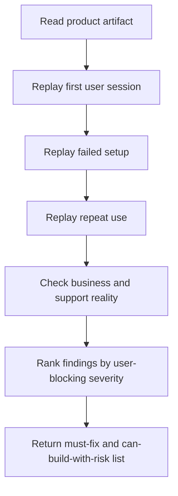

# Product Reality Reviewer

Review a planned or partially-built product as the person who notices the missing user path before the implementation
team spends a week polishing the wrong thing.

## Use This For

- Reviewing a vibe-coded project plan, PRD, prototype, or feature proposal.
- Asking "what will confuse or block a first-time user immediately?"
- Checking account creation, missing provider access, permissions, cost, support, and recovery paths.
- Producing must-fix findings before build work starts.

## Do Not Use This For

- Reviewing code correctness or test coverage.
- General competitive research without a concrete product artifact.
- Pure UI style critique. Use a UX/design skill for visual execution.

## Review Process

1. Identify the target user and the promised job. If either is vague, mark it as a finding.
2. Replay the first user session from landing to first value without assuming the builder's accounts or local setup.
3. Ask the blunt questions: how do users create accounts, connect providers, recover, invite teammates, pay, and get help?
4. Check whether AI provider access is assumed. If Claude Max, OpenAI Pro, local models, or MCP setup are required, require fallback.
5. Check trust: permissions, secrets, data retention, audit trail, human approval, and rollback.
6. Convert issues into severity-ranked findings: `must-fix-before-build`, `can-build-with-risk`, or `watch-after-launch`.
7. Use `scripts/reality_check.mjs` to validate a structured product manifest.

## Output Contract

Return:

- `verdict`: `build-ready`, `build-with-risk`, or `not-ready`.
- `mustFix`: user-blocking issues that should stop implementation.
- `riskRegister`: important but non-blocking risks with owner and evidence.
- `missingQuestions`: questions a real user or support person will ask immediately.
- `recommendedPlanChanges`: concrete edits to the project plan.

## Anti-Patterns

### Builder Privilege Blindness

**Novice**: "It works because it works on my machine with my paid AI accounts."
**Expert**: Review from the user's cold machine, no tokens, no MCP, no repo state, no context, and no trust yet.
**Timeline**: In 2026, AI-product onboarding is often a provider-access problem before it is a feature problem.
**Detection**: The artifact requires a paid model account but has no demo, fallback, or guided credential setup.

### Account Creation Deferred

**Novice**: "Auth can come later."
**Expert**: Account creation shapes data ownership, team collaboration, billing, audit logs, deletion, and support from day one.
**Timeline**: Agentic products create durable work; anonymous state becomes a migration and trust problem quickly.
**Detection**: Plan mentions saved work, teams, billing, or history but no account lifecycle.

### Supportless Magic

**Novice**: "The agent succeeded, so support is just logs."
**Expert**: Users need receipts they can understand: what happened, what changed, what failed, how to retry, and how to ask for help.
**Timeline**: As agent autonomy increases, support artifacts become core product UX, not an afterthought.
**Detection**: No failure state, no transcript, no user-facing error, no escalation path.

## References

| File | Load When |
| --- | --- |
| `references/review-questions.md` | Need the canonical skeptical questions for first-run, account, provider, and trust review. |
| `references/severity-rubric.md` | Need to classify findings without over-blocking the build. |
| `examples/expected-output.md` | Need the shape of a finished skeptical product review. |
| `templates/output-template.md` | Need a reusable review report template. |
| `schemas/product-reality.schema.json` | Need the JSON input contract for the checker. |
| `scripts/reality_check.mjs` | Need deterministic product-risk findings from a manifest. |
| `agents/openai.yaml` | Need a subagent descriptor for delegated product review. |

<!-- BEGIN BUNDLE INDEX (manual) -->

## Skill Bundle Index

**root**
- [`CHANGELOG.md`](CHANGELOG.md) - Changelog for this skill.
- [`README.md`](README.md) - Quick start and purpose.

**`agents/`**
- [`agents/openai.yaml`](agents/openai.yaml) - OpenAI/Codex-style agent descriptor for skeptical product review.

**`examples/`**
- [`examples/expected-output.md`](examples/expected-output.md) - Example review output with severity-ranked findings.

**`references/`**
- [`references/review-questions.md`](references/review-questions.md) - Canonical product-reality questions.
- [`references/severity-rubric.md`](references/severity-rubric.md) - Severity definitions and escalation rules.

**`schemas/`**
- [`schemas/product-reality.schema.json`](schemas/product-reality.schema.json) - JSON contract for `reality_check.mjs`.

**`scripts/`**
- [`scripts/reality_check.mjs`](scripts/reality_check.mjs) - Produces deterministic findings from a product manifest.

**`templates/`**
- [`templates/output-template.md`](templates/output-template.md) - Copyable product review template.

<!-- END BUNDLE INDEX -->
