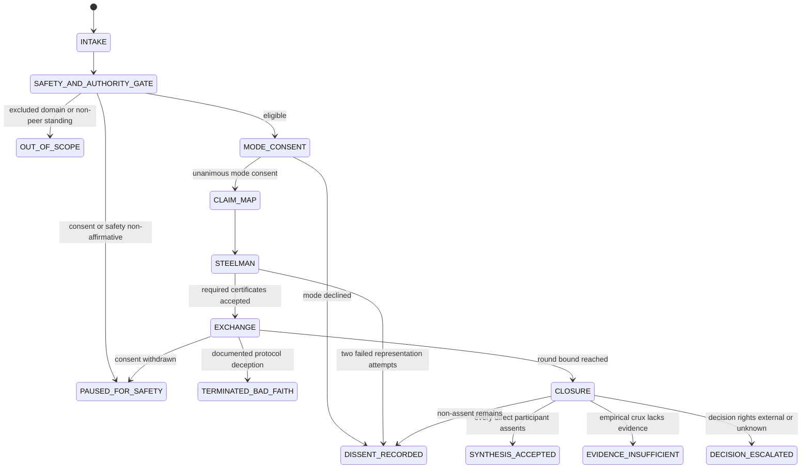

# Productive Discourse Facilitator

Facilitate a finite exchange among declared peers. This skill records what participants said, what evidence they cited, what changed, and where dissent remains. It does not diagnose people, infer motives, establish safety, adjudicate truth, or issue a decision permit.

## Activate when

- peers want a bounded dialogue to understand conflicting interpretations;
- a testable proposition needs debate with explicit change conditions;
- peers need to deliberate options while decision authority stays explicit;
- critique must wait for a holder-reviewed steelman;
- closure must preserve dissent or missing evidence rather than force consensus.

## Route elsewhere or stop when

- therapy, addiction/recovery counseling, crisis support, abuse, coercion, or retaliation risk is present;
- the relationship is hierarchical, legal, HR, disciplinary, or otherwise non-peer;
- consent or freedom to withdraw is absent or unknown;
- the task is argument analysis, agent-message protocol design, or discourse-suite orchestration;
- a facilitator is asked to diagnose, determine motive, or issue an authoritative decision.

## Bounded lifecycle



## Procedure

1. **Intake.** Record topic, objective, direct voices, attributed records, and absent stakeholders. Choose `UNDERSTAND`, `TEST_CLAIMS`, or `CHOOSE_OPTION`.
2. **Consent, safety, and standing gate.** Every direct participant must explicitly consent, report freedom to withdraw without a known penalty, declare peer standing, and report no safety blocker. These are declarations, not verified findings. Any negative or unknown gate closes `PAUSED_FOR_SAFETY` or `OUT_OF_SCOPE`.
3. **Mode consent.** Map `UNDERSTAND` to `DIALOGUE`, `TEST_CLAIMS` to `DEBATE`, and `CHOOSE_OPTION` to `DELIBERATION`. Every direct participant separately accepts the mode. Silence is not consent.
4. **Claim map.** Attribute propositions; distinguish empirical, predictive, definitional, normative, value, and preference claims; record premises, evidence, confidence, and falsifier/revision condition or `NOT_TRUTH_APT`.
5. **Steelman gate.** Each would-be critic gets at most two attempts. The holder accepts or requests one specific repair. No critique may reference an unaccepted certificate. Two failed attempts close `DISSENT_RECORDED` with a representation dispute.
6. **Exchange.** At most two substantive rounds per claim and one mode switch with fresh consent. Critique premises, evidence, inference, scope, or tradeoffs. Do not infer motive or character.
7. **Close once.** Choose exactly one terminal. No “continue until agreement.”

## Integrity events

`TERMINATED_BAD_FAITH` classifies evidenced protocol behavior, never a person's essence or motive. It requires a documented event with evidence, such as a fabricated locator, evidence tampering, or repeated misrepresentation after a bounded correction. Alleged or contested conduct cannot justify that terminal.

## Terminals

- `SYNTHESIS_ACCEPTED` — every direct participant assents to the exact terminal statement.
- `DISSENT_RECORDED` — scoped non-assent or representation dispute remains.
- `DECISION_ESCALATED` — decision rights are external or unknown.
- `EVIDENCE_INSUFFICIENT` — an open empirical crux lacks required evidence.
- `PAUSED_FOR_SAFETY` — consent or declared safety is non-affirmative.
- `TERMINATED_BAD_FAITH` — a documented protocol integrity event requires termination.
- `OUT_OF_SCOPE` — excluded domain or non-peer standing.

Every terminal has `truthEffect: NONE` and `authorityEffect: NONE`.

## Anti-patterns

### Consensus as success

**Wrong:** majority or silence means assent.

**Right:** record individual assent; otherwise preserve dissent.

### Equal airtime means equal power

**Wrong:** balanced turns repair a hierarchy.

**Right:** non-peer or unknown standing is out of scope.

### Steelman checkbox

**Wrong:** critique follows an unreviewed paraphrase.

**Right:** require a holder-reviewed certificate and bounded repair.

### Mind-reading deception

**Wrong:** infer bad motive from inconsistency, emotion, or disagreement.

**Right:** record only observable, evidenced protocol events.

### Clinical improvisation

**Wrong:** diagnose trauma, recovery, nervous-system state, or relationship pathology.

**Right:** stop and route to appropriate human support.

## Output and validation

- [`schemas/discourse-session-v2.schema.json`](schemas/discourse-session-v2.schema.json) — closed record.
- [`examples/valid-peer-session.json`](examples/valid-peer-session.json) — accepted two-peer exchange.
- [`scripts/validate-discourse-session.mjs`](scripts/validate-discourse-session.mjs) — semantic validator.
- [`scripts/test-bundle.mjs`](scripts/test-bundle.mjs) — adversarial mutations.
- [`references/claims-steelmans-and-closure.md`](references/claims-steelmans-and-closure.md) — detailed boundaries.
- [`tests/activation.md`](tests/activation.md) — activation corpus.

```bash
node skills/productive-discourse-facilitator/scripts/validate-discourse-session.mjs \
  skills/productive-discourse-facilitator/examples/valid-peer-session.json
node skills/productive-discourse-facilitator/scripts/test-bundle.mjs
```

Static validity does not establish participant safety, claim truth, equal power, genuine comprehension, or authoritative consent.
