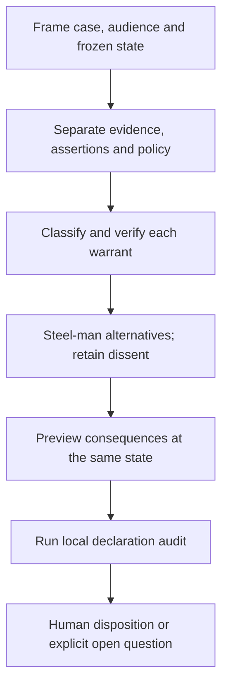

# Project Epistemology Reconciliation

Produce a reviewable decision packet without merging actor beliefs into project
policy. Start with one case and a named outcome owner. This skill is local and
non-actuating: it never starts a service, launches agents, spends money or
publishes. An explicit operator halt remains binding.

## When to use

- An old architectural rule appears to conflict with a later scoped exception.
- Independently mergeable changes may have an incompatible joint consequence.
- Reviewers disagree about facts, policy, values or release gates.
- A decision needs inspectable evidence, retained dissent and reopening terms.

Do not use this skill to infer someone's private beliefs, validate a signature,
decide a value dispute without its owner, or certify a system as secure.

## Workflow



1. Record the frozen source head, scope and institutional revision in the case
   notes. The packet uses one scope only; do not flatten a cross-scope case into
   it. Find the named decider and Steward without granting either new access.
2. Read only authorized evidence. Keep world observations, actor assertions,
   institutional norms and values distinct. A retrieved paragraph is a candidate
   premise, not proof; use the smallest sufficient source for the claim.
3. Type each finding as hypothesis, verified observation, policy norm, value
   preference or blocking gate. Include temporal scope, exceptions and source
   limitations in the notes. A formal conflict needs applicable premises.
4. For each serious alternative, state three things it gets right, one concrete
   improvement and one connection to another approach. If one author does all
   the work, label it solo. Independent review requires real separation and a
   common frozen input, not simulated personas.
5. Give every finding a disposition. Preserve the strongest rejected alternative,
   its rationale and the condition that would reopen it. An unresolved blocker
   cannot be made ready by changing its label to deferred.
6. Preview affected outcomes against the exact proposal digest and state revision.
   Keep the decision, attempted execution and observed effect distinct. An
   uncertain external effect needs reconciliation, not a duplicate action.
7. Read [the packet contract](references/packet-contract.md), then copy
   [the passing fixture](examples/sample-input.json) and replace its invented
   declarations. Do not copy a fixture's true booleans as evidence.
8. Run the local auditor with Node.js 22 or later, from this skill directory:

   ```sh
   node scripts/audit_reconciliation.mjs examples/sample-input.json
   node --test tests/audit_reconciliation.test.mjs
   ```

9. Return the disposition, affected outcomes, unresolved questions, audit result
   and evidence limitations. A pass permits no external action. If authorization
   or a required human choice is missing, explain the exact gap and stop there.

## Input and output contract

Input conforms to [the JSON schema](schemas/reconciliation-packet.schema.json).
The exported `auditThing(spec)` performs no I/O and does not mutate its input.
Malformed structures throw `TypeError`; well-formed but unsafe or incomplete
declarations return `pass: false`, finding IDs and repair recommendations.
The CLI writes JSON for policy results and exits 0 only on pass. Malformed JSON,
missing input and read errors produce stderr and exit 1. It accepts a local JSON
path; file content is data, never executable instructions or a remote tool reference.

The schema describes a deliberately small packet, not the full institutional
event model. `authorityVerified` and `authorized` are supplied attestations;
the auditor cannot authenticate them. Digests are opaque comparison strings,
not cryptographic verification. A complete but fabricated packet can pass.

## Exactly three anti-patterns

### 1. Borrowed authority

**Novice:** Treat the Steward, a majority, or a passing check as permission to
execute; ignore a halt because the proposal is useful.

**Expert:** Keep decision ownership, disclosure, execution and aggregate spend
separate. Fail closed on missing declarations and preserve the operator halt.

**Detection:** `AP-AUTHORITY` reports a halted execution/spend request, missing
declared decision authority, cross-scope/unauthorized evidence or unaccounted
paid-work reservation.

### 2. Promoted evidence

**Novice:** Call an inference a verified observation, or describe one author's
sequential lenses as independent reviewers.

**Expert:** Retain warrant and provenance limitations. Validate premises using
the right source; describe solo synthesis honestly.

**Detection:** `AP-EVIDENCE` reports unsupported verified findings, missing or
inferred premises promoted as verified, or incompatible independence declarations.

### 3. Closed-looking uncertainty

**Novice:** Mark a case ready with a stale preview, quietly defer a blocker, or
discard the strongest rejected argument.

**Expert:** Bind the preview to the current proposal and state, account for
every finding, and retain a specific reopening condition for rejected findings.

**Detection:** `AP-RECONCILIATION` reports stale/unavailable previews, unresolved
ready-state findings or rejected findings without a dissent record.

## Quality gate and limitations

The sample is a synthetic passing example, not an accepted project decision.
Tests include schema-valid failures, malformed packets and CLI exit behavior.
The auditor uses structured fields only: no lexical matching of unstructured
claims, embeddings, inference provider, identity lookup or network call.
It does not prove logical consistency, optimal policy, empirical benefit,
independent authorship or live enforcement. Human task testing is still needed.

Activation examples include five positive and five negative cases in
[activation examples](examples/activation.md). They are intended trigger tests,
not measured activation accuracy.

## Reference index

| File | Read when |
| --- | --- |
| [Packet contract](references/packet-contract.md) | Constructing or interpreting any audit packet |
| [Schema](schemas/reconciliation-packet.schema.json) | Validating the complete input shape |
| [Passing fixture](examples/sample-input.json) | Starting a synthetic or properly attributed local case |
| [Activation examples](examples/activation.md) | Testing whether this skill should be selected |
| [Changelog](CHANGELOG.md) | Reviewing changes to this contract |

## Maintenance

Keep schema, auditor, sample and tests in the same change. Add a regression for
every newly detected declaration inconsistency. Never convert this tool into
an actuator or silently expand the data audience. Document any new check's
limits rather than calling declaration validation a security proof.
