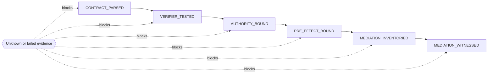

# Adjudication claim ladder

```mermaid
flowchart LR
  C[CONTRACT_PARSED] --> V[VERIFIER_TESTED]
  V --> A[AUTHORITY_BOUND]
  A --> P[PRE_EFFECT_BOUND]
  P --> I[MEDIATION_INVENTORIED]
  I --> W[MEDIATION_WITNESSED]
  U{{Unknown or failed evidence}} -. blocks .-> C
  U -. blocks .-> V
  U -. blocks .-> A
  U -. blocks .-> P
  U -. blocks .-> I
  U -. blocks .-> W
```

The arrows mean “requires all prior evidence,” not automatic promotion.
