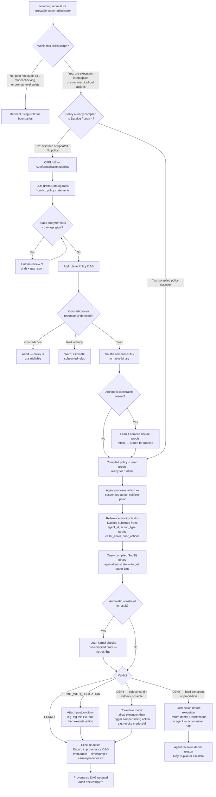

# Diagram 1: flowchart

```mermaid
flowchart TD
  A[Incoming request for provable-action-adjudicator] --> B{Within this skill's scope?}
  B -->|No: post-hoc audit, LTL model checking,\nor prompt-level safety| C[Redirect using NOT-for boundaries]
  B -->|Yes: pre-execution interception\nof structured tool-call actions| D{Policy already compiled\nto Datalog / Lean 4?}

  D -->|No: first-time or updated NL policy| E[OFFLINE — Autoformalization pipeline]
  E --> E1[LLM drafts Datalog rules\nfrom NL policy statements]
  E1 --> E2{Static analyzer finds\ncoverage gaps?}
  E2 -->|Yes| E3[Human review of\ndraft + gap report]
  E3 --> E2
  E2 -->|No| E4[Add rule to Policy DAG]
  E4 --> E5{Contradiction or\nredundancy detected?}
  E5 -->|Contradiction| FAIL[Abort — policy is\nunsatisfiable]
  E5 -->|Redundancy| WARN[Warn; eliminate\nsubsumed rules]
  E5 -->|Clean| E6[Soufflé compiles DAG\nto native binary]
  E6 --> E7{Arithmetic constraints\npresent?}
  E7 -->|Yes| E8[Lean 4 compile decide-proofs\noffline — stored for runtime]
  E7 -->|No| D2
  E8 --> D2[Compiled policy + Lean proofs\nready for runtime]

  D -->|Yes: compiled policy available| D2

  D2 --> F[Agent proposes action —\nsuspended at tool-call join point]
  F --> G[Reference monitor builds\nDatalog substrate from:\nagent_id, action_type, target,\ncaller_chain, prior_actions]
  G --> H[Query compiled Soufflé binary\nagainst substrate — target: under 1ms]
  H --> I{Arithmetic constraint\nin result?}
  I -->|Yes| J[Lean kernel checks\npre-compiled proof — target: 5µs]
  J --> K{Verdict}
  I -->|No| K

  K -->|PERMIT| L[Execute action\nRecord in provenance DAG\nimmutable — timestamp + causal predecessor]
  K -->|PERMIT_WITH_OBLIGATION| M[Attach postcondition\ne.g. log this PII read\nthen execute action]
  M --> L
  K -->|DENY — hard constraint\nor prohibition| N[Block action before execution\nReturn denial + explanation\nto agent — action never runs]
  K -->|DENY — soft constraint\nrollback possible| O[Corrective mode:\nallow execution then\ntrigger compensating action\ne.g. revoke credential]
  O --> L

  L --> P[Provenance DAG updated\nAudit trail complete]
  N --> Q[Agent receives denial reason\nMay re-plan or escalate]
```
