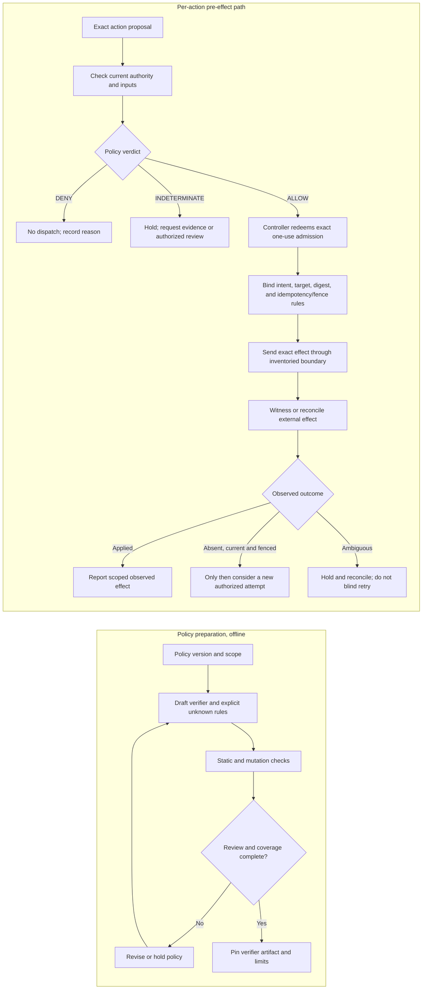

# Diagram 1: Separate policy decision from effect evidence

An admission receipt is not an exactly-once effect guarantee. DENY and INDETERMINATE never open the actuator path. Compensation is a separate authorized action, not execution of a denied operation. Static verifier checks do not prove that every effect route is mediated.
