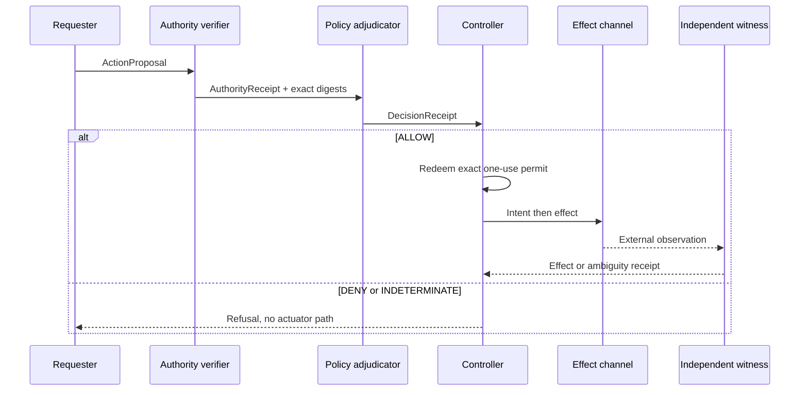

# Pre-effect sequence

```mermaid
sequenceDiagram
  participant R as Requester
  participant A as Authority verifier
  participant J as Policy adjudicator
  participant C as Controller
  participant X as Effect channel
  participant W as Independent witness
  R->>A: ActionProposal
  A->>J: AuthorityReceipt + exact digests
  J->>C: DecisionReceipt
  alt ALLOW
    C->>C: Redeem exact one-use permit
    C->>X: Intent then effect
    X-->>W: External observation
    W-->>C: Effect or ambiguity receipt
  else DENY or INDETERMINATE
    C-->>R: Refusal, no actuator path
  end
```

This diagram asserts order and role separation. It does not prove that every
effect channel is mediated.
