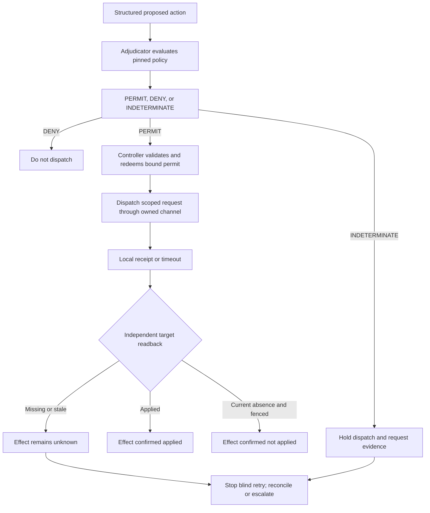

# P01 — Policy verdict is separate from external effect truth

```mermaid
flowchart TB
  Action[Structured proposed action] --> Monitor[Adjudicator evaluates pinned policy]
  Monitor --> Verdict[PERMIT, DENY, or INDETERMINATE]
  Verdict -->|DENY| NoDispatch[Do not dispatch]
  Verdict -->|PERMIT| Gate[Controller validates and redeems bound permit]
  Gate --> Dispatch[Dispatch scoped request through owned channel]
  Verdict -->|INDETERMINATE| Hold[Hold dispatch and request evidence]
  Dispatch --> Receipt[Local receipt or timeout]
  Receipt --> Truth{Independent target readback}
  Truth -->|Applied| Applied[Effect confirmed applied]
  Truth -->|Current absence and fenced| Absent[Effect confirmed not applied]
  Truth -->|Missing or stale| Unknown[Effect remains unknown]
  Unknown --> Reconcile[Stop blind retry; reconcile or escalate]
  Hold --> Reconcile
```
