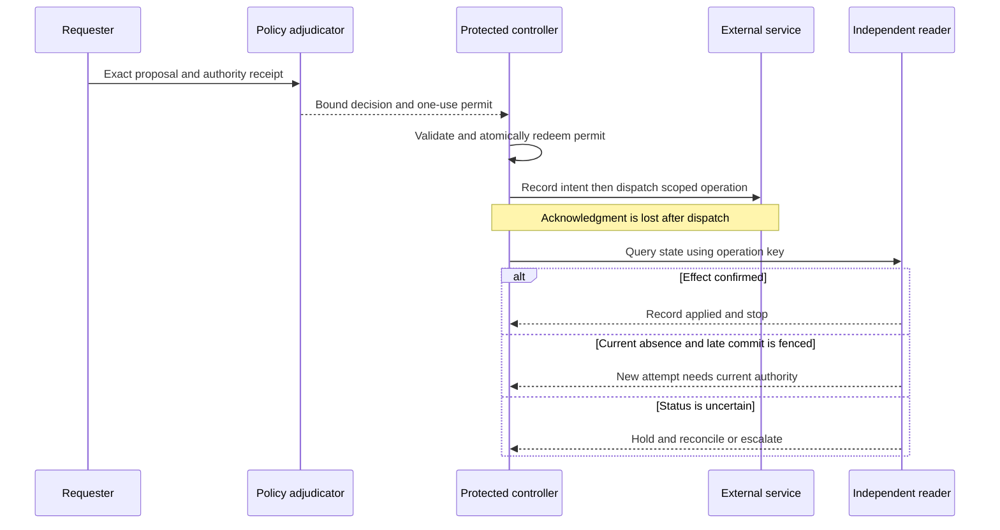

# P02 — One-use admission does not guarantee exactly-once effect

```mermaid
sequenceDiagram
  participant Agent as Requester
  participant Judge as Policy adjudicator
  participant Gate as Protected controller
  participant Service as External service
  participant Reader as Independent reader
  Agent->>Judge: Exact proposal and authority receipt
  Judge-->>Gate: Bound decision and one-use permit
  Gate->>Gate: Validate and atomically redeem permit
  Gate->>Service: Record intent then dispatch scoped operation
  Note over Gate,Service: Acknowledgment is lost after dispatch
  Gate->>Reader: Query state using operation key
  alt Effect confirmed
    Reader-->>Gate: Record applied and stop
  else Current absence and late commit is fenced
    Reader-->>Gate: New attempt needs current authority
  else Status is uncertain
    Reader-->>Gate: Hold and reconcile or escalate
  end
```
