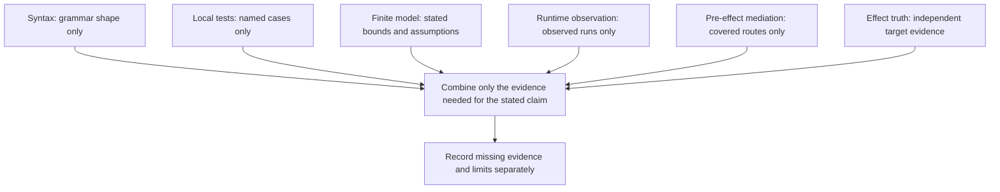

# P03 — Evidence classes constrain different claims

These are complementary evidence classes, not prerequisite rungs. The skill's separate claim ladder is a local audit protocol whose cumulative requirements are explicitly declared.
