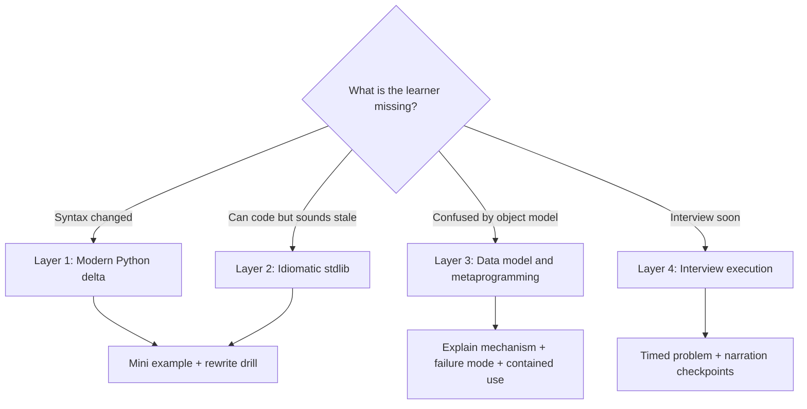

# Python Advanced Patterns

Modern Python interview fluency for experienced engineers returning after a long gap. Optimize for fast reactivation: connect old mental models (`__slots__`, descriptors, object layout) to current Python 3 idioms, then drill through realistic coding-interview loops.

## When to Use

Use for:
- Preparing someone who used Python years ago and needs a Python 3 refresh
- Explaining "new to me" features such as assignment expressions, pattern matching, dataclasses, protocols, and type hints
- Teaching metaprogramming without turning every interview answer into a framework
- Choosing Pythonic data structures and stdlib tools under live-coding pressure
- Reviewing interview code for stale, clever, or unidiomatic Python

NOT for:
- Beginner syntax tours
- Web framework architecture
- NumPy, Pandas, ML, or scientific Python
- Contest-style algorithm optimization without code-quality discussion

## Decision Points

### Refresher Path Selection



### Pattern Selection Tree

```
Need a lightweight record?
  -> dataclass unless behavior-free tuple unpacking matters; use frozen=True for value objects.

Need dictionary-like grouped state?
  -> defaultdict, Counter, deque, heapq, OrderedDict, or dataclass before custom classes.

Need validation or computed attributes?
  -> property for one field, descriptor for reusable field behavior, decorator for function wrapping.

Need runtime class creation or class-wide hooks?
  -> __init_subclass__ before metaclass; metaclass only when class creation itself is the abstraction.

Need expressive branching on shape?
  -> match/case for tagged structures or nested shapes; if/elif for simple predicates.

Need assignment inside expression?
  -> walrus only when it removes duplicated work or clarifies loop/control flow.

Need interface-like typing?
  -> Protocol for structural contracts; ABC when registration or shared implementation matters.
```

## Four-Layer Crash Course

### Layer 1: Python 3 Delta

Teach the high-signal changes first:
- `print()` is a function; integers are unbounded; text/bytes are separate
- Iterators are lazy: `range`, `map`, `filter`, `zip` do not eagerly produce lists
- Keyword-only arguments, f-strings, unpacking generalizations, and annotations are normal
- Assignment expressions (`:=`) bind inside expressions; use sparingly
- Structural pattern matching (`match/case`) matches shapes, not just values

Drill: "Rewrite this older Python style into current Python 3, then explain which changes are semantic versus cosmetic."

### Layer 2: Idiomatic Interview Stdlib

Reach for these before custom machinery:
- `dataclasses.dataclass` for structured state
- `collections.defaultdict`, `Counter`, `deque`, `OrderedDict`
- `heapq`, `bisect`, `itertools`, `functools`, `contextlib`
- Generators for streaming or incremental output
- Type hints on public APIs; keep internals readable under time pressure

Drill: "Solve the same problem once with raw dict/list, then improve it using one stdlib tool and explain the trade-off."

### Layer 3: Data Model and Metaprogramming

Core mechanisms:
- Attribute lookup: instance dict -> class -> base classes; descriptors can intercept lookup
- `__slots__` removes per-instance `__dict__` unless included; use for memory/layout constraints, not style points
- Decorators transform functions or classes at definition time
- Descriptors power `property`, methods, staticmethod/classmethod, and many ORMs
- `__getattr__`, `__getattribute__`, `__setattr__`, and `__init_subclass__` are hooks; metaclasses are the last resort

Rule: In interviews, explain metaprogramming as a contained mechanism, then implement the simplest version that proves you understand it.

### Layer 4: Interview Execution

For each practice problem:
1. State the public API and invariants
2. Pick a data model and name the stdlib tools
3. Code a working core path
4. Add edge cases and manual traces
5. Discuss complexity, concurrency, and what would change in production

For a returning Pythonist, add one language checkpoint per problem: "Where did modern Python help us here, and where did we avoid cleverness?"

## Worked Micro-Patterns

### Walrus Operator

Use when it removes duplicated computation:

```python
while (line := reader.readline()):
    process(line)
```

Avoid when it hides state changes in a dense condition. In interviews, say: "I would use this only if the interviewer is comfortable with current Python syntax; otherwise I can expand it."

### Descriptor Before Metaclass

Use descriptors for reusable attribute behavior:

```python
class Positive:
    def __set_name__(self, owner, name):
        self.name = "_" + name

    def __get__(self, obj, owner=None):
        if obj is None:
            return self
        return getattr(obj, self.name)

    def __set__(self, obj, value):
        if value <= 0:
            raise ValueError("must be positive")
        setattr(obj, self.name, value)
```

Explain the lookup protocol before writing it. That explanation is often more valuable than the code.

### Dataclass for Interview State

```python
from dataclasses import dataclass, field
from collections import deque

@dataclass
class Window:
    limit: int
    hits: deque[int] = field(default_factory=deque)
```

Use `default_factory` for mutable defaults. This is a shibboleth: missing it is an instant signal of stale or shallow Python fluency.

## Anti-Patterns

### Metaclass Flex

**Novice**: Uses metaclasses to prove advanced knowledge.

**Expert**: Starts with a plain class, function, decorator, descriptor, or `__init_subclass__`. Reaches for a metaclass only when class creation itself must be customized across a family of classes.

**Interview signal**: "I know how to do this with a metaclass, but that is more machinery than this problem needs."

### Python 2 Reflexes

**Novice**: Eagerly wraps iterators in `list()`, avoids annotations, hand-rolls records, or treats bytes and strings interchangeably.

**Expert**: Uses lazy iterators deliberately, annotates public contracts, and distinguishes text from bytes at boundaries.

**Timeline**: Python 3 made lazy iteration, Unicode boundaries, and annotation-heavy APIs the mainstream baseline.

### Walrus as Novelty

**Novice**: Uses `:=` because it is new.

**Expert**: Uses it to avoid duplicated work in loops or comprehensions, and expands it when clarity or interviewer familiarity matters.

**Timeline**: Assignment expressions arrived in Python 3.8; many experienced Python users missed them if they stepped away before modern Python 3 stabilized.

### Mutable Default Trap

**Novice**: Writes `def f(items=[]):` or `@dataclass class X: items: list = []`.

**Expert**: Uses `None` sentinels for function defaults and `field(default_factory=list)` for dataclasses.

**Interview signal**: Catching this without prompting shows real Python maturity.

## Tutoring Protocol

When teaching interactively:
1. Start with a calibration question: "Show me how you would model this state in Python."
2. Name the old mental model and the modern replacement.
3. Give one tiny runnable example.
4. Ask the learner to predict behavior before explaining it.
5. Convert the concept into a 10-minute interview drill.
6. End with a "keep / update / avoid" recap.

Use this tone: direct, senior, encouraging, and concrete. Do not lecture through a feature catalog; make the learner write and explain code.

## Reference Loading

No reference files are required for the core skill. Pair with `senior-coding-interview` when the task is a full mock interview, and with `interview-simulator` when the user wants timed role-play.

## Bundled Agents

- `agents/python-refresh-tutor.md` — Use when the user wants an interactive tutor persona for Python interview prep, especially for a returning Pythonist who knows older advanced features but needs a modern Python 3 crash course.
