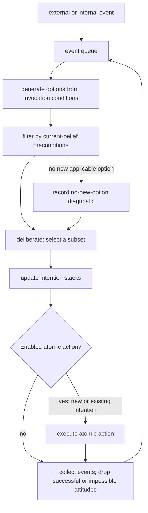
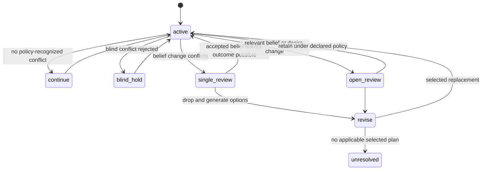

# BDI methods from theory to practice

Use this skill when an agent must keep acting while beliefs, objectives, and the environment change, and a plan library can express the relevant responses. The paper does not prescribe a universal policy, latency, architecture, safety authority, financial action, or optimum.

**Source boundary.** Rao and Georgeff, [*BDI Agents: From Theory to Practice*](https://cdn.aaai.org/ICMAS/1995/ICMAS95-042.pdf), ICMAS 1995, pp. 312–319, official eight-page PDF, was read in full on 2026-09-24. It gives a formal BDI account, an ideal interpreter, a practical PRS/dMARS-style representation, and the OASIS air-traffic example. It treats blind, single-minded, and open-minded commitment as application-tailored choices. A local implementation must separately define sensing authority, update rules, scheduling, and effect authorization.

## The reusable procedure

1. **Write the state boundary.** Name the observed events, current ground beliefs, competing desires, active intention stacks, and the action boundary. Record which observations may update beliefs and which effects need independent approval.
2. **Express each plan.** Give it an invocation event, a precondition over current beliefs, and a body of primitive actions or subgoals. Index candidate plans by invocation event, then test their preconditions. This follows the paper’s practical plan representation.
3. **Run one interpreter cycle.** Take queued events; generate options; deliberately select a subset; update intention stacks; execute an enabled atomic action; collect external events; drop successful attitudes and impossible attitudes. The order is the paper’s ideal loop; queue priority, fairness, and timing are local policies.
4. **Choose and test a commitment policy.** Blind rejects conflicting belief/desire changes; single-minded permits belief changes that drop an intention; open-minded permits relevant belief and desire changes. Run all candidate policies against the *same constructed trace* and record completions, revisions, missed changes, compute time, and unresolved cases.
5. **Calibrate rather than assert.** Measure option-generation time separately from scheduling, belief update, action execution, and input delay. A slow first action is a symptom; a profile identifies the component(s). Do not infer a bottleneck from one timeout or a comparison with an environment-change period.

## Commitment-policy comparison

| Policy | Paper-level distinction | Hand-checkable constructed trace |
| --- | --- | --- |
| Blind | Rejects belief and desire changes that conflict with the commitment. | A `route_A` intention remains after a sensor report says the route is blocked; the report must still be retained as evidence even if the policy does not revise. |
| Single-minded | Entertains belief changes and may drop a conflicting commitment. | The same report makes `route_A` infeasible under the declared model; mark the intention dropped and run option generation. A new lower-priority desire alone does not require revision. |
| Open-minded | Entertains belief and desire changes that may drop a commitment. | A verified priority change conflicts with `route_A`; record the desire change, policy rule, and selected replacement or unresolved outcome. |

The source distinguishes committing to one possible future from committing to all futures, separately from blind/single/open termination behavior. Do not collapse those axes. A blind policy does **not** mean “drop when achieved or impossible”; its defining behavior is denial of conflicting belief/desire changes. The generic interpreter’s dropping of successful/impossible attitudes is not a proof that every policy applies the same termination rule.

## Diagnostics and fixtures

| Observation | Competing explanations to measure | Next check |
| --- | --- | --- |
| Repeated plan switching | policy trigger too broad; conflicting desires; unstable beliefs; selection tie-breaking; external event burst | Trace trigger, belief/desire change, option set, and chosen stack per cycle. |
| No first action before a deadline | option matching; precondition evaluation; deliberation; queue delay; action gate; logging/transport | Profile each stage on the same event and plan-library fixture. |
| Continued obsolete action | blind policy; missing/late observation; absent precondition; stale belief; action already committed | Inspect the policy, observation provenance/timestamp, plan precondition, and action boundary. |
| No plan selected | no invocation match; precondition failure; a deliberate policy rejection; incomplete library; queue loss | Preserve every rejected candidate and reason. Do not call the goal impossible without a complete declared model/search. |

### Constructed fixture: navigation comparison

Use `goal = reach(checkpoint)`; plans `short_route` (requires `path_clear`) and `detour` (requires `detour_open`); initial belief `path_clear`; event `blocked(path)`. The fixture can compare: blind retains `short_route` while recording the conflict; single-minded drops it after the belief update and selects `detour` if its precondition holds; open-minded may also switch after a separately recorded priority change. The fixture proves only the declared interpreter behavior, not robot safety or physical success.

### Constructed fixture: replayed market-like data

Replay values `p_0=100`, `p_1=103`, and an event `announcement_unverified`. Plans merely label simulated choices `hold` and `recompute`; they do not place orders. Compare whether policy rules react only to a verified belief update, not to the unverified announcement. Report selected stacks and computation cost; do not claim gain, loss, price movement, merger outcome, or trading advice.

### Constructed fixture: delayed telemetry simulator

Declare an input delay `d`, state-estimation error bound `e`, and a simulator-only action `predict_next`. Test whether a policy records stale telemetry, revises its simulation plan under the declared error rule, or remains unresolved. The paper supplies no three-second delay, stable-orbit result, flight-control authority, or recommended policy.

## Reference routing

- [Three attitudes and resource bounds](references/resource-bounded-rationality-three-attitudes.md): domain assumptions and B/D/I separation.
- [Decision trees to symbolic reasoning](references/decision-trees-to-symbolic-reasoning.md): possible worlds and what the formal transformation preserves.
- [Commitment strategies](references/commitment-strategies-and-reconsideration.md): the two commitment axes and interpreter status events.
- [Option generation](references/option-generation-problem-filtering.md): invocation/precondition filtering and measurement procedure.
- [Plans as compilation](references/plans-as-knowledge-compilation.md): plan anatomy, stack semantics, and library limits.
- [Theory–practice approximation](references/theory-practice-gap-practical-approximation.md): the paper’s representation restrictions.
- [Failure modes](references/failure-modes-complex-agent-systems.md): diagnosis procedure and negative cases.
- [Paper scope and calibration](references/paper-scope-and-calibration.md): source access, implementation assumptions, and historical identity.

## Original-heading disposition ledger

| Original heading | Disposition | Destination/reason |
| --- | --- | --- |
| Decision Points | Retained and corrected | Reusable procedure and policy comparison replace unsupported numeric routing. |
| Primary Decision Tree: Commitment Strategy Selection | Retained and corrected | Commitment-policy comparison preserves blind/single/open distinctions. |
| Decision Tree: Plan Library Organization Strategy | Retained | Plan anatomy and option-filtering route retain the procedure. |
| Decision Tree: Belief Update Granularity | Corrected | State boundary requires an explicit local observation/update adapter. |
| Failure Modes | Retained and expanded | Diagnostics separates symptoms from competing causes. |
| Thrashing Agent (Continuous Reconsideration) | Retained | Diagnostics trace handles it without a single-cause claim. |
| Zombie Plans (Blind Persistence) | Corrected | Fixture distinguishes retained evidence from policy revision. |
| Option Generation Bottleneck | Corrected | Stage profiling replaces the false period comparison rule. |
| Schema Bloat (Over-Detailed Plans) | Retained | Plans-as-compilation reference supplies library tests. |
| Desire-Intention Confusion | Retained | B/D/I state boundary and policy table preserve distinction. |
| Worked Examples | Retained and corrected | Navigation, replay, and telemetry fixtures are constructed and non-operational. |
| Robot Navigation Under Deadline Pressure | Retained | Navigation fixture. |
| Trading Algorithm Under Market Volatility | Corrected and renamed | Replayed market-like data fixture removes order/loss/merger claims. |
| Satellite Control Under Communication Delays | Corrected | Delay/error simulator fixture removes invented timing and stability guarantee. |
| Reference Files | Retained | Reference routing covers all eight support files. |
| Quality Gates | Corrected | Measure local targets rather than assert universal thresholds. |
| Not-For Boundaries | Retained and corrected | Paper scope rejects automatic safety, financial, real-time, or optimality conclusions. |
