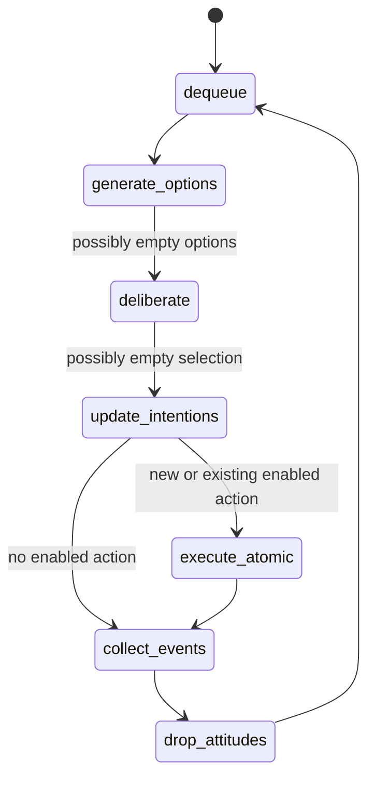

# BDI interpreter cycle and commitment review

The ideal loop is printed in [Rao–Georgeff 1995, p. 317](https://cdn.aaai.org/ICMAS/1995/ICMAS95-042.pdf). No new option need not mean no enabled action: an existing intention can supply it. Queue scheduling, effect authorization, and resolution policy are local. Internal events are posted as they occur; external events accumulated during the cycle are collected before dropping successful/impossible attitudes.
