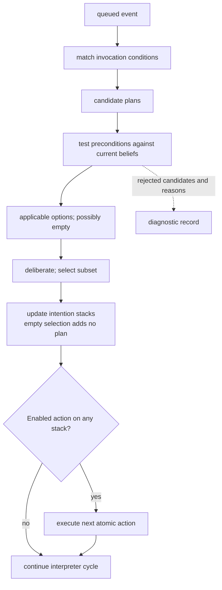

# Plan selection: invocation then precondition

Invocation and precondition must both hold for a new plan to be an option ([Rao–Georgeff 1995, pp. 317–318](https://cdn.aaai.org/ICMAS/1995/ICMAS95-042.pdf)). The selected subset can be empty while an existing intention remains executable. The practical representation also posts subgoals as internal events; this figure isolates filtering and the action boundary rather than enumerating every plan-body transition. Diagnostic recording is a local instrumentation choice.
