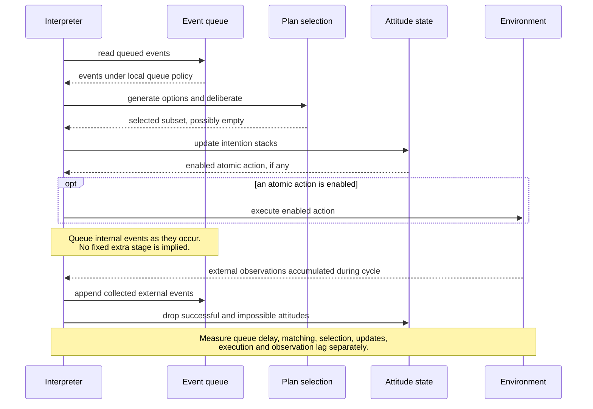

# Resource-bounded cycle: measure rather than infer a bottleneck

The event queue stores events; it does not decide which attitudes to drop. The interpreter updates attitude state, and external observations come from the environment, including changes unrelated to the agent's action. The abstract loop in [Rao–Georgeff 1995, p. 317](https://cdn.aaai.org/ICMAS/1995/ICMAS95-042.pdf) is the source for ordering. Instrumentation and component boundaries are constructed. The paper gives no universal duration or measured bottleneck for this fixture.
