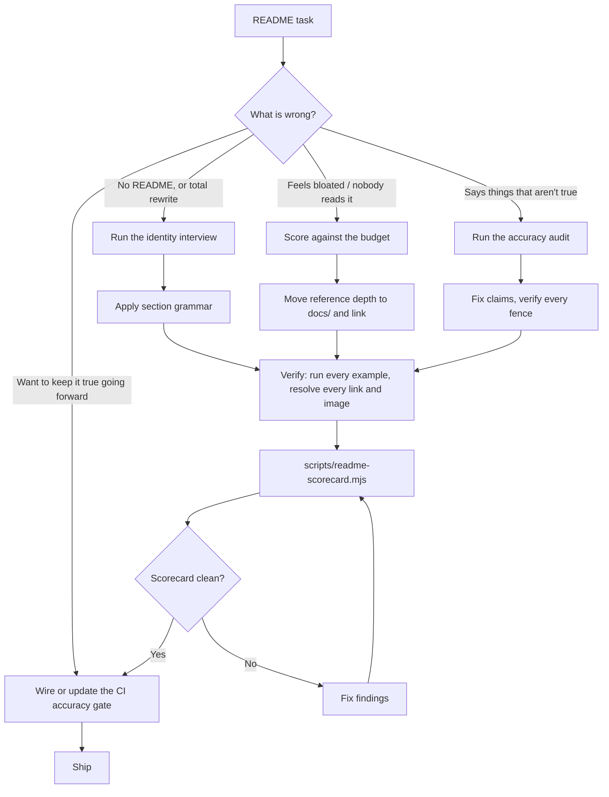

# README Craft

A README is not documentation. It is a **decision surface**. Its entire job is to move a
stranger through two gates, in order:

1. **The ten-second gate.** Is this for me? A reader who cannot answer that from the first
   screenful leaves, and no amount of excellent material further down recovers them.
2. **The two-minute gate.** Can I get one real thing working? The first success has to be
   copy-pasteable and has to actually work.

Everything that does not serve one of those two gates is **cost**, not value. It pushes the
material that does serve them further down the page. This is the single idea the rest of
this skill operationalizes.

## Decision tree



## Step 1 — The identity interview

Before writing a line, answer these five. If you cannot answer one from the codebase, ask
the maintainer. Guessing here is how a README ends up describing a product that no longer
exists.

| # | Question | Where the answer belongs |
|---|---|---|
| 1 | In one sentence a stranger understands, what **is** this? | Line 3, under the title |
| 2 | Who is it for, and who is it explicitly **not** for? | The pitch paragraph |
| 3 | What is the smallest thing a reader can do that produces a real result? | Quick start |
| 4 | What is the **one** idea a reader must hold to use the rest correctly? | "How it works" |
| 5 | What proof exists that this is real and maintained? | Badges, demo, adopters |

**The identity question is #1, and it is the one that rots.** A project accretes features
continuously, so its feature list stays roughly accurate by incremental edits. Its
*identity* changes in discrete jumps — a library becomes a platform, a port manager becomes
a coordination kernel — and nothing about adding a feature forces anyone to revisit the
first sentence. A README can be feature-accurate and identity-wrong at the same time.
That combination reads worse than being simply out of date, because the reader is being
confidently told the wrong thing.

Diagnostic: read only the first fifteen lines of the README, then read the architecture
doc of record. If they describe different products, stop and rewrite from identity down.
Do not patch.

## Step 2 — Section grammar

Order is not cosmetic. Each section earns the reader's attention for the next one.

```
1  Title + one-line description        required   under 120 chars, matches package description
2  Badges                              optional   2-4, informational, each links somewhere live
3  Hero media                          strong yes GIF/screenshot of real output, resolves
4  The pitch                           required   3-6 sentences: problem, approach, who it's for
5  Quick start                         required   install + smallest real success, copy-pasteable
6  How it works                        required   the ONE load-bearing idea, plus a diagram
7  Table of contents                   if >150 lines, and only AFTER the pitch
8  Core capabilities                   required   grouped, 5-9 groups, each with a real example
9  Adopters / who's using it           optional   evidence beats adjectives
10 Documentation map                   required   where the depth actually lives
11 Development & contributing          required   how to build, test, and submit
12 License                             required   last section, SPDX identifier
```

Rules that are frequently violated:

- **The table of contents never comes before the pitch.** A wall of links is not an
  introduction. `standard-readme` puts it third only because it assumes a short file; for
  anything long, the pitch and quick start go first and the TOC follows.
- **"How it works" comes before the capability tour.** A reader who holds the central idea
  can skim thirty features. A reader who does not is reading a glossary.
- **License is the last section.** Always.
- **Every section header is a promise.** If a reader jumps to it from the TOC, it must
  deliver that thing and not a preamble to that thing.

Full rules, including what each section must *not* contain, are in
`references/section-grammar.md`.

## Step 3 — The budget

A README competes with a docs site, and it loses on depth every time. Its advantage is that
it is the first thing anyone sees. Spend it accordingly.

| Budget line | Target | Hard ceiling |
|---|---|---|
| Lines before the first runnable command | 25 | 40 |
| Total README length | 250–400 lines | 600 |
| Code fences | 8–20 | 30 |
| Distinct top-level sections | 8–12 | 15 |
| Consecutive prose lines without a break | 6 | 10 |

Over the ceiling means the material belongs in `docs/` with a link from the documentation
map. A 1,000-line README is a documentation site wearing a trenchcoat: it has the cost of a
docs site (nobody reads it end to end, it drifts everywhere at once) and none of the
benefits (no search, no navigation, no per-page ownership).

**What to cut first, in order:** exhaustive command indexes, environment-variable tables,
per-flag reference, destructive-command lists, changelog-shaped prose, and anything phrased
as "as of version X". All of that is reference material — it belongs in `docs/` or in
`--help` output, and `--help` has the enormous advantage of being generated from the code
that it documents.

## Step 4 — Show, don't assert

The strongest sentence in a README is a screenshot of the thing working.

| Weakest → strongest |
|---|
| "Port Daddy coordinates agents." |
| A bullet list of coordination features. |
| A fenced command. |
| A fenced command **with its real output**. |
| A terminal recording of the command producing that output. |

Rules:

- **Every example shows its output.** A block with only input asks the reader to imagine the
  payoff. Show what prints, trimmed to the interesting lines, with `# →` or a comment marker
  for annotation.
- **Recordings go near the top.** One good GIF above the fold does more than the next three
  sections. If the repo already generates terminal recordings (VHS tapes, asciicasts), the
  README is the first place they should appear — check `demos/`, `*.tape`, and any
  `public/gifs` directory before writing a word.
- **Media must resolve.** A `` pointing at a file that does not exist renders as a
  broken-image icon at the very top of the page — the single most damaging possible defect,
  because it is the first thing a stranger sees and it says "unmaintained" before any prose
  gets a chance to say otherwise.
- **Diagrams over adjectives for architecture.** Mermaid renders natively on GitHub. A
  six-node flowchart replaces two paragraphs and cannot drift silently in the same way prose
  can, because it is structurally forced to name its parts.

## Step 5 — Voice

House rules, adapted from the Google developer documentation style guide and load-bearing
for READMEs specifically:

- **Second person, present tense, active voice.** "Claim a port" — not "a port can be
  claimed" and not "we then claim a port."
- **Conditions before instructions.** "To run against a remote daemon, set `PORT_DADDY_URL`"
  — not "Set `PORT_DADDY_URL` if you're running against a remote daemon." The reader who
  does not meet the condition should be able to stop reading at the comma.
- **Sentence case headings.** Title Case Headings Read As Marketing.
- **No adjectives that the reader cannot check.** "Blazing fast", "powerful", "robust",
  "seamless", "comprehensive" are noise. Replace each with a number, a benchmark, or delete
  it. `pd bench` reports sub-millisecond commit latency is a claim; "blazing fast" is not.
- **Never narrate the document's own history.** No "previously this README said", no "as of
  v3.28", no "we recently renamed X to Y". Write every version as if it is the first one
  anyone has seen. Version-scoped statements are the mechanism by which a README becomes a
  changelog.
- **Emoji are an accent, not a bullet system.** One per heading across twenty headings is
  visual noise, hurts scanning, and reads to screen readers as a stream of names. Two or
  three deliberate ones that carry the project's voice are fine. Decorating every heading is
  the tell of a document nobody edited.

## Step 6 — Verify everything

This is the step that separates a README that is trusted from one that is merely read. An
unverified example is worse than a missing one: it teaches the reader that the document is
decorative, and that lesson generalizes to every other claim on the page.

```bash
# Extract every fenced block with provenance
node skills/readme-craft/scripts/extract-examples.mjs README.md --json

# Score the README against the rubric (exits non-zero on findings)
node skills/readme-craft/scripts/readme-scorecard.mjs README.md
```

Verification tiers, in descending order of what you should aim for:

1. **Executable** — the block runs in CI against a real instance and its output is compared.
2. **Surface-checked** — every command, subcommand, and flag in the block is resolved
   against the tool's real registry. Catches the common case: a verb that was renamed.
3. **Referenced** — the block is generated from, or literally included from, a file that is
   itself tested (`examples/`, a test fixture).
4. **Eyeballed** — a human ran it once. This decays. Assume it is wrong after two minor
   versions.

Mark intent inline so the gate knows what to do with each block:

````markdown
```bash
# readme-verify: run
pd status
```

```bash
# readme-verify: surface
pd fleet halt --root abc123
```

```bash
# readme-verify: skip — illustrative pseudocode
pd <verb> <args>
```
````

Design guidance for the CI gate itself is in `references/verification.md`.

## Anti-patterns

### The stale identity

- **Novice**: Keeps the README's opening paragraph and appends new features under new
  headings. Each individual edit is correct, so nothing ever trips.
- **Expert**: Treats the first fifteen lines as a separately-owned artifact with its own
  review trigger. When the architecture doc of record and the README's first sentence
  disagree, that is a P1 documentation bug, not a cleanup task — a confidently wrong
  first sentence is more damaging than a missing one.
- **Timeline**: Became acute around 2024 as projects started pivoting mid-life in response
  to the agent-tooling shift. A 2021 library README that fell behind was merely thin; a
  2026 README describing the previous product actively misdirects.

### The changelog that ate the front door

- **Novice**: Every shipped feature earns a README section, on the theory that undocumented
  features are invisible. The README grows monotonically and is never cut.
- **Expert**: New features earn a line in the capability tour and a page in `docs/`. The
  README's job is orientation; the docs' job is completeness. Ships a *deletion* in most
  README PRs, and treats the length ceiling as a real budget rather than a suggestion.
- **Timeline**: The failure mode arrived with docs-in-repo culture around 2016 and got much
  worse once CI gates started requiring a README touch per feature — a well-intentioned
  freshness rule with no counterweight produces monotonic growth by construction.

### Untested fences

- **Novice**: Writes examples from memory or from the design doc. They were true when typed.
- **Expert**: Treats every fenced block as a test case with an explicit verification tier,
  and wires a gate that fails the build when a block references a verb or flag that no
  longer exists. Accepts that this means fewer, better examples.
- **Timeline**: Doctest (Python, 2001) and rustdoc doctests (2015) proved the pattern
  decades ago for library APIs; CLI and daemon projects still overwhelmingly skip it, which
  is exactly why CLI READMEs rot faster than library READMEs.

### Wall-of-contents opening

- **Novice**: Puts a thirty-item table of contents immediately after the title, reasoning
  that it helps navigation.
- **Expert**: Knows the reader has not yet decided to navigate anything. The TOC goes after
  the pitch and quick start, and only if the file exceeds ~150 lines. GitHub renders its own
  heading-outline menu, which covers most of the need.
- **Timeline**: `standard-readme` (2016) mandated an early TOC for files that were assumed
  to be short. The rule got cargo-culted onto 1,000-line files where it inverts the intent.

### Self-asserted badges

- **Novice**: Adds a hand-written `tests-7300%20passing` shields.io badge. The number is
  hardcoded and drifts the moment a test is added.
- **Expert**: Every badge either links to a live source of truth (CI run, npm, coverage
  service) or does not exist. A static badge asserting a metric is a claim with no
  verification path — strictly worse than no badge, because it demonstrates that the
  project ships unverifiable claims in its most prominent position.
- **Timeline**: Badge inflation peaked around 2018–2020; current practice trends to 2–4
  live badges.

## Quality gates

Before shipping a README, all of these must hold:

- [ ] A stranger can answer "is this for me?" from the first 15 lines
- [ ] The first runnable command appears within 40 lines
- [ ] The first sentence agrees with the project's architecture doc of record
- [ ] Every image and link resolves (`scripts/readme-scorecard.mjs` checks this)
- [ ] Every fenced block carries a `readme-verify` tier, or the file declares a default
- [ ] Every `run`-tier block actually ran, in this session or in CI
- [ ] Total length is within the budget, or the overage is a deliberate, stated decision
- [ ] No unverifiable adjectives ("blazing fast", "powerful", "seamless", "robust")
- [ ] No version-scoped or revision-history narration
- [ ] Headings are sentence case
- [ ] License section is last and names an SPDX identifier
- [ ] The documentation map points at pages that exist

## NOT for

- **Generated API reference.** Use `api-documentation-generator`. A README links to
  reference; it does not contain it.
- **Website and landing-page copy.** Use `port-daddy-marketing-copy`. The landing page can
  lean on design to carry weight; a README has only markdown and has to be denser and more
  literal.
- **Long-form explanatory essays.** Use `port-daddy-expository-writer`. Those assume a
  reader who chose to be there; a README assumes a reader deciding whether to stay.
- **ADRs, CHANGELOGs, PR descriptions.** Each has its own register and its own gate.
- **Docstring authoring inside source files.** That is a code-review concern with its own
  tooling.

## References

Load these only when the situation calls for them:

- `references/section-grammar.md` — the full per-section contract: what each section must
  contain, must not contain, and how to tell when it has gone wrong. Read when scaffolding
  or restructuring.
- `references/exemplars.md` — anatomy of the READMEs worth stealing from (ink, VHS, uv,
  ripgrep) with the specific technique each one demonstrates. Read when you need a concrete
  model for a particular section.
- `references/voice-and-style.md` — the style rules in full, the Diátaxis mapping for what
  belongs in a README versus `docs/`, and the adjective blocklist. Read when editing prose.
- `references/verification.md` — how to design a README accuracy gate: fence extraction,
  the verification tiers, surface-checking against a CLI registry, and CI wiring. Read when
  building or changing the gate.
- `examples/before-after.md` — a worked rewrite showing an identity-stale, feature-list
  README reduced to a front door. Read when you want to see the cuts, not just the rules.
- `scripts/INDEX.md` — what each runnable tool does and when to reach for it.
- `agents/readme-steward.md` — the subagent definition for ongoing README upkeep: how to
  triage each finding class, and the constraints that stop it from satisfying a gate by
  deleting the failing example. Read when wiring an agent or a scheduled job to own this.
