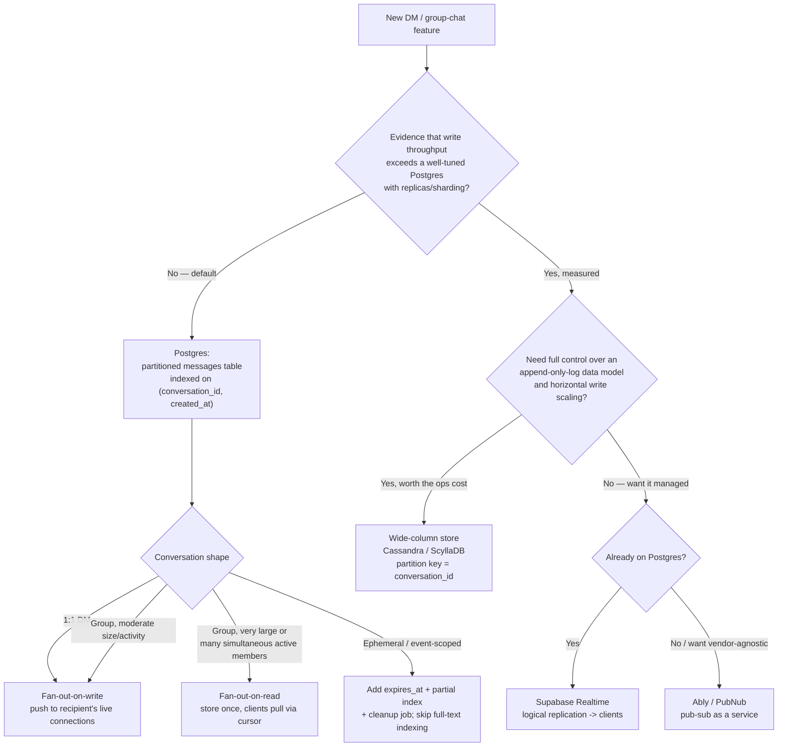

# Realtime Messaging Backend Architecture

Picks the backend data-model and storage architecture for DM and group-chat
features at social-app scale: which store to use, how messages fan out to
recipients, and where transient signals (typing, presence, receipts) live.

## When to Use

✅ **Use for**:
- "What database should we use for DMs and group chat?"
- "When does it make sense to move our chat backend off Postgres?"
- "How should we model an ephemeral event/party chat that expires?"
- "Where should read receipts, typing indicators, and presence live?"
- "Should new messages push to every group member, or should clients pull?"
- "Should we use Supabase Realtime, Ably, or PubNub for our chat app?"

❌ **NOT for**:
- Implementing the WebSocket server, connection lifecycle, reconnection/
  backoff logic, or client-side socket handling — see
  `websocket-realtime-expert`.
- CRDT-based collaborative document/text editing (Google-Docs-style
  concurrent editing) — see `real-time-collaboration-engine`.
- General Postgres query/index tuning unrelated to a messaging schema —
  see `postgresql-optimization`.
- General Redis caching strategy unrelated to chat presence/receipts — see
  `redis-patterns-expert` / `scalable-db-caching-strategy`.

---

## Core Decision Process

Store choice and delivery strategy are **independent axes** — you can be on
Postgres with fan-out-on-read for one oversized group, and fan-out-on-write
for every DM, at the same time. Don't couple them.

## Postgres Is the Default Starting Point

A `messages` table partitioned by `created_at` and indexed on
`(conversation_id, created_at)` handles very substantial read/write volume,
and gives you transactional guarantees — read receipts (the durable, coarse
kind), message edits/deletes, moderation flags — that are awkward to build
correctly on an eventually-consistent wide-column store. Reach for Postgres
first. Don't pre-optimize into a specialized store before you have evidence
it's the bottleneck.

Read `references/postgres-message-schema.md` for table shapes, partitioning,
and indexing; `examples/postgres_schema_example.sql` for a concrete,
copy-pasteable starting schema.

## When Wide-Column Stores Earn Their Cost

Cassandra/ScyllaDB become worth the operational complexity when write
throughput genuinely exceeds what a well-tuned Postgres (with read replicas
and/or sharding) can sustain — evidenced by metrics, not a hunch. Their
data model naturally fits "append-only log per conversation partition" and
scales horizontal writes past what a single-primary Postgres can do. This
is a scale most products never reach: treat it as a migration to plan for
given real evidence, not a default starting choice, given the operational
cost (multi-node cluster management, eventual-consistency tradeoffs, no
ad-hoc joins/secondary indexes).

Read `references/scaling-beyond-postgres.md` before starting this
migration — it covers the concrete evidence bar and a dual-write migration
shape.

## Managed Realtime Backends

Supabase Realtime, Ably, and PubNub trade infrastructure ownership for
velocity: they handle WebSocket fan-out and presence/typing plumbing so you
only model data and business logic. Supabase Realtime taps your Postgres
database's own logical replication stream — attractive when you're already
on Postgres, since it needs no separate message bus. Ably/PubNub are
backend-agnostic pub-sub-as-a-service, useful when you want zero
self-hosted realtime infra regardless of your primary database.

Read `references/managed-realtime-tradeoffs.md` for the full decision
matrix and cost tradeoffs of each.

## Fan-Out: Push vs. Pull

For 1:1 DMs, fan-out-on-write (push to the recipient's live connection
immediately) is simple and sufficient — always use it there. For group
chat, fan-out-on-write to every member's live connection works fine up to
moderate size/activity; very large or highly-simultaneously-active groups
may need fan-out-on-read (store once, clients pull via a cursor) to avoid
one write amplifying into hundreds of push events. There's no universal
member-count threshold — the real crossover point depends on your actual
traffic. Design the abstraction (a per-conversation `delivery_mode`) so you
can switch strategies for one hot conversation without a full rewrite.

Read `references/fanout-strategies.md` for the hybrid "cheap notification,
separate data fetch" pattern.

## Ephemeral Chat Needs Schema-Level TTL

A chat tied to a live event or "party" that shouldn't persist forever needs
an explicit TTL/expiry design at the schema level (an `expires_at` column
plus a cleanup job, or a TTL-native store) decided at conversation-creation
time — don't bolt deletion on as an afterthought. Ephemeral content also
has different read-path implications: you may intentionally skip full-text
search indexing on it, since indexing data that will be deleted is pure
write-amplification.

## Read Receipts, Typing, and Presence Belong in Redis

These are usually separate, higher-churn, more-ephemeral data than the
messages themselves — model them in a fast key-value/in-memory store
(Redis) rather than the same durable table as message history, since
they're overwritten constantly and don't need durability guarantees. The
one exception: a coarse, once-per-read-session "last read" cursor is
low-churn enough to live in Postgres if you want it transactionally
consistent with other durable state.

Read `references/ephemeral-and-presence-data.md` for the full design,
including the exact TTL key patterns for typing and presence.

---

## Anti-Patterns

### Anti-Pattern: Premature Wide-Column Migration

**Novice**: "We're building a chat app — better start on Cassandra/DynamoDB
from day one so we don't have to migrate later."
**Expert**: A properly indexed, partitioned Postgres `messages` table
handles very high sustained read/write volume — most products never
generate traffic that saturates a well-tuned Postgres with read replicas.
Wide-column stores trade away transactions, joins, and operational
simplicity for horizontal write scaling you probably don't need yet. Start
on Postgres, instrument write latency and replication lag, and treat the
migration as a planned, evidence-driven project.
**Timeline**: The 2012-2016 "NoSQL for everything" era pushed teams toward
Cassandra/MongoDB by default for anything at social scale. Postgres's own
scaling improvements since (logical replication, native partitioning,
sharding extensions like Citus) restored "boring Postgres first" as the
correct default for nearly all chat products.

### Anti-Pattern: Typing Indicators / Presence in the Durable Messages Table

**Novice**: "I'll add an `is_typing` boolean to `conversation_members`, or
write a row into `messages` for every typing event, so the client can just
subscribe to the same stream."
**Expert**: Typing/presence signals fire many times per second per active
user and are only relevant for a few seconds. Writing them into a durable,
WAL-logged, indexed table multiplies write volume and bloats autovacuum
churn for data nobody needs once it's stale. Model them as short-TTL keys
in Redis (or your managed realtime backend's native presence feature)
instead — no durability guarantee needed, and expiry is free.
**Detection**: Grep the schema for `is_typing`, `typing_at`,
`last_seen_at` columns on a durable table, or a `message_type = 'typing'`
row shape in the messages table itself.

### Anti-Pattern: Bolting Deletion Onto a Permanent-Chat Schema

**Novice**: "For the event chat that should disappear after the party
ends, I'll just run a `DELETE WHERE created_at < X` cron job against the
same `messages` table as everything else."
**Expert**: Ephemeral chat needs expiry modeled at the schema level from
the start — an `expires_at` column, a partial index on it for the cleanup
job, and no full-text indexing on content that will never be searched
long-term. Bolting deletion on afterward means the cleanup job full-scans
a huge shared table, and you've already paid indexing costs for data with
no long-term value. Decide "does this conversation expire?" at
conversation-creation time, not cleanup time.
**Detection**: A cleanup job whose `WHERE` clause isn't backed by an index,
or a single shared `messages` table with no `expires_at`/partition
distinction between permanent and ephemeral conversations.

### Anti-Pattern: Uniform Fan-Out-On-Write Regardless of Group Size

**Novice**: "We fan out every message to every group member's live
connection — it's simple, and it worked fine in testing."
**Expert**: Fine for DMs and small/medium groups, but a message to a very
large or highly-simultaneously-active group turns one write into hundreds
or thousands of push events — that write amplification, not the database,
is what falls over first. Design delivery as a per-conversation strategy
you can flip (push vs. pull) rather than a global assumption baked into
the client protocol.
**Detection**: No `delivery_mode`/equivalent field on conversations, and a
fan-out path that iterates every member unconditionally regardless of
group size.

---

## References

Consult these for deep dives — they are NOT loaded by default:

| File | Consult When |
|------|-------------|
| `references/postgres-message-schema.md` | Designing the actual `messages`/`conversations` tables, partitioning, or indexing strategy |
| `references/scaling-beyond-postgres.md` | Evaluating whether/how to migrate to Cassandra/ScyllaDB, and the evidence bar for doing so |
| `references/managed-realtime-tradeoffs.md` | Choosing between Supabase Realtime, Ably, and PubNub |
| `references/fanout-strategies.md` | Designing push vs. pull delivery, or the hybrid notification pattern |
| `references/ephemeral-and-presence-data.md` | Designing TTL/expiry for ephemeral chat, or placing receipts/typing/presence |
| `examples/postgres_schema_example.sql` | You want a concrete, copy-pasteable starting schema |
