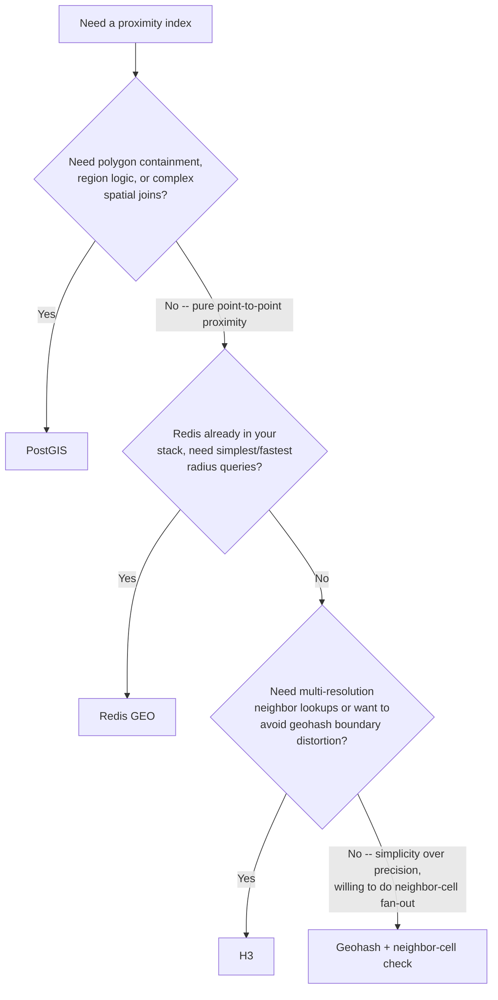

# Realtime Proximity Map

Design the backend and data-flow architecture for a live "who's nearby" map: how positions are
indexed for fast proximity queries, how those positions are fuzzed before another user ever
sees them, and how updates reach viewers' screens without flooding the network or the database.

## When to Use

✅ **Use for**:
- Building a "who's nearby" / live-proximity map (dating, social, meetup, or location-based apps)
- Choosing a geospatial index for proximity queries (PostGIS vs geohash vs H3 vs Redis GEO)
- Designing location fuzzing so users never see each other's exact GPS coordinates
- Architecting live position-update delivery (WebSocket transport, throttling, fan-out)
- Reviewing an existing proximity feature for privacy leaks or write-amplification problems

❌ **NOT for**:
- General large-scale map rendering, tile pipelines, or static geographic data visualization
  at scale (choropleths, heatmaps of aggregate/non-personal data) — see
  `large-scale-map-visualization`
- Building the chat/messaging layer once two nearby users start talking — see
  `realtime-messaging-backend-architecture`
- General WebSocket connection handling, reconnection, or scaling mechanics unrelated to
  location — see `websocket-realtime-expert`
- Content moderation or trust & safety features on top of a proximity app

---

## Core Architecture

A proximity-social map has three concerns that are easy to conflate but should be designed
separately: **where the data lives** (indexing), **what other users are allowed to see**
(privacy), and **how updates reach the screen** (transport).

```mermaid
flowchart TD
    GPS[Client GPS tick] --> Throttle[Client-side throttle:\nbatch/debounce by time or distance]
    Throttle -->|WebSocket publish| Hot[Hot index: Redis GEO\nor H3-cell store]
    Hot -->|coarse write frequency| Durable[(Primary DB / PostGIS\nsystem of record)]
    Hot --> Query{Proximity query\n"who's near me"}
    Query --> Fuzz[Server-side fuzzing:\nzoom-scaled radius / grid-snap / distance-band]
    Fuzz -->|coalesced, throttled fan-out| WS[WebSocket push to viewers]
    WS --> Map[Client map renders\nfuzzed positions]
```

**Write path**: current position goes to the hot index (Redis GEO, or an H3-cell-keyed store)
on every throttled client publish — that path needs to be fast and absorb frequent writes.
The durable/historical record, if you keep one, is written to the primary database at a much
coarser frequency (e.g. once a minute, or only on significant movement), never at raw GPS-tick
frequency. Writing every position update straight into Postgres creates write amplification
that competes with the rest of your transactional workload.

**Read path**: proximity queries hit the hot index, results pass through the fuzzing layer
before serialization, and the fuzzed result is what reaches the client. The exact coordinate
never leaves the server for another user's client.

## Choosing a Geospatial Index



- **PostGIS** — real geometry (`ST_DWithin`, polygon containment, spatial joins). Right default
  if you already run Postgres and need actual geometric precision. Costs primary-DB load.
- **Geohash** — base32 prefix encoding, works in any store. Rectangular cells distort distance
  at boundaries — two points meters apart can land in totally different prefixes. Always query
  the 8 neighbor cells too, never just the point's own cell.
- **H3** (Uber, Apache-2.0) — hexagonal cells, uniform neighbor distance, strong built-in
  k-ring (`grid_disk`) multi-resolution lookups. Best when proximity-search quality matters
  more than exact geometric precision.
- **Redis GEO** (`GEOADD`/`GEOSEARCH`) — sorted-set + geohash internally, simplest and fastest
  pure "who's within N km" queries. No polygon/region support.

Full code examples and the boundary-problem mechanics: `references/geospatial-indexing.md`.

## Privacy-Preserving Location Fuzzing

Never send another user's exact GPS coordinate to their viewer's client — not rounded, not
hidden in an unrendered field. Techniques, coarsest to most precise:

1. **Distance band** — "within 500m" instead of a number or dot.
2. **Grid-cell snap** — display the H3/geohash cell centroid, not the true point.
3. **Randomized jitter** — random offset within a radius; regenerate periodically so repeated
   queries can't be averaged back to the true point.
4. **Precise sharing** — only via explicit, time-boxed, revocable opt-in (e.g. meetup arrival
   confirmation). Never the default.

**Fuzz radius scales with zoom**: more fuzz when the viewer is zoomed out (exact position
matters less), tighter fuzz only as zoom increases, with a floor that never collapses to
near-exact precision. Store the exact coordinate server-side only, for as long as a real
feature needs it, and never expose it through any client-reachable endpoint by default.

Full technique details, code, and regulatory context: `references/privacy-fuzzing.md`.

## Live Update Delivery

Push over WebSocket, not polling. Throttle **both** ends independently:

- **Client publish rate**: debounce/batch GPS ticks — publish on a fixed interval or only past
  a movement threshold, not on every raw tick.
- **Server fan-out rate**: coalesce nearby users' movements into a batched diff per viewer per
  short window (e.g. 1-2s), rather than pushing every tiny movement the instant it happens.

## Map Tile Rendering

MapLibre GL (open-source, self-hosted or third-party vector tiles) gives full styling control
and predictable cost as usage scales — usually the better long-term choice for a
custom-branded proximity map. Google Maps JS API integrates faster and has best-in-class base
map data, at the cost of per-load billing and less styling flexibility. Full comparison:
`references/live-updates-and-tiles.md`.

---

## Anti-Patterns

### Anti-Pattern: Displaying Exact GPS Coordinates to Other Users

**Novice**: "We round to 5 decimal places before sending it to the client, so it's fine."
**Expert**: 5 decimal places of latitude/longitude is roughly 1 meter of precision — that is
still exact for any practical purpose, including stalking risk. Fuzzing must be a deliberate
transform (grid-snap, jitter, or distance-band) applied server-side before serialization, sized
to a real minimum radius, not a rounding artifact. The exact coordinate should never appear in
the response payload sent for another user's profile.
**Timeline**: Pre-2015 location apps routinely shipped precise coordinates and were repeatedly
shown (security research, app audits) to enable real-world stalking; "fuzz by default" is now
the baseline expectation for any consumer proximity feature, not an advanced feature.

### Anti-Pattern: Geohash Prefix-Matching Without Checking Neighbor Cells

**Novice**: "Query for everyone whose geohash starts with the same 6 characters as mine — that's
everyone within about 600m."
**Expert**: Geohash cells are rectangular grid boxes. Two points a few meters apart can fall on
opposite sides of a cell boundary and share zero leading characters, because the encoding can
flip a high-order bit right at the edge. A prefix-only query silently drops real neighbors that
sit one cell over. Always compute the cell's 8 neighbors and query all 9 cells (self + neighbors)
before filtering by true distance — this is a required step, not an optimization.
**Detection**: If your "nearby users" query only ever does `WHERE geohash LIKE 'prefix%'` with
no neighbor-cell expansion, users near any cell boundary are being silently under-counted.

### Anti-Pattern: Writing Every Position Update Directly to the Primary Database

**Novice**: "Just `UPDATE users SET location = ... WHERE id = ...` on every GPS tick — Postgres
can handle it."
**Expert**: A proximity feature with even a few thousand concurrent active users, each
publishing a position every few seconds, turns into a sustained high-frequency write workload
against your primary transactional database — competing for the same connection pool, WAL
throughput, and index maintenance as checkout, auth, and everything else. Route the
high-frequency hot-path writes to a purpose-built store (Redis GEO, or an H3-cell-indexed
cache) and write to the durable database at a much coarser frequency, or only on significant
movement.
**Detection**: If your primary DB's slow-query log or write-throughput graph tracks 1:1 with
concurrent active map users, the hot path is in the wrong place.

---

## References

Consult these for deep dives — they are NOT loaded by default:

| File | Consult When |
|------|--------------|
| `references/geospatial-indexing.md` | Choosing between PostGIS, geohash, H3, or Redis GEO; need runnable query/code examples or the full boundary-problem explanation |
| `references/privacy-fuzzing.md` | Designing or auditing the fuzzing layer; need concrete jitter/snap code, zoom-scaling logic, or regulatory framing |
| `references/live-updates-and-tiles.md` | Designing the WebSocket throttle/fan-out logic, or comparing MapLibre GL vs Google Maps for tile rendering |

<!-- BEGIN BUNDLE INDEX (auto: index_references.py) -->

## Skill Bundle Index

*Every file in this skill, and when to open it. Auto-generated via the skill-architect skill's reference indexer.*

**root**
- [`CHANGELOG.md`](CHANGELOG.md) — Realtime Proximity Map -- Changelog — - Initial skill creation - Core architecture: hot index (Redis GEO / H3) for live queries, durable DB at coarse write frequency, server-side
- [`README.md`](README.md) — Realtime Proximity Map — Architectural guidance for building a real-time "who's nearby" map feature -- the Sniffies/Grindr/Zenly pattern -- covering geospatial index

**`references/`**
- [`references/geospatial-indexing.md`](references/geospatial-indexing.md) — Geospatial Indexing: PostGIS vs Geohash vs H3 vs Redis GEO — Read this when choosing (or reviewing a choice of) the index that answers "which users/points are near this coordinate?" at scale.
- [`references/live-updates-and-tiles.md`](references/live-updates-and-tiles.md) — Live Update Delivery and Map Tile Rendering — Read this when designing how position updates reach viewers' maps in real time, or when choosing a map-tile rendering stack for a proximity-
- [`references/privacy-fuzzing.md`](references/privacy-fuzzing.md) — Privacy-Preserving Location Fuzzing — Read this when designing how a user's location is displayed to *other* users on a proximity map, or when reviewing whether a proximity featu

<!-- END BUNDLE INDEX -->
