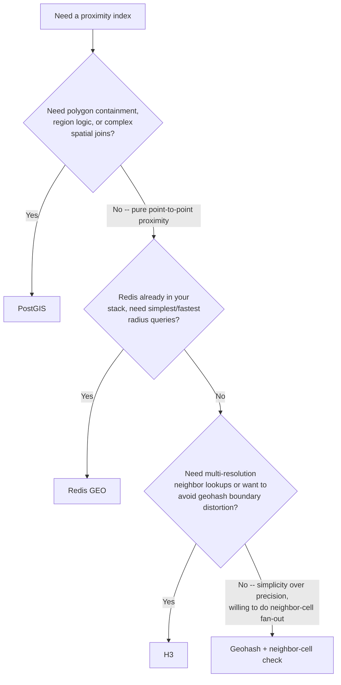

# Geospatial Indexing: PostGIS vs Geohash vs H3 vs Redis GEO

Read this when choosing (or reviewing a choice of) the index that answers "which users/points
are near this coordinate?" at scale. All four options can answer that question; they differ in
precision, write cost, and what else they can do besides proximity.

## The four options

### PostGIS (Postgres extension)

Full geometry types (`POINT`, `POLYGON`, etc.) with real geometric operators: `ST_DWithin`,
`ST_Contains`, `ST_Intersects`, spatial joins against arbitrary polygons. Backed by a GiST index
on the geometry column.

```sql
CREATE EXTENSION IF NOT EXISTS postgis;
ALTER TABLE users ADD COLUMN location geography(Point, 4326);
CREATE INDEX users_location_gix ON users USING GIST (location);

-- Users within 2km, ordered nearest-first
SELECT id, ST_Distance(location, ST_MakePoint(:lng, :lat)::geography) AS meters
FROM users
WHERE ST_DWithin(location, ST_MakePoint(:lng, :lat)::geography, 2000)
ORDER BY location <-> ST_MakePoint(:lng, :lat)::geography
LIMIT 50;
```

**Pick PostGIS when**: you already run Postgres, you need real geometric queries (accurate
distance, "is this point inside this neighborhood polygon," complex spatial joins), or the
feature needs both proximity *and* region logic (e.g. geofenced venues) in one query.

**Cost**: geospatial queries run on your primary transactional database. A "who's nearby"
endpoint hit every few seconds by every active user competes for the same connection pool and
buffer cache as your checkout flow, auth, and everything else. This is the main reason
proximity-heavy apps pull the hot path out of Postgres (see SKILL.md's architecture section)
even when PostGIS remains the source of truth for anything durable.

### Geohash

Encodes `(lat, lng)` into a base32 string (`9q8yy...`) where each additional character narrows
the bounding box. Two points that share a longer prefix are usually closer together. Because
it's just a string, you can index it in any store: a Postgres `text` column, a DynamoDB
partition key, an Elasticsearch field, a Redis sorted set key prefix.

```python
import geohash  # e.g. python-geohash
code = geohash.encode(37.7749, -122.4194, precision=7)  # '9q8yyk8'
# Prefix query: everything starting with '9q8yy' is roughly nearby
```

**The boundary problem**: geohash cells are rectangular, and prefix similarity is a proxy for
distance, not distance itself. Two points meters apart that straddle a cell edge can get
completely different prefixes, sharing zero leading characters despite being neighbors. A
prefix-only query for cell `9q8yy` will silently miss real neighbors sitting one cell over.

**Mitigation**: never query only the point's own cell. Compute the 8 neighboring cells
(`geohash.neighbors(code)` in most libraries) and query all 9 (self + 8 neighbors), then filter
the merged result set by true distance. Skipping this fan-out is the most common geohash
mistake (see the Anti-Patterns section in SKILL.md).

**Pick Geohash when**: you need something proximity-ish that works in any key-value store you
already have, precision requirements are loose, and you're willing to always do the
neighbor-cell fan-out.

### H3 (Uber, Apache-2.0)

Hexagonal hierarchical spatial index. Every cell is a hexagon; every hexagon has exactly 6
neighbors, each at (approximately) the same distance from the center — this is what geohash's
rectangular grid can't give you, since a rectangle's neighbors sit at two different distances
(edge-adjacent vs. corner-adjacent). That uniformity means proximity search near cell edges is
far less distorted than geohash's.

```python
import h3
cell = h3.latlng_to_cell(37.7749, -122.4194, res=9)   # resolution 0 (huge) .. 15 (tiny)
ring = h3.grid_disk(cell, k=1)                         # cell + 6 immediate neighbors
# Query your index for any of the cells in `ring`
```

`grid_disk` (k-ring) neighbor lookup is a first-class, well-tested part of the library.
Multi-resolution proximity search (start coarse, refine) is a supported pattern, not a manual
workaround like geohash neighbor-checking.

**Pick H3 when**: proximity search *quality* matters more than exact geometric precision,
you want built-in multi-resolution neighbor lookups, or you're also aggregating/binning points
for density visualization alongside live proximity queries.

### Redis GEO (GEOADD / GEOSEARCH)

Built on a sorted set where the score is a 52-bit geohash-derived value. Purpose-built for one
job: "give me everyone within N km of this point," at very high read/write throughput, with
sub-millisecond latency.

```
GEOADD nearby:live 13.361389 38.115556 "user:42"
GEOSEARCH nearby:live FROMLONLAT 15 37 BYRADIUS 200 km ASC WITHCOORD WITHDIST
```

No polygon containment, no complex spatial joins — pure radius/proximity. If you need "is this
point inside this custom-drawn venue boundary," Redis GEO cannot answer that; you need PostGIS
or manual point-in-polygon logic downstream.

**Pick Redis GEO when**: the entire requirement is "who/what is within N km right now," you
already run Redis, and you need the fastest, simplest possible write-heavy proximity index.

## Decision tree



## Combining indexes

These are not mutually exclusive. A common production shape: Redis GEO (or H3-cell-indexed
Redis hashes) for the hot "who's nearby right now" read path, PostGIS as the durable system of
record for anything that needs real geometry (venue polygons, historical analytics, region
containment). See SKILL.md's architecture section for the write-path split.
