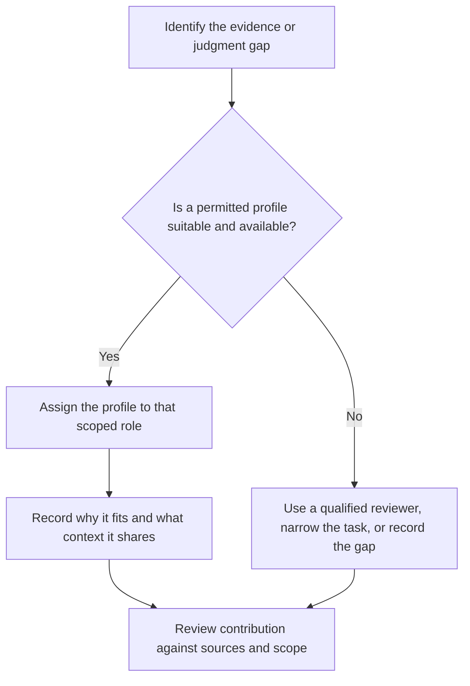
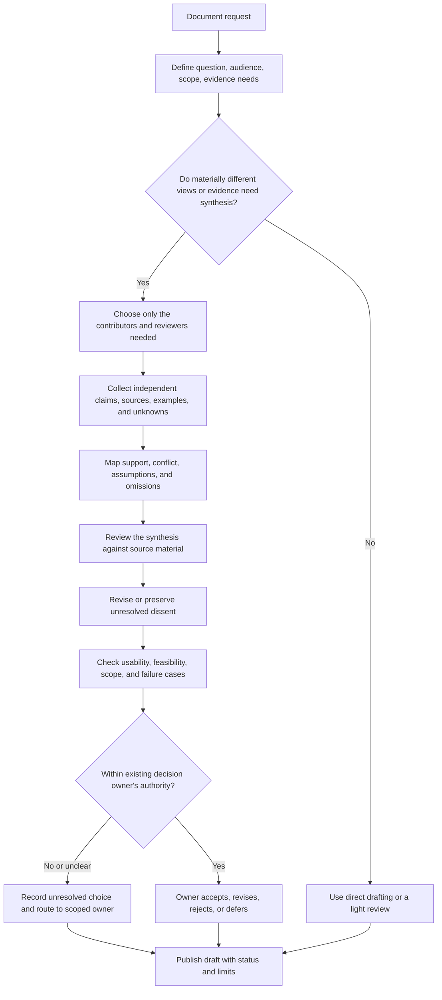
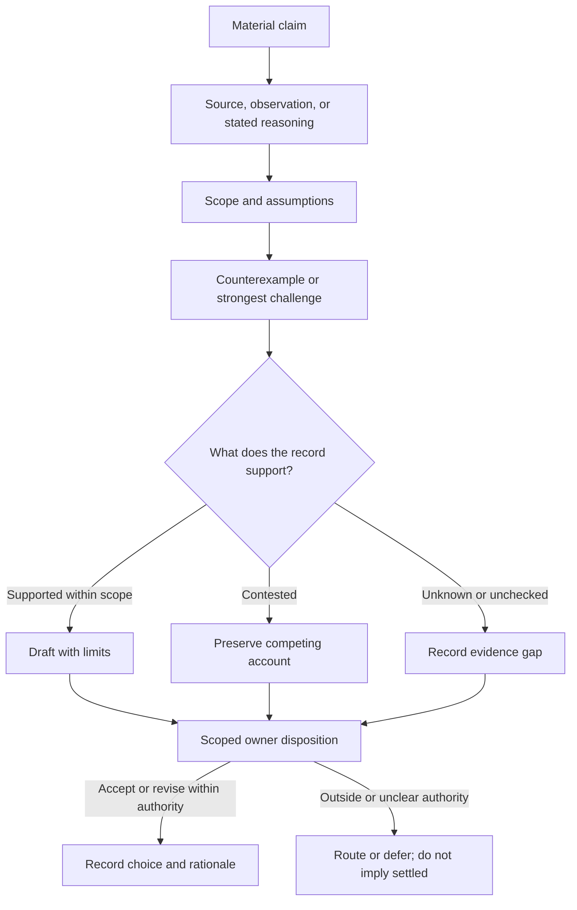

# Recursive Synthesis

Use this first-party workflow to develop a consequential document from distinct viewpoints, evidence, critique, and revision. It is a configurable collaboration method, not a fixed staffing plan or empirical guarantee. The named phases below are a useful default sequence; combine, skip, or repeat stages when the document's scope and risks justify it.

Synthesis produces a reviewable draft. It does not confer authority. Follow the decision rights already established for the work: preserve the named owner's scope and prior authorization, and route only choices outside that authority to the person or body empowered to decide. If authority is unclear and a consequential decision depends on it, record the uncertainty and resolve the ownership question before presenting a choice as settled.

This document-synthesis workflow is distinct from Li et al.'s paper-specific Recursive Synthesis for Long-Horizon Terminal Tasks (RST), which grows verified terminal-task data. See [the related-method reference](references/source-algorithm-and-verification.md) for its algorithm and transfer limits.

## Choose the process size

Use the smallest process that can expose the meaningful alternatives and verify consequential claims. A short scope note, two independent drafts, and one focused review may suffice. A broad charter or architecture document may need additional domain reviewers, staged synthesis, and a record of dissent. Contributor count, rounds, lengths, and timeboxes are project choices; none is a universal complexity threshold.

For each role or task, select a contributor or method profile only when it is approved, available, and suited to the evidence and judgment needed. Provider or model names in a local example are not rankings or recommendations. Separate profiles do not by themselves establish independence; record shared sources, context, and constraints when they matter.

## A configurable document workflow

The reference templates retain a fuller seven-stage arrangement (setup plus six work phases). Use it when useful, not as a required ceremony.

1. **Setup.** State the decision question, intended readers, scope, constraints, evidence needs, and existing decision owner. Name what the document cannot decide. Choose a collaboration method and a stop condition proportional to the work.
2. **Diverge.** Ask contributors to work independently where independence would reduce anchoring. Give them the same problem statement and access to necessary sources. Ask for claims, reasons, counterexamples, uncertainty, and practical consequences. Do not prescribe a fixed number of contributors, words, principles, or perspectives.
3. **Map.** Extract claims and attach their sources, assumptions, scope, and evidence status. Separate shared support from actual agreement; identify disagreement, missing perspectives, and questions that cannot be settled from the available evidence. A majority or high agreement can be correct and does not by itself establish truth.
4. **Comment.** Invite authors and relevant reviewers to check whether the draft represents their position accurately. A strong critique can first state what it understands correctly, then identify errors, evidence gaps, tradeoffs, and a proposed correction. This is a useful review structure, not a quota or a reason to suppress direct factual correction.
5. **Consolidate.** Revise the document for a coherent purpose and audience while keeping distinct claims and unresolved conflicts visible. Use a dissent or decision log when it helps future readers understand alternatives, the responsible decision owner, rationale, costs, and revisit conditions.
6. **Reality-check.** Ask reviewers with relevant operational, technical, user, legal, or domain knowledge to test the draft cold when that perspective would add value. Independence may help reveal assumptions that participants stopped noticing, but reviewer confusion is evidence to investigate, not proof the document is wrong. No role is categorically excluded from earlier work.
7. **Finalize and disposition.** Incorporate, reject, or defer review findings with reasons. Record the document's status, scope, unresolved items, sources, and decision owner. The owner makes only the choices within their authority. Keep the draft, dissent, and final decision distinct if the governance process requires it.

### Claim and dissent ledger

For each material claim, track a concise record:

| Field | What to capture |
|---|---|
| Claim | Exact proposition and intended scope |
| Source or basis | Primary source, observation, stakeholder account, reasoning, or constructed example |
| Assumptions | Conditions the claim depends on |
| Counterevidence | Strongest relevant challenge or alternative |
| Status | Supported for stated scope, contested, unknown, or not checked |
| Decision | Accepted wording, revision, deferral, or unresolved dissent |
| Authority | Person/body authorized to make the decision, if one is needed |

Agreement is a property of the reviewed inputs, not a measure of correctness. Preserve independent sources, contrary observations, abstentions, and missing evidence. Do not turn a vote, ranked list, or agreement percentage into an evidence test. A useful summary can distinguish a shared finding, a contested interpretation, and a policy choice without forcing one consensus score.

## Review questions

Use the questions that fit the document; they are prompts, not pass/fail thresholds.

- Does the problem statement distinguish facts, values, and decisions?
- Are sources current and appropriate to the specific claims they support?
- Is a shared term hiding incompatible definitions?
- Has the synthesis combined positions in a way that neither source author intended?
- Does a proposed compromise preserve the relevant benefits while making its costs explicit?
- Which strong counterexample or affected perspective could change the conclusion?
- What is unknown, and what action would reduce that uncertainty?
- Can the intended reader use the draft without needing the process history?
- Are implementation, ownership, accessibility, and failure conditions visible?
- Which remaining choice is a policy decision, and who has authority to make it?

## Failure signals and response

Treat these as diagnostic prompts, not proven causal tests:

- **Echoing language:** Contributors use the same framing without independent sources or reasoning. Check shared prompts, context, evidence, and model dependence; seek a genuinely different source or affected perspective if it matters.
- **Apparent convergence:** The draft has little dissent. Check whether counterexamples were invited, whether disagreement was resolved by evidence or simply omitted, and whether the common position is well-supported. Do not manufacture disagreement to meet a quota.
- **Context loss:** Later edits omit earlier qualifications or evidence. Maintain a source-linked claim ledger and review the changed passages against it.
- **Analysis paralysis:** Reviews repeat without changing a material claim or surfacing new evidence. Ask the scoped owner to decide, revise scope, or document the remaining uncertainty and stop condition.
- **Complexity theater:** Coordination artifacts outgrow the document's value. Remove process steps that do not improve evidence, fairness, usability, or accountability.
- **Late-stage regression:** The final edit weakens a supported claim or erases a material dissent. Compare it with the reviewed draft and disposition log; apply only justified changes.

## Constructed example: API governance document

This is an illustrative scenario, not an empirical case study. Suppose an organization is drafting API design guidance and contributors prefer different tradeoffs: resource-oriented HTTP conventions, typed query interfaces, latency, security, developer tooling, asynchronous workflows, legacy integration, domain boundaries, platform operations, and mobile constraints.

The synthesis can identify possible common requirements such as machine-readable contracts or consistent authentication, but it should not report an agreement rate unless it actually collected and defined that measure. The REST/GraphQL and synchronous/asynchronous choices remain separate design questions. A proposed document may recommend a default and specify exceptions, but the named owner must decide within their delegated scope. The decision log should state the evidence considered, affected systems, migration costs, exceptions, and conditions for revisit. No rollout duration, adoption rate, or future dispute-resolution rate is implied by this constructed example.

## Boundaries

Prefer direct drafting for a narrow or urgent request, an uncontested document, a quick summary, or a single-author task. Use focused consultation if only one expertise gap needs filling. Use this workflow when meaningful alternatives, evidence, accountability, or preserved dissent justify the additional coordination.

For prompt templates and fuller phase examples, read [Phase Templates](references/phase-templates.md). For assumptions and design rationale behind this local process, read [Process Design](references/process-design.md). Use the [RST related-method reference](references/source-algorithm-and-verification.md) only when comparing the paper's verified-seed terminal-task algorithm; the paper does not define this document workflow.
