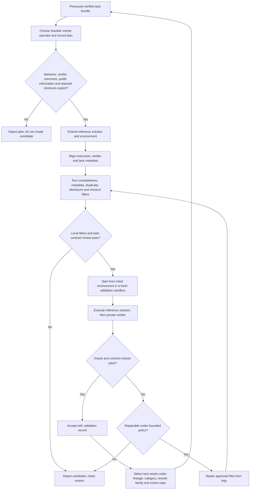
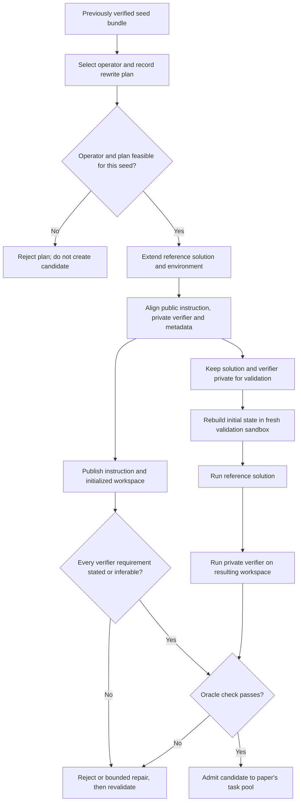

# Recursive synthesis: paper algorithm, safeguards, and transfer boundary

Li et al., “Recursive Synthesis for Long-Horizon Terminal Tasks,” arXiv:2608.05466 v1 (2026-08-05), was read on 2026-09-24 at abstract, Methods §§4.1–4.4, and relevant appendix material from the [pinned primary HTML](https://arxiv.org/html/2608.05466v1). The paper calls its algorithm Recursive Synthetic Terminal Tasks (RST). It generates executable terminal-agent task data from already verified task bundles; it is not this skill’s first-party document-synthesis workflow.

The paper’s example loop starts from a verified seed task containing a public instruction, initialized environment/workspace, reference solution, verifier, and task metadata. For each round, the generator selects a feasible rewrite operator and writes a plan for the changed behavior, solution/environment modifications, verifier outcomes, information available to the agent, and shortcuts to reject. Cosmetic changes, unrelated checks, and requirements hidden only in private tests are grounds to reject a plan. The generator extends the executable solution and environment first, then aligns the verifier, public instruction, and metadata to that workflow.

## RST candidate gates described in the paper

| Stage | Check or action | Rejection / retry boundary |
|---|---|---|
| Seed and target | Start from an accepted seed with the expected task components; select an operator feasible for its files, tools, dependencies, and workflow. Record the intended behavior and evidence in a plan. | Reject a plan that is cosmetic, unrelated to executable behavior, or depends on information available only in private tests. |
| Rewrite and contract | Extend the reference solution and supporting environment; update verifier, public instruction, and runtime metadata to match. Every verifier requirement must be stated in the public instruction or inferable from the workspace. | A reference solution passing the verifier is oracle validity in the paper’s terminology; it is separate from task-contract validity. Neither establishes that the verifier is semantically complete or sound. |
| Local filters | Check required files/components and metadata, near-duplicates, and accidental disclosure of private verifier information. Audit whether a shortcut can pass without the intended workflow. | Reject candidates failing a local check before allocating a sandbox. These filters reduce known failure modes; they do not prove novelty or eliminate leakage. |
| Fresh sandbox and repair | Build the environment from its initial state, execute the reference solution, then run the private verifier on the resulting workspace. If a failure is repairable, permit a limited repair restricted to approved files, using the validation logs, and rerun validation. | Discard persistent failures. A fresh initial sandbox is a re-run condition, not proof of sandbox isolation or verifier correctness. |
| Next-round pool | Select accepted tasks under caps on parent lineage, category, rewrite family, and generation cohort. | Caps are the paper’s diversity policy, not a universal formula. The paper reports results for its setup; it does not establish unbounded scaling or general-document benefits. |

The candidate pipeline below summarizes the method; its gates are not claims that a passing check covers every intended property. The paper reports fifteen rounds and 37,484 tasks for its setup. Those figures are author-reported results, not an unlimited-scaling guarantee.

The second diagram separates the agent-facing public task contract from the solution/verifier used for validation. Passing both checks is the paper’s admission criterion for its task-generation setting; it is not an independent proof of verifier soundness, complete requirement coverage beyond the inspected contract, sandbox isolation, or deployment readiness. Do not transfer this RST procedure to ordinary multi-agent document drafting; the first-party workflow remains in `SKILL.md` and the other linked references.
