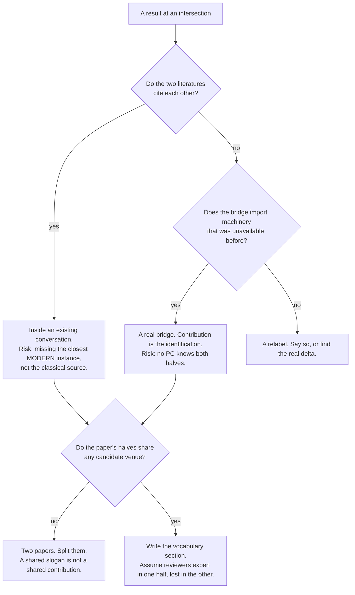

# Research Paper Submission

Getting a between-fields result published. The failure mode this skill exists for
is not bad writing — it is a correct, well-written paper that no community
recognises as theirs, positioned against literature its author never knew to
search.

## When to Use

✅ **Use for**: choosing a venue; writing a contributions or related-work
section; checking whether a term you are about to coin is taken; finding prior
art in a field whose vocabulary you do not speak; making imported machinery
readable for non-specialists; a pre-submission correctness pass.

❌ **NOT for**: doing the proof or experiment (do that first — this skill
presents it); internal house-voice write-ups (`harbor-exposition`); grant
proposals, theses, or blog posts; general copy-editing.

## The premise that governs everything

Work at an intersection is usually **transplantation**: an established theorem
from a community that has never heard of your application, re-derived against
your scenario. That is a legitimate contribution, and it determines how you will
be reviewed. It fails in three ways, and knowing which one you face decides
every subsequent choice.



## Order of work

Do these in order. Steps 1–2 change what the paper *is*; doing them after
drafting means rewriting.

1. **Positioning** — fill in `templates/positioning-worksheet.md` before writing
   the contributions paragraph. It is built from real failures; every question
   corresponds to one.
2. **Prior art** — run the protocol in `references/finding-prior-art.md`.
   Snowball two rounds from a seed; cross vocabulary boundaries deliberately via
   controlled vocabularies; run the naming check on anything you plan to coin.
3. **Venue** — `references/venue-map.md`. Page budget differs by more than 2×
   across candidates, so a late choice means a rewrite.
4. **Structure** — `references/exemplar-structures.md`. Match the target
   community's dialect for contributions, related work, and where notation goes.
5. **Exposition** — `references/exposition-craft.md`. Definitions local and
   immediately before use; theorems readable cold; analogies that carry a
   candidate inference.
6. **Figures** — `references/figures-and-examples.md`.
7. **Mechanical pass** — `scripts/submission_lint.py`, then answer every
   claim-to-confirm it raises.

```bash
python3 scripts/submission_lint.py paper.tex --figures-dir ../figures
python3 scripts/submission_lint.py paper.tex --bib refs.bib --quiet-info   # errors only
python3 scripts/test_submission_lint.py                                     # 20 assertions
```

## Anti-Patterns

### Searching only in your own vocabulary

**Novice**: "I searched thoroughly and found no prior work."
**Expert**: You searched thoroughly *in your own words*. A paper that solves your
problem under another name is invisible to every keyword you would think of. The
fix is structural: state your result with **no term of art from the field you
import from**, then search that; use each adjacent field's controlled vocabulary
(ACM CCS, MSC, JEL, arXiv categories); snowball forward from any one anchor you
do find.
**Detection**: your related-work section cites only venues you already read. A
result at an intersection of *n* fields with citations from one field is not
finished.
**Real cost**: a characterization claimed as a contribution had been published 13
years earlier, with the same alphabet split and the same degenerate case, and was
found only because an unrelated third paper mentioned it in passing.

### Coining a term that is already taken

**Novice**: "I'll call this *regimentation* — it's descriptive."
**Expert**: quote-search the exact phrase across adjacent fields **before** it
enters the draft. If taken and it means the same thing, adopt and cite — that
converts a novelty risk into a free citation of the founding work. If taken and
different, rename. Coin only when neither applies.
**Detection**: any term introduced without a citation that a reader in an
adjacent field might already know.
**Real cost**: one paper used a normative-multi-agent-systems term of art as if
coining it; another named a theorem after a result in information economics that
concludes **the opposite**.

### Front-loaded preliminaries

**Novice**: "Section 2: Preliminaries. All notation and definitions."
**Expert**: every practitioner source that can be verified disfavours it —
Tsitsiklis marks it "optional; avoid it if you can", Krantz says it discourages
readers, Dreyer's "just in time" is a structural argument against batching. What
they *do* require is a tight local run of definitions immediately before the
result that needs them. The difference is proximity, not whether definitions
appear — the referees' most common complaint is still *missing* definitions.
**Detection**: a definition in §2 whose first use is in §5.

### Formalism without its intuitive reading

**Novice**: the theorem is stated precisely, so the paper is done.
**Expert**: Tao's target is the *post-rigorous* stage — formalism present and
checkable, always alongside the intuition. A paper showing only rigorous
formalism asks every reader to redo the labour the author already did.
**Detection**: a boxed theorem with no sentence before it saying what it means.

### One example, mandatory for everyone

**Novice**: the worked example belongs in the main argument.
**Expert**: two cognitive-load results pull opposite ways. The **worked-example
effect** (Sweller & Cooper 1985) says a newcomer measurably needs it. The
**expertise-reversal effect** (Kalyuga et al. 2003) says the same example taxes
the specialist, who must reconcile it against a schema they already hold. So the
example must exist **and be visibly skippable** — a labelled box or aside — so
each reader takes only the load they need.
**Detection**: a specialist cannot reach the theorem without reading the toy case.

### Decorative analogy

**Novice**: "It's like a bouncer at a door" — vivid, so it helps.
**Expert**: Gentner's structure-mapping says analogy transfers **relations**, not
attributes, and earns its place by licensing a *candidate inference* — something
you did not already know, projected from base to target, that then checks out.
An analogy sharing surface features is a mere-appearance match and is "sharply
limited in predictive utility."
**Detection**: the analogy cannot survive one "so does that mean…?" question.

### Trusting a verification sweep that cannot fail

**Novice**: "4,000 randomized instances, zero violations."
**Expert**: check what the assertion actually evaluates. A sweep whose test
rearranges the inequality it is testing, or whose loop never consults the mutant
flag, is a tautology with a seed. It will report zero violations on a false
theorem.
**Detection**: can you algebraically derive the assertion from the theorem
statement printed above it? Then it is not evidence.
**Real cost**: a "76,000 schedules, 0 dominate" claim was entailed by an
inequality chain three lines above it — and the sweep was therefore structurally
incapable of catching the infeasible optimum it was meant to validate.

### Superlatives the proof does not deliver

**Novice**: "unbounded depth", "provably does not", "enforces exactly".
**Expert**: each is a promise with a specific proof obligation. "Unbounded" must
not describe a logarithmic bound. "Exactly" is an iff and needs both directions,
checked at the degenerate cases. A negative existence claim needs a proof, not a
failure to exhibit.
**Detection**: `submission_lint.py` flags all of these. It independently
rediscovered four false "unbounded depth" claims and one false "provably does
not" in a corpus that had already been manually audited.

## Quality Gates

```
□ positioning-worksheet.md filled in BEFORE the contributions paragraph
□ Result stated once with no term of art from the imported field
□ Every coined term run through the naming check; decision recorded
□ Prior art searched in ≥1 adjacent field's own controlled vocabulary
□ Nearest prior work's theorem quoted verbatim WITH its hypotheses
□ Closest modern instance cited, not only the classical source
□ Venue chosen before drafting; page budget matches
□ Contributions/related-work format matches the target community's dialect
□ Definitions local, immediately before first use — no orphan preliminaries
□ Every theorem has an intuitive reading adjacent to it
□ Worked example present and visibly skippable
□ Every analogy licenses a checked candidate inference
□ Honest boundary in the paper's own voice, named as the venue names it
□ Figures survive greyscale; colour is never the sole channel
□ Every verification claim could actually have failed
□ submission_lint.py: zero errors, every claim-to-confirm answered
```

## References

- `references/venue-map.md` — **Read when** choosing a venue or working out
  which community a result belongs to. Format/blindness table, the three
  transplantation failure shapes, live adjacent conversations.
- `references/finding-prior-art.md` — **Read when** writing related work,
  checking whether a term is taken, or claiming novelty. Snowballing, controlled
  vocabularies, per-tool blind spots, verification discipline.
- `references/exposition-craft.md` — **Read when** placing definitions, stating
  a theorem, or writing an analogy. Verbatim guidance from Halmos, Knuth,
  Krantz, Tao, Mermin, Peyton Jones, Dreyer, Tsitsiklis; the two cognitive-load
  effects; Gentner's systematicity test.
- `references/exemplar-structures.md` — **Read when** structuring the paper or
  writing the first sentence. Nine opening moves with verbatim examples;
  per-community conventions; two structures worth copying wholesale.
- `references/figures-and-examples.md` — **Read when** designing a figure or
  caption. What is experimental versus expert opinion versus craft lore; the
  Okabe–Ito palette; theory-figure conventions.
- `templates/positioning-worksheet.md` — **Fill in before** the contributions
  paragraph. Ten sections, each from a real failure.
- `scripts/submission_lint.py` — **Run before** every submission. Dangling refs
  and citations, duplicate labels, uncaptioned floats, missing limitations,
  unhedged superlatives.
- `scripts/test_submission_lint.py` — **Run after** editing the linter. 20
  assertions including the `\\{` brace regression.

<!-- BEGIN BUNDLE INDEX (auto: index_references.py) -->

## Skill Bundle Index

*Every file in this skill, and when to open it. Auto-generated; run `scripts/index_references.py --fix`.*

**root**
- [`CHANGELOG.md`](CHANGELOG.md) — Research Paper Submission — Changelog — Built from five parallel primary-source research passes: venue CFPs fetched and read, fifteen recent strong papers read in full, practitione

**`references/`**
- [`references/exemplar-structures.md`](references/exemplar-structures.md) — How strong papers in this space are actually built — **Read when** structuring a paper, writing the first sentence, formatting a contributions list, or deciding where the running example goes.
- [`references/exposition-craft.md`](references/exposition-craft.md) — Explaining formal ideas to readers who are not specialists in them — **Read when** drafting a section that imports machinery from another field, deciding where definitions go, stating a theorem, or writing an 
- [`references/figures-and-examples.md`](references/figures-and-examples.md) — Figures, captions, and worked examples — **Read when** designing a figure for a theory paper, writing a caption, or deciding how to use a running example.
- [`references/finding-prior-art.md`](references/finding-prior-art.md) — Finding prior art across a vocabulary boundary — **Read when** writing a related-work section, checking whether a term is already taken, or trying to establish that something is novel.
- [`references/venue-map.md`](references/venue-map.md) — Venue map and literature positioning — **Read when** choosing where to submit, or working out which community a result actually belongs to.

**`scripts/`**
- [`scripts/submission_lint.py`](scripts/submission_lint.py) — submission_lint.py - mechanical pre-submission checks for a LaTeX paper.
- [`scripts/test_submission_lint.py`](scripts/test_submission_lint.py) — Tests for submission_lint. Run: python3 test_submission_lint.py

**`templates/`**
- [`templates/positioning-worksheet.md`](templates/positioning-worksheet.md) — Positioning worksheet — Fill this in **before** writing the contribution paragraph, not after.

<!-- END BUNDLE INDEX -->
