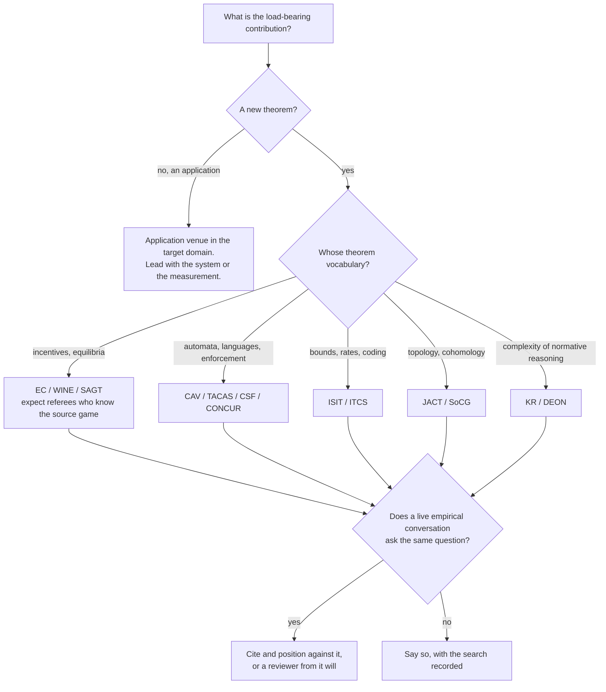

# Venue map and literature positioning

**Read when** choosing where to submit, or working out which community a result
actually belongs to.

All deadlines are from the **2025–26 CFP cycle** and shift yearly — recheck
before relying on one. Claims are `[verified]` (page fetched and read),
`[probable]` (one strong source, not independently confirmed), or `[uncertain]`.

## Format and blindness, by venue family

The single most useful fact here is how much the page budget differs. A result
that fits AAMAS's 8 pages is a different artifact from the same result at EC's
18, and choosing late means rewriting.

| Venue | Limit | Blind | Notes |
|---|---|---|---|
| **EC** | ≤18 pp body, unlimited appendix | double | Explicit anti-padding desk-reject warning `[probable]` |
| **WINE** | ≤12 pp excl. refs, 11pt min | double | Rebuttal phase; format deviation is a stated desk-reject risk `[verified]` |
| **SAGT** | ≤18 pp incl. refs, LNCS | anonymized | Accepts arXiv-prior work if anonymized `[probable]` |
| **AAMAS** | ≤8 pp + unlimited refs | double, mandatory | Separate JAAMAS track for already-published journal work `[probable]` |
| **AAAI** | 7 pp + 2 pp refs | double | AAAI-27 has an **AI Alignment special track** `[probable]` |
| **NeurIPS / ICML** | ≤9 / 8 pp + unlimited appendix | double | Strong empirical bar — see the warning below |
| **CCS** | 12 pp + Ethics appendix | double | Anonymous artifact URL required at submission `[probable]` |
| **NDSS** | ≤18 pp camera-ready | double | AE badges, 2 pp artifact appendix `[probable]` |
| **USENIX Sec** | — | double | **Open-science/artifact sharing required at submission** as of the 2026 cycle `[probable]` |
| **OSDI** | "the right length", ~12 pp | double | Padding actively discouraged `[probable]` |
| **NSDI / EuroSys** | ≤12 pp | double | `[probable]` |
| **CAV** | 18 pp regular / 10 pp tool | regular anonymized, tool not | `[probable]` |
| **CONCUR** | ≤15 pp, LIPIcs | — | Appendix not guaranteed reviewed, not published `[probable]` |
| **TACAS** | 16 pp / 6 pp demo | ETAPS norm | **Mandatory AE for tool papers**, voluntary otherwise `[probable]` |
| **POPL** | — | full double-blind | Identities withheld until conditional accept `[probable]` |
| **JACT** | journal | standard | Home of Hansen–Ghrist spectral sheaf theory `[verified]` |

Venues worth adding that are easy to overlook: **CSF** (IEEE Computer Security
Foundations) — the actual home of the enforcement-theory lineage; **KR** — where
tractability dichotomies for normative reasoning live; **DEON** — exact topical
match for deontic fragments but small and philosophy-leaning, biennial; **ISIT**
— for anything that is really an information-theoretic bound; **AFT** and **FC**
for cryptoeconomic mechanism design.

## The transplantation pattern, and what it costs

Read across a corpus that imports mature theorems into a new domain, the
recurring move is: take an established result from a community that has never
heard of your application (supervisory control from 1980s factory-floor control
engineering; inspection games from arms-control economics; spectral sheaf theory
from applied topology; declassification from language-based security; Akerlof
from information economics; Erlang-C from queueing) and re-derive it against
your scenario.

This is a **transplantation** program, not a new-foundations one. That is a
legitimate and citable kind of contribution, but it determines everything about
how the work is reviewed, and it fails in three characteristic ways.

### (i) Squarely inside an existing conversation

Where the source theorem is imported honestly and extended, the paper sits
inside a mainstream conversation and will be reviewed by people who know the
source cold. The exposure here is not novelty — it is **missing the closest
modern instance**. A deterrence/inspection-game paper that cites Becker and the
inspection-games handbook but not the peer-prediction and crowdsourced-quality
literature (Miller, Resnick & Zeckhauser 2005, *Management Science*
`[verified]`) invites exactly one referee comment, and it is fatal.

### (ii) Genuinely between conversations — the valuable case

A real bridge is one where the two literatures **do not currently cite each
other**. Two tests that it is real rather than rebranding:

- Can you name a reader in field A who has never read field B's founding paper,
  and vice versa? If a formal-methods audience has essentially never read the
  control-theory source, and control theorists do not read security venues, the
  identification is a contribution rather than a relabel.
- Does the bridge *import machinery* that was not previously available? "Naming
  the condition imports the synthesis machinery" is a real claim. "Naming the
  condition makes it sound rigorous" is not.

The structural risk is that a genuine bridge has **no programme committee that
knows both halves**. Topologists will not recognise the Byzantine-accountability
stakes; systems reviewers cannot referee sheaf Laplacians. Plan for reviewers
who are expert in one half and lost in the other — which is an argument for
writing the vocabulary section (see `exposition-craft.md`) rather than assuming
it away.

### (iii) At risk of falling between stools

Two failure shapes, both recoverable if caught early:

**The two-audience single paper.** A result too theorem-first for an empirical
venue and too application-motivated for a theory venue satisfies neither. The
fix is not a different venue — it is a rewrite that picks one readership: strip
the motivation to a paragraph and lead with the theorem in the theory
community's native notation, *or* add the real empirical section. A paper cannot
serve both simultaneously.

**Two papers stapled together.** If a paper's halves belong to different
literatures with *no overlapping venue*, each half reads as padding to a
reviewer who came for the other. This is worth checking explicitly: list the
venues that fit part I and the venues that fit part II, and if the intersection
is empty, split the paper. A shared slogan is not a shared contribution.

## The empirical-bar warning

For anything framed around LLM agents: NeurIPS and ICML main tracks now expect
evaluation at a scale that hand-worked closed forms and seed-based simulation
scripts do not meet. Toy-scale simulation plus a real theorem is a **workshop**
submission at those venues (scalable oversight, safe/trustworthy agents), or a
main-track submission somewhere that reviews theorems. Choosing the main track
with N=60 simulations is the most predictable rejection in the whole map.

## Live adjacent conversations to position against

Transplantation work is most often blindsided not by the source field but by a
*contemporary* conversation asking the same question with different tools.

- **AI control / scalable oversight** (the Redwood Research line; Greenblatt et
  al., "AI Control: Improving Safety Despite Intentional Subversion", ICML 2024
  `[verified]`) asks precisely "what can a runtime prevent versus merely detect
  when the untrusted component is an LLM" — empirically, via red-team/blue-team
  protocols rather than formal characterization. Any paper answering that
  question formally is adjacent to this whether or not it cites it, and its most
  natural readers are not the ones who referee at formal-methods venues.
- **Peer prediction and crowdsourced quality control** for anything about agents
  grading agents.
- **Accountable Byzantine agreement** (PeerReview, Haeberlen–Kouznetsov–Druschel,
  **SOSP 2007** `[verified]` — often miscited as OSDI) for anything about
  detecting equivocation in gossip.
- **Sheaf neural networks** (Bodnar et al., NeurIPS 2022 `[verified]`) as
  evidence that the cellular-sheaf toolkit has an active ML readership.

## Choosing, in practice

## Before choosing, answer these

- Which single readership is this paper for? Name it.
- What does that community expect in the first two pages that another would not?
- Is there a live empirical conversation asking my question with other tools?
- If the paper has two halves, do their candidate venue sets intersect at all?
- Is the closest *modern* instance of my problem cited, not just the classical
  source?
