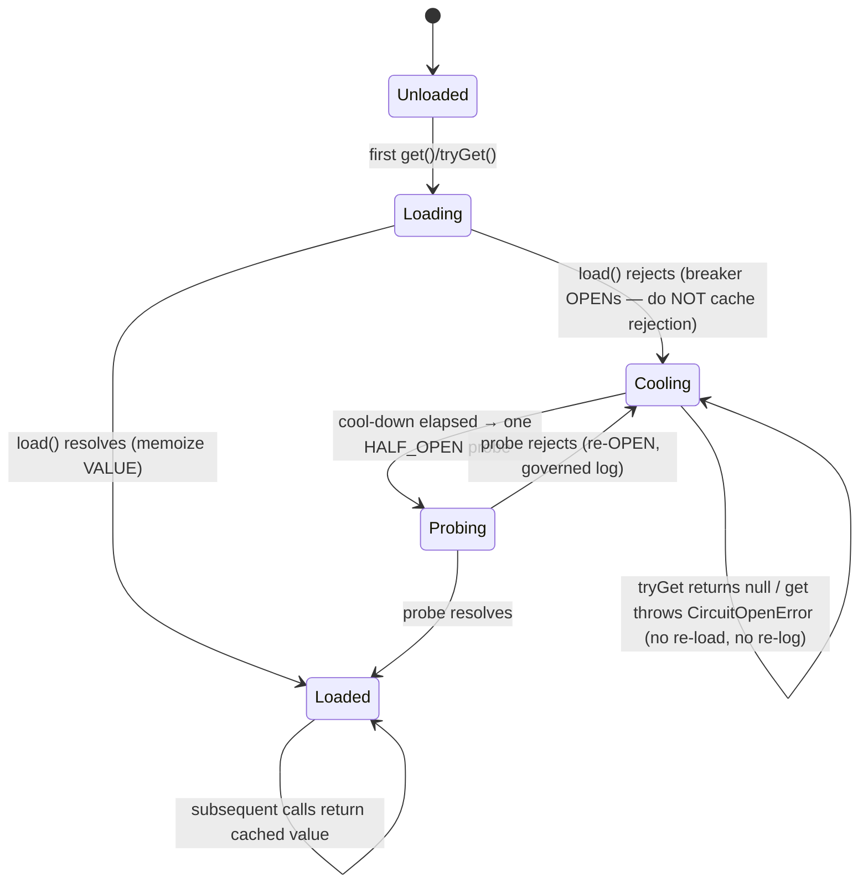
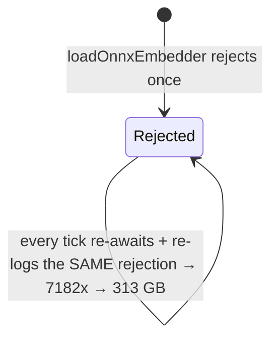

# Resilience Wiring for Load-Once Dependencies

Applying a circuit breaker + full-jitter backoff to a **memoized, lazily-loaded
dependency** — the one case the general resilience canon does not cover, because
here the failure is cached and re-awaited rather than re-requested.

> **Read [[circuit-breakers-and-retries]] first for anything general.** That skill
> owns full-jitter backoff, Google SRE retry budgets, deadline propagation, the
> CLOSED/OPEN/HALF_OPEN state machine, and the retriable-status whitelist. This
> skill assumes you have a working `CircuitBreaker` and does NOT re-derive it.

## When to Use

✅ **Use for**:
- A dependency loaded once and memoized: `getEmbedder()`, `getPool()`, a native
  addon / dylib, an ONNX or other ML model, a singleton client.
- You see a module-level `let xPromise` (or singleton) assigned once inside a
  `getX()` and awaited in a loop — the poison-pill shape.
- A failing dependency is flooding logs/disk, or being re-loaded every tick.
- Deciding whether a dependency is OPTIONAL (skip when down) or REQUIRED (fail).

❌ **NOT for** (→ use [[circuit-breakers-and-retries]]):
- General request-level retries, retry budgets, or the breaker math/formulas.
- Choosing jitter parameters or cascading-failure amplification analysis.
- Anything that is not a *load-once / memoized* dependency.

---

## The delta, in one diagram

A load-once dep has a state the general breaker case doesn't: `loaded`. The bug is
caching a *rejection* as if it were `loaded`. The fix caches only success.



Contrast the anti-pattern, whose only "state" is a permanently-rejected promise it
re-awaits forever:



---

## Core Process

### Step 1: Spot the poison-pill shape

Grep for a memoized promise/singleton with no failure reset, awaited in a loop:

```bash
grep -rnE '(let|var)\s+\w*(Promise|Instance|Client|Embedder|Pool)\b' --include='*.ts' src | grep -iv 'reset\|null'
```

If a `getX()` assigns `xPromise` once and never clears it on rejection, a single
permanent failure becomes a rejection cached forever. That is the bug.

### Step 2: Classify the dependency's load-shape

- **OPTIONAL enrichment** (semantic hints, embeddings): the caller can produce a
  correct result without it → `tryGet(): T | null`, caller ships the un-enriched
  result when it returns null.
- **REQUIRED** (DB pool, auth key): load-bearing → `get(): Promise<T>` that throws
  `CircuitOpenError` when down, so the caller fails loudly rather than silently
  returning wrong/empty data.

Getting this backwards is a bug both ways: OPTIONAL-as-required takes a feature
fully down on an enrichment outage; REQUIRED-as-optional returns silent wrong answers.

### Step 3: Wrap the load in a gated loader

Replace the memoized `getX()` with `createGatedLoader(load, { name, breaker, ... })`
— see `references/gated-loader.md` for the full implementation. It guarantees:
1. **Only success is memoized** (a failure never becomes a cached poison pill).
2. **The load failure is governed** (reported once per window, not once per tick).
3. **Concurrent callers coalesce** onto one in-flight load (no cold-start stampede).

### Step 4: Actually wire it (do not stop at "the primitive exists")

The deliverable is the *rewired call site*, not the utility. Confirm the old
memoized singleton has zero remaining callers and the gated loader is imported by
LIVE code, not only tests:

```bash
grep -rn 'getEmbedder\|xPromise' src               # → only the loader internals remain
grep -rln 'createGatedLoader' src | grep -v test   # → MUST be non-empty
```

See `scripts/herd_sim.py` to watch the storm (7182 ticks → 323 GB) collapse to a
governed handful of logs, plus the breaker state-machine trace.

---

## Anti-Patterns

### Anti-Pattern: Poison-Pill Memoized Promise

**Novice**: "I memoize the load promise so it only runs once — caching is good."
**Expert**: Memoizing the *promise* caches its rejection too. `if (!xPromise) xPromise = load()`
turns one permanent failure (missing dylib) into a rejection that every subsequent
`await` re-throws and re-logs. Memoize only the resolved VALUE; gate re-loads with a
breaker. Real incident: `semantic-resolver.getEmbedder()` → 7,182 re-awaits → 313 GB
write storm.
**Detection**: a module-level `let xPromise` assigned once, never reset on `.catch`,
awaited inside a poll/fleet loop.

### Anti-Pattern: The Primitive Exists but Is Dead Code

**Novice**: "We already have `agent-resilience.ts` with a circuit breaker, so we're covered."
**Expert**: Having the primitive in the tree does not equal wiring it. Port Daddy's
correct `fullJitterDelay` + `BackendCircuitBreaker` were **exercised only by unit
tests**; the live spawn/poll paths hand-rolled or omitted backoff and never touched
the breaker. An audit that greps for `class CircuitBreaker` and finds one proves
nothing — grep for its **non-test call sites** and confirm the hot paths route through
it. A resilience util with no live importer is worse than none: it *looks* like coverage.
**Detection**: `grep -rln 'circuit\|resilience' src | grep -v test` returns empty (or
only test files) while retry logic is hand-rolled at call sites.

---

## References

Consult these for deep dives — NOT loaded by default:

| File | Consult When |
|------|-------------|
| `references/gated-loader.md` | Writing the `createGatedLoader` code (get/tryGet/coalescing) |
| `references/incident-and-detection.md` | Auditing a repo for the storm; writing the post-mortem; grep/ops symptom playbook |
| `scripts/herd_sim.py` | Runnable stdlib demo: storm vs gated-loader, and the breaker trace |
