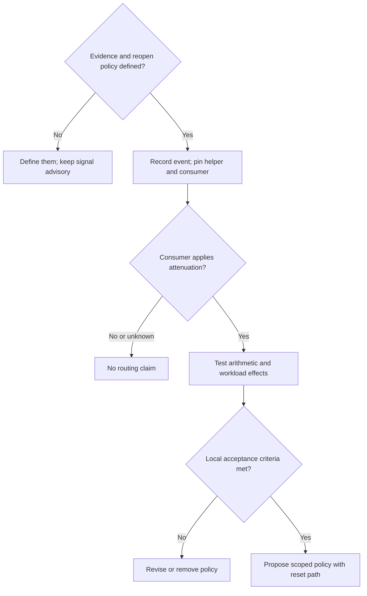

# Diagram 1: Resolution signal investigation

Require completion evidence and an invalidation policy before recording a signal. Pin both the read helper and the consumer. Workload tests include unresolved, partial, falsely completed, reopened and urgent tasks; measure missed useful work alongside duplicate revisits.

