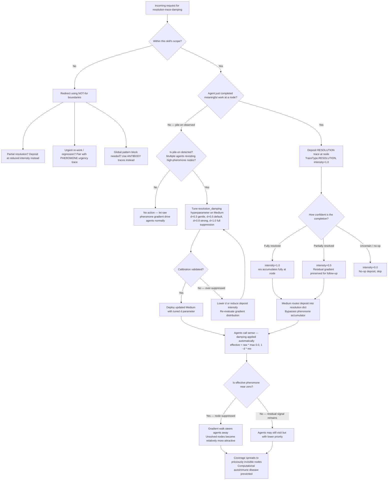

# Diagram 1: flowchart

```mermaid
flowchart TD
  A[Incoming request for resolution-trace-damping] --> B{Within this skill's scope?}
  B -->|No| C[Redirect using NOT-for boundaries]
  B -->|Yes| D{Agent just completed meaningful work at a node?}

  C --> C1[Partial resolution? Deposit at reduced intensity instead]
  C --> C2[Urgent re-work / regression? Pair with PHEROMONE urgency trace]
  C --> C3[Global pattern block needed? Use ANTIBODY traces instead]

  D -->|No — pile-on observed| E{Is pile-on detected?\nMultiple agents revisiting high-pheromone nodes?}
  D -->|Yes| F[Deposit RESOLUTION trace at node\nTraceType.RESOLUTION, intensity=1.0]

  E -->|No| G[No action — let raw pheromone gradient drive agents normally]
  E -->|Yes| H[Tune resolution_damping hyperparameter on Medium\nd=0.3 gentle, d=0.5 default, d=0.8 strong, d=1.0 full suppression]

  F --> I{How confident is the completion?}
  I -->|Fully resolved| J[intensity=1.0\nres accumulates fully at node]
  I -->|Partially resolved| K[intensity=0.5\nResidual gradient preserved for follow-up]
  I -->|Uncertain / no-op| L[intensity=0.0\nNo-op deposit, skip]

  J --> M[Medium routes deposit into resolution dict\nBypasses pheromone accumulator]
  K --> M
  M --> N[Agents call sense — damping applied automatically\neffective = raw * max 0.0, 1 - d * res]

  N --> O{Is effective pheromone near zero?}
  O -->|Yes — node suppressed| P[Gradient walk steers agents away\nUnsolved nodes become relatively more attractive]
  O -->|No — residual signal remains| Q[Agents may still visit but with lower priority]

  P --> R[Coverage spreads to previously invisible nodes\nComputational autoimmune disease prevented]
  Q --> R

  H --> S{Calibration validated?}
  S -->|Yes| T[Deploy updated Medium with tuned d parameter]
  S -->|No — over-suppressed| U[Lower d or reduce deposit intensity\nRe-evaluate gradient distribution]
  T --> N
  U --> H
```
