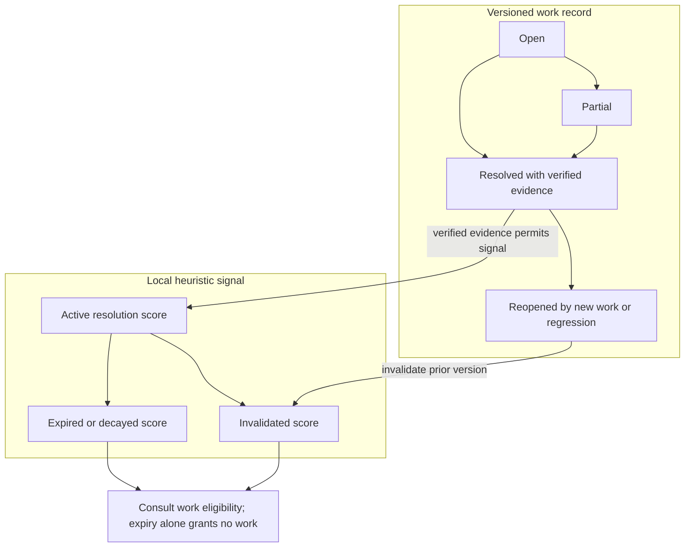

# D05 — Work status and signal lifetime

Signal expiry does not reopen completed work. Eligibility comes from the work record; the local score has a separate lifecycle.

```mermaid
flowchart TD
 subgraph Work[Versioned work record]
 O[Open] --> P[Partial]
 O --> R[Resolved with verified evidence]
 P --> R
 R --> N[Reopened by new work or regression]
 end
 subgraph Signal[Local heuristic signal]
 A[Active resolution score] --> E[Expired or decayed score]
 A --> X[Invalidated score]
 end
 R -->|verified evidence permits signal| A
 N -->|invalidate prior version| X
 E --> K[Consult work eligibility; expiry alone grants no work]
 X --> K
```
