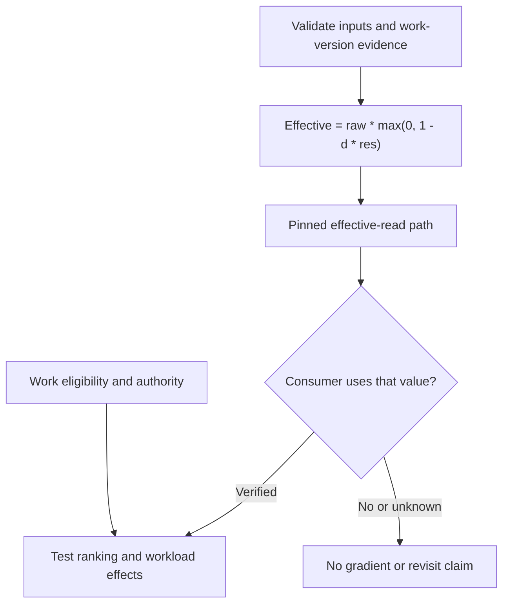

# D06 — Damping equation and consumer boundary

Finite nonnegative inputs are required for the displayed bound. A computed priority is not proof that navigation consumes it. Independent work eligibility and authority constrain which candidates may be ranked.

