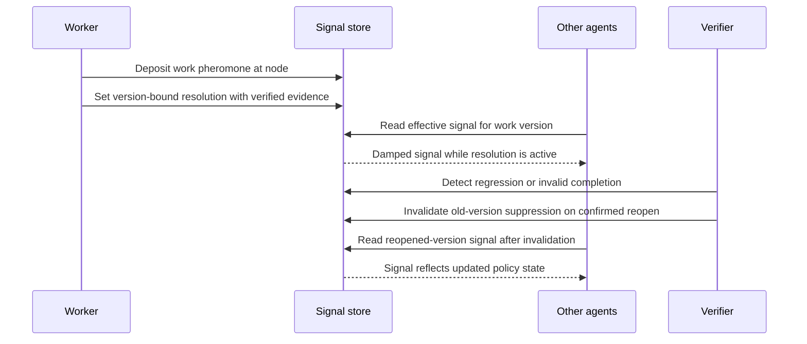

# D07 — False completion and reopen trace

```mermaid
sequenceDiagram
  participant W as Worker
  participant M as Signal store
  participant O as Other agents
  participant V as Verifier
  W->>M: Deposit work pheromone at node
  W->>M: Set version-bound resolution with verified evidence
  O->>M: Read effective signal for work version
  M-->>O: Damped signal while resolution is active
  V->>M: Detect regression or invalid completion
  V->>M: Invalidate old-version suppression on confirmed reopen
  O->>M: Read reopened-version signal after invalidation
  M-->>O: Signal reflects updated policy state
```
