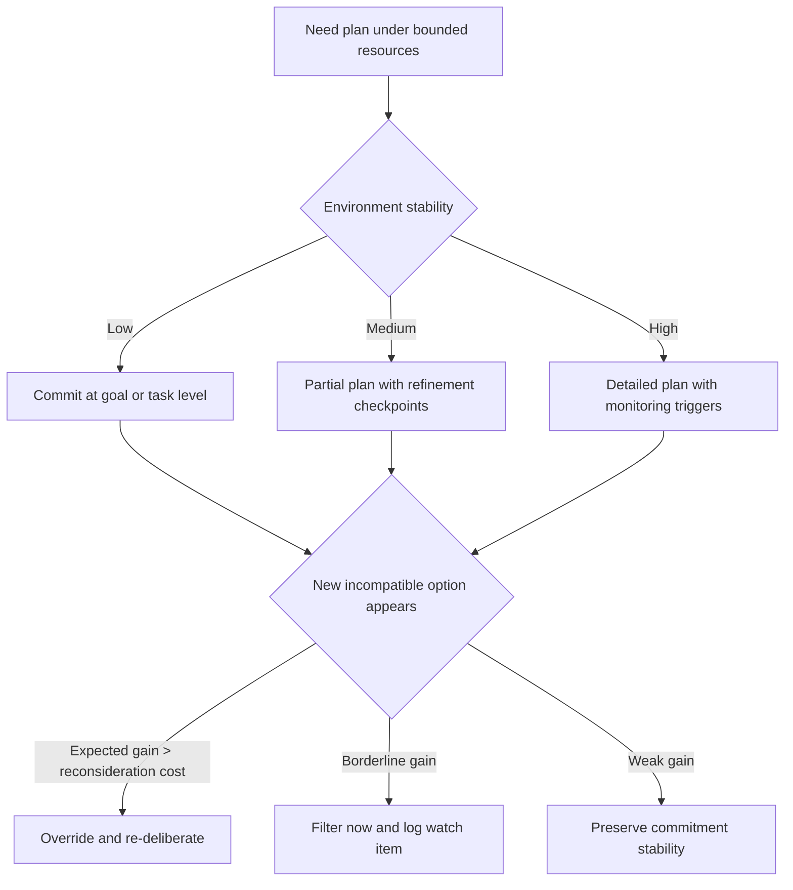

# Resource-Bounded Planning

Use Bratman, Israel, and Pollack's planning doctrine when the main problem is not finding a perfect plan but deciding how much deliberation is worth doing before the world changes underneath you.

## When to Use

Use this skill when:
- Deliberation itself is expensive and competes with acting in time.
- Plans need to stay useful even when they are only partially specified.
- An agent keeps oscillating between overthinking and brittle execution.
- Multi-agent work needs coordination without constant communication.
- You need principled reconsideration rules instead of ad hoc replanning.

## NOT for Boundaries

This skill is not the right primary lens for:
- Classical optimization where all alternatives and costs are already known.
- Deterministic planning problems with stable, fixed requirements.
- Single-shot decisions where taking more time has negligible downside.
- Pure implementation work once the bounded-planning policy has already been chosen.

## Core Mental Models

### Plans as Computational Constraints

Plans are not just outputs of reasoning. They narrow future reasoning by:
- Focusing means-end analysis on committed ends.
- Filtering out incompatible options.
- Carrying assumptions that later reasoning can reuse.

The win is not perfect action sequencing. The win is cheaper future deliberation.

### Structural Partiality as a Feature

Partial plans are not incomplete failures. They are deliberate commitments at the highest stable abstraction level:
- Commit to goals or task structure early.
- Defer low-level details until means-end coherence actually requires them.
- Refine only when the next action or dependency demands specificity.

### Stability vs Revisability

Plans must be stable enough to save computation and revisable enough to handle surprise. That tension is managed, not eliminated, through explicit filter and override rules.

### Filter Override as Calibrated Meta-Reasoning

Most incompatible options should be filtered away. Some should trigger reconsideration. The practical question is not "should overrides exist?" but "how sensitive should they be in this domain?"

### Means-End Coherence as a Problem Transformer

Commitment turns an open search problem:

```text
What should I do?
```

into a constrained subproblem:

```text
How will I achieve this committed end?
```

That transformation is why commitment helps bounded agents at all.

## Decision Points

### 1. Commitment Formation

Commit when the expected savings from constrained future reasoning exceed the expected cost of revising later.



```text
High uncertainty and fast change:
  Commit at goal or task level only

Moderate uncertainty with recurring patterns:
  Commit to partial plan plus explicit refinement checkpoints

Low uncertainty with established patterns:
  Commit to detailed plan with monitoring triggers
```

### 2. Filter Override Calibration

When a new incompatible option appears:

```text
If expected gain clearly exceeds reconsideration cost:
  Override and re-deliberate

If gain is plausible but below threshold:
  Filter now, log as a watch item

If gain is weak:
  Ignore and preserve commitment stability
```

Use override frequency as a calibration signal:
- Above 30% usually means thrashing.
- Below 5% usually means brittleness.
- Around 10-20% is a healthy starting range.

### 3. Structural Partiality Level

Choose the shallowest specification that still supports the next action.

```text
Hours-scale execution:
  Action-level detail may be needed

Days to weeks:
  Task-level structure usually suffices

Long horizon or unstable environment:
  Stay at goal level until dependencies harden
```

### 4. Multi-Agent Consistency

Shared commitments are coordination devices. Check consistency when:
- Agents share resources.
- One agent's assumptions affect another agent's refinement path.
- The cost of late conflict exceeds the cost of periodic synchronization.

## Failure Modes

### Perpetual Deliberation
**Detection**: Deliberation time exceeds action time or override frequency climbs above the calibrated range.

**Fix**: Raise override thresholds, set hard deliberation budgets, and commit at a higher abstraction level.

### Brittle Automation
**Detection**: Plans fail repeatedly because assumption violations are discovered too late.

**Fix**: Lower override thresholds slightly, monitor key assumptions explicitly, and shorten the stability horizon of detailed commitments.

### Premature Specification
**Detection**: Detailed steps are rewritten repeatedly before execution reaches them.

**Fix**: Defer detail until means-end coherence or dependency readiness demands it.

### Consistency Cascade
**Detection**: Coordination overhead starts consuming a large share of useful work.

**Fix**: Relax noncritical consistency constraints, batch synchronization, and localize consistency checks.

### Analysis-Paralysis Spiral
**Detection**: The cost of deciding how to plan exceeds the value of the decision itself across repeated cases.

**Fix**: Classify decisions by stakes, then give each class a bounded deliberation budget.

## Worked Example

### Multi-Agent Resource Allocation Under a Traffic Spike

Scenario: three agents manage a data center during a sudden traffic surge.

1. **Commitment formation**
   Scheduler commits to shedding a class of low-priority traffic.
   Allocator commits to shifting capacity toward the web tier.
   Monitor commits to a latency threshold and escalation rule.
2. **Consistency pass**
   They share assumptions about spike duration and nonblocking actions.
3. **Execution with refinement**
   Each agent acts on its partial commitment and refines only as new constraints appear.
4. **Override check**
   A new opportunity appears, but the expected gain does not exceed the reconsideration cost, so the system filters it instead of thrashing.

The expert move is not deeper precomputation. It is calibrating commitment depth and override sensitivity so the system keeps moving under pressure.

## Fork and Subagent Guidance

Fork work into separate lanes when the bounded-planning problem has distinct roles:
- **Commitment lane** for choosing the abstraction level and stability horizon.
- **Monitoring lane** for assumption checking and override triggers.
- **Coordination lane** for shared-resource or shared-assumption consistency.

Keep final policy synthesis in the parent so one owner balances speed, stability, and reconsideration cost.

## Visual Artifacts Worth Generating

Generate a visual artifact when it clarifies bounded-control behavior:
- A commitment-horizon ladder when different plan layers have different stability windows.
- A filter-override flow when operators need to tune reconsideration sensitivity.
- A coordination map when multiple agents share assumptions or resources.

The companion Mermaid flowchart is the fast artifact for commitment and override decisions.

## Reference Files

- `diagrams/01_flowchart_decision-points.md` — Mermaid flowchart mapping task arrival → deliberation budget → commitment depth → filter-override logic. **Read when** designing or debugging a bounded-planning policy's decision sequence.

- `references/deliberation-as-expensive-operation.md` — Establishes that deliberation time competes with execution time; the core resource constraint that makes bounded planning necessary. **Read when** justifying why full deliberation is infeasible.

- `references/plans-as-computational-constraints.md` — Explains how plans narrow future reasoning by filtering options and reusing assumptions, reducing deliberation cost. **Read when** designing partial plans or understanding why commitment reduces cognitive load.

- `references/structural-partiality-and-hierarchical-commitment.md` — Argues partial plans are rational strategy, not failure; shows how hierarchical decomposition defers low-level detail. **Read when** deciding commitment depth or justifying incomplete specifications.

- `references/filter-override-mechanisms.md` — Details the stability-revisability tension and override rules for detecting incompatible options. **Read when** tuning reconsideration triggers or handling plan disruption.

- `references/temporal-dynamics-of-commitment.md` — Analyzes time-sensitive nature of plans; when conditions change during deliberation. **Read when** calibrating deliberation budgets or setting reconsideration windows.

- `references/consistency-maintenance-as-coordination-mechanism.md` — Shows how plan consistency enables multi-agent coherence without constant communication. **Read when** using shared commitments for distributed coordination.

- `references/failure-modes-of-resource-bounded-reasoning.md` — Taxonomy of six failure modes inherent to bounded rationality (perpetual deliberation, brittleness, etc.). **Read when** diagnosing planning pathologies or understanding unavoidable tradeoffs.

- `templates/commitment-calibration-worksheet.md` — Structured worksheet for decision context, commitment depth, and override policy before implementation. **Read when** configuring a bounded-planning policy for a specific agent or workflow.

## Quality Gates

- [ ] Commitment depth is explicit and justified.
- [ ] Filter and override rules are architecturally visible, not implicit.
- [ ] Refinement triggers are objective and tied to means-end coherence or dependency readiness.
- [ ] Deliberation budget is set and monitored.
- [ ] Override frequency has a target range.
- [ ] Multi-agent consistency checks are proportional to coordination criticality.
- [ ] The plan supports action before full specification.
