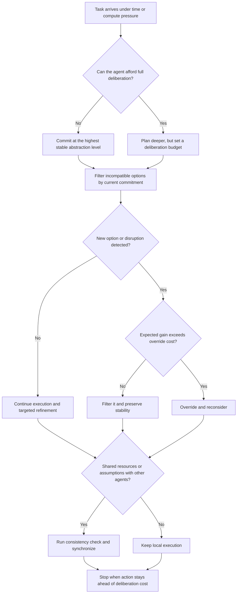

# Resource-Bounded Planning Decision Flow

Use this companion when deciding how deeply to commit, when to override, and when to keep moving with a partial plan.

```mermaid
flowchart TD
    A[Task arrives under time or compute pressure] --> B{Can the agent afford full deliberation?}
    B -- No --> C[Commit at the highest stable abstraction level]
    B -- Yes --> D[Plan deeper, but set a deliberation budget]
    C --> E[Filter incompatible options by current commitment]
    D --> E
    E --> F{New option or disruption detected?}
    F -- No --> G[Continue execution and targeted refinement]
    F -- Yes --> H{Expected gain exceeds override cost?}
    H -- No --> I[Filter it and preserve stability]
    H -- Yes --> J[Override and reconsider]
    I --> K{Shared resources or assumptions with other agents?}
    G --> K
    J --> K
    K -- Yes --> L[Run consistency check and synchronize]
    K -- No --> M[Keep local execution]
    L --> N[Stop when action stays ahead of deliberation cost]
    M --> N
```
