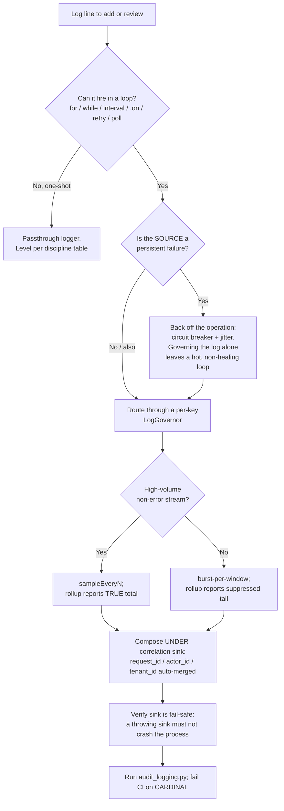

# Responsible Logging

Make a long-lived service log **leveled, bounded, correlated, and non-fatal** — so a
persistently-failing loop reports once with a count instead of writing 313 GB overnight.

## When to Use

✅ **Use for**:
- Adding a log line to any loop: `for`/`while`/`setInterval`/`.on(...)`/retry/poll/heartbeat.
- A daemon eating disk, an unrotated log file, or a launchd/systemd captured-stdout blowup.
- Reviewing level discipline (`error` vs `warn` vs `info`) and `console.*`/`print` sprawl.
- Designing per-key dedup/rate-limit/sampling with **rollups**, or a log governor primitive.
- Threading `requestId`/`actorId`/`tenantId` correlation ids through logs (multi-tenant).
- Making observability fail-safe: a broken sink must not crash or stall the process.

❌ **NOT for**:
- Picking a log-aggregation vendor / building a metrics/tracing/APM pipeline (use `observability-apm-expert`, `log-aggregation-architect`).
- Dashboard or alerting-UI design.
- Application business logic, or non-logging performance work.

---

## The Cardinal Anti-Pattern (read this first)

> **Error-level logging inside an unthrottled retry/poll loop with no dedup.**

This one shape caused a real **313 GB** write storm: `semantic_resolution_failed` logged
**7,182×** with no backoff and no dedup, plus a **255 MB unrotated** captured-stdout file
and a 231 MB DB. Worse, an *identical* prior incident (`bosun_heartbeat_write_failed`) was
patched **narrowly at the call site and RECURRED months later** — the class stayed open
until a shared **log governor** primitive existed. Full story:
`references/case-study-port-daddy.md`.

The fix is never "add an `if` at that one call site." The fix is a reusable primitive plus
an audit that keeps the class closed.

---

## Core Process



### Step 1 — Audit the codebase

Enumerate every offending site before touching code. The bundled script reads structured
source tokens (not prose):

```bash
python3 scripts/audit_logging.py <path>          # human-readable, ranked
python3 scripts/audit_logging.py <path> --json   # for CI / further processing
```

It flags: **CARDINAL** error/warn logs inside unthrottled loops; **HIGH** launchd/systemd
captured-stdout traps and uncapped File transports; **MEDIUM** raw `console.*`/`print`
sprawl. Exit code is non-zero on findings — wire it into CI so the class cannot reopen.

### Step 2 — Reach for a primitive, not a patch

Match the situation to a primitive (details in `references/governor-primitive.md`):

| Situation | Reach for | Key rule |
|-----------|-----------|----------|
| Error/warn that can fire every tick | **LogGovernor** `governed({level, key})` | STABLE low-cardinality key |
| Chatty request/trace stream | `governed({sampleEveryN:N})` | rollup reports the **true** total |
| One-shot event (boot/shutdown/config) | passthrough `info()`/`error()` | no key needed |
| A dependency that fails permanently | **circuit breaker + jitter** around the load | governor bounds the *log*, not the *failure* |
| A file/table that grows forever | **rotation / retention policy** | governor doesn't bound data volume |

The governor bounds *how often you log*. It does **not** fix the failure — pair it with
backoff on the failing operation, or you get a quiet loop that still burns CPU forever.

### Step 3 — Get the governor key right

The single most common mistake. The key must be the **stable shape** of the event, never
its instance:

```ts
// ✅ collapses the storm
obs.governed({ key: 'semantic_resolution_failed', level: 'error',
               message: 'semantic_resolution_failed', meta: { term, error: String(err) } });

// ❌ every occurrence is a new key → nothing dedups → storm rebuilt
obs.governed({ key: `semantic_resolution_failed:${term}`, /* ... */ });
```

Varying detail (ids, terms, timestamps, tenant) goes in `meta`, never in the key.

### Step 4 — Rotation + the captured-stdout trap

An in-process rotating logger only rotates **files it owns**. Raw stdout captured by
launchd (`StandardOutPath`) or systemd (`StandardOutput=append:`) is **never rotated by
the service manager** — that is how 255 MB accumulated while winston rotated fine. Cap
in-process files (`maxsize` **and** `maxFiles`), keep stdout terse, and rotate any
captured stream out-of-band. Details + fixes: `references/rotation-and-capture-traps.md`.

### Step 5 — Correlation + fail-safe (the two horizons)

- **Multi-tenant horizon**: thread `{ requestId, actorId, tenantId }` via `AsyncLocalStorage`
  / contextvars / `context.Context` and compose the governor **under** a correlation sink so
  every line (and every rollup) carries the ids — no call-site changes. Attribution ≠
  authorization; never gate access on a log field.
- **Dev-on-dev horizon (now)**: the storm happened on an unwatched dev box. A `SelfMonitor`
  on the daemon's **own** DB/WAL/footprint (not whole-disk %) is what would have caught it.
  Wire `requestId` even single-tenant so the plumbing exists before real tenants arrive.
- **Fail-safe**: wrap every emit — `try { emit } catch {}` around the sink call. A broken sink must
  not crash the daemon. Test it: inject a throwing sink and assert requests still complete.
  See `references/multi-tenant-and-safety.md`.

---

## Anti-Patterns

### Anti-Pattern: Error-level log inside an unthrottled loop with no dedup

**Novice**: "It's an error, so I log it at `error` every time it happens. Logging is cheap
and I want to see all of them."
**Expert**: In a loop that fires every few seconds, "all of them" is unbounded. This exact
shape wrote **313 GB** and **7,182** identical `semantic_resolution_failed` lines with no
backoff. Logging is *not* cheap at loop frequency — it is disk, inodes, and DB rows.
Route loop-logs through a per-key governor: emit the first few per window, count the rest,
and flush **one rollup** (`…and 4,312 more in 60s`) so you keep the fact without the bytes.
And back off the failing operation itself — a bounded log over a hot non-healing loop is
still a CPU leak.
**Timeline**: 2026-05-31 `bosun_heartbeat_write_failed` patched narrowly at the call site →
recurred as `semantic_resolution_failed` (313 GB) → class closed only once a shared
`LogGovernor` primitive existed. A patch closes an instance; a primitive closes the class.
**LLM mistake**: models emit `logger.error(...)` unconditionally inside `catch` blocks and
`while` loops because that is the dominant pattern in training data — most of which is
short-lived request handlers, not daemons that run for weeks.
**Detection**: `python3 scripts/audit_logging.py <path>` → any `CARDINAL` finding.

### Anti-Pattern: Trusting the in-process logger to bound ALL output

**Novice**: "winston/pino is configured with `maxsize` and `maxFiles`, so my log volume is
bounded. Done."
**Expert**: The rotating logger only rotates **files it owns**. Every `console.log` /
`print` / `fmt.Println` goes to raw stdout, and when launchd/systemd captures that stream
it is **never rotated by the service manager**. In the incident, winston rotated at
50 MB × 5 perfectly while a captured-stdout file hit **255 MB** in one handle. Rotation is
necessary but not sufficient: you also need **one-logger discipline** (no raw-sink sprawl)
and out-of-band rotation (newsyslog/logrotate/journald) for any captured stream.
**Timeline**: Pre-2026-05 raw `console.*` sprawl coexisted with a correctly-configured
winston logger → the 313 GB storm rode mostly the raw path → fix consolidated on one
governed logger and audited raw sinks in CI.
**LLM mistake**: models treat "configured a rotating file transport" as equivalent to
"logging is bounded," ignoring the stdout/stderr the service manager captures.
**Detection**: `audit_logging.py` `HIGH` findings (`launchd-captured-stdout-never-rotated`,
`systemd-file-capture-never-rotated`, `unrotated-file-transport`) and `MEDIUM`
`raw-sink-bypasses-logger`.

---

## Level Discipline (quick reference)

| Level | Means | In a loop? |
|-------|-------|------------|
| `error` | a human must eventually act | **only via the governor** |
| `warn` | degraded but self-handling (breaker open, retrying) | governed |
| `info` | notable lifecycle event | governed or `sampleEveryN` |
| `debug` | developer detail, off in prod | governed if in a hot path |

---

## Bundle Contents

| File | What it is | Consult when |
|------|-----------|--------------|
| `scripts/audit_logging.py` | Stdlib-only auditor; ranks CARDINAL/HIGH/MEDIUM findings, non-zero exit for CI | Step 1 — before editing any logging code |
| `references/case-study-port-daddy.md` | The 313 GB incident, the recurrence, the five-primitive fix | Understanding *why* each rule exists; convincing a skeptic |
| `references/governor-primitive.md` | Stack-agnostic LogGovernor contract + pseudocode + porting notes | Building/reviewing a dedup/rate-limit/sampling primitive |
| `references/rotation-and-capture-traps.md` | Rotation settings, launchd/systemd capture trap, one-logger + level discipline | Any disk-growth, rotation, or stdout-capture question |
| `references/multi-tenant-and-safety.md` | Correlation-id threading, dev-on-dev horizon, fail-safe observability | Multi-tenant correlation, self-monitoring, non-load-bearing rules |

---

## Validation Checklist

```
□ Every loop-emitted error/warn goes through a per-key governor (audit_logging.py clean of CARDINAL)
□ Governor keys are stable + low-cardinality (no ids/terms/timestamps in the key)
□ Suppression emits a ROLLUP — the tail count is never silently dropped
□ Sampled streams report the TRUE total, not the sampled count
□ In-process File transports cap maxsize AND maxFiles
□ Captured stdout/stderr (launchd/systemd) is rotated by SOMETHING
□ One logger; no raw console.*/print sprawl (audit_logging.py clean of MEDIUM)
□ Correlation ids (request/actor/tenant) auto-merged under the governor
□ A throwing sink cannot crash the process (tested with an injected failing sink)
□ Fixed the CLASS (audited for siblings), not just the one call site
```
