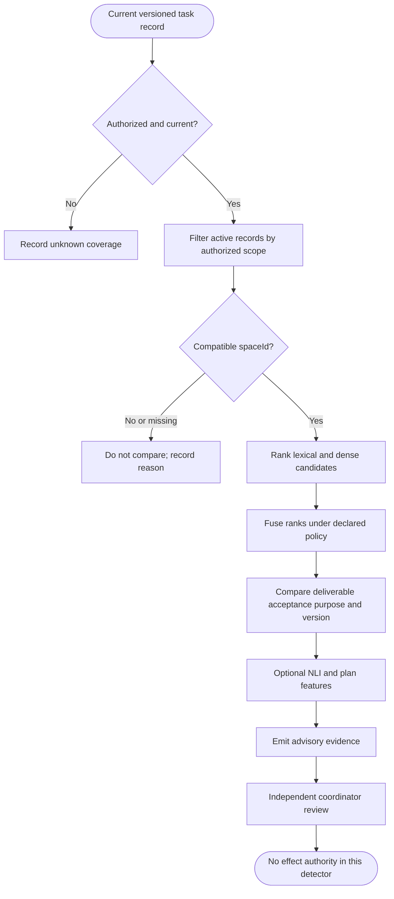

# Diagram 1: Candidate overlap review (shadow mode)

```mermaid
flowchart TD
  A([Current versioned task record]) --> B{Authorized and current?}
  B -->|No| C[Record unknown coverage]
  B -->|Yes| D[Filter active records by authorized scope]
  D --> E{Compatible spaceId?}
  E -->|No or missing| F[Do not compare; record reason]
  E -->|Yes| G[Rank lexical and dense candidates]
  G --> H[Fuse ranks under declared policy]
  H --> I[Compare deliverable acceptance purpose and version]
  I --> J[Optional NLI and plan features]
  J --> K[Emit advisory evidence]
  K --> L[Independent coordinator review]
  L --> M([No effect authority in this detector])
```
