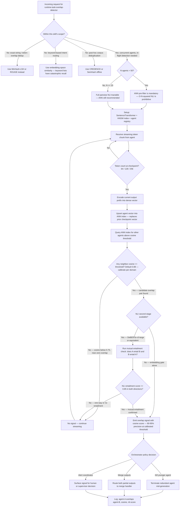

# Diagram 1: flowchart

```mermaid
flowchart TD
  A[Incoming request for runtime-task-overlap-detector] --> B{Within this skill's scope?}
  B -->|No: exact-string / token-overlap dedup| C[Use MinHash-LSH or ROUGE instead]
  B -->|No: keyword-based intent routing| D[Use embedding-space similarity — keyword lists have catastrophic recall]
  B -->|No: post-hoc corpus deduplication| E[Use CREDENCE or SemHash offline]
  B -->|Yes: concurrent agents, in-flight detection needed| F{N agents > 50?}

  F -->|Yes| G[ANN pre-filter is mandatory — O-N-squared NLI is prohibitive]
  F -->|No, N <= 20| H[Full pairwise NLI tractable — ANN still recommended]

  G --> I[Setup: SentenceTransformer + HNSW index + agent registry]
  H --> I

  I --> J[Receive streaming token chunk from agent]
  J --> K{Token count at checkpoint? 64 / 128 / 256}
  K -->|No| J
  K -->|Yes| L[Encode current output prefix into dense vector]

  L --> M[Upsert agent vector into ANN index — replaces prior checkpoint vector]
  M --> N[Query ANN index for other agents above cosine threshold]

  N --> O{Any neighbor cosine >= threshold? Default 0.88 — calibrate per domain}
  O -->|No — cosine below 0.75, near-zero overlap| P[No signal — continue streaming]
  P --> J

  O -->|Yes — candidate overlap pair found| Q{NLI second stage available?}

  Q -->|No — embedding gate alone| R[Emit overlap signal with cosine score — 90-95% precision at calibrated threshold]
  Q -->|Yes — DeBERTa-v3-large or equivalent| S[Run mutual entailment check: does A entail B and B entail A?]

  S --> T{NLI entailment score >= 0.85 in both directions?}
  T -->|No — one-way or no entailment| P
  T -->|Yes — mutual entailment confirmed| R

  R --> U{Orchestrator policy decision}
  U -->|Kill younger agent| V[Terminate redundant agent mid-generation]
  U -->|Merge outputs| W[Route both partial outputs to merge handler]
  U -->|Alert coordinator| X[Surface signal for human or supervisor decision]

  V --> Y[Log: agent-A overlaps agent-B, cosine, nli-score]
  W --> Y
  X --> Y
```
