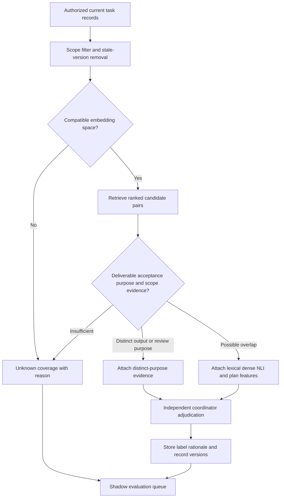

# R07 — Shadow-mode scoped task-overlap signal (rewrites existing Mermaid)

```mermaid
flowchart TD
  A[Authorized current task records] --> B[Scope filter and stale-version removal]
  B --> C{Compatible embedding space?}
  C -->|No| U[Unknown coverage with reason]
  C -->|Yes| R[Retrieve ranked candidate pairs]
  R --> S{Deliverable acceptance purpose and scope evidence?}
  S -->|Insufficient| U
  S -->|Distinct output or review purpose| N[Attach distinct-purpose evidence]
  S -->|Possible overlap| F[Attach lexical dense NLI and plan features]
  F --> H[Independent coordinator adjudication]
  H --> L[Store label rationale and record versions]
  L --> SH[Shadow evaluation queue]
  U --> SH
  N --> H
```
