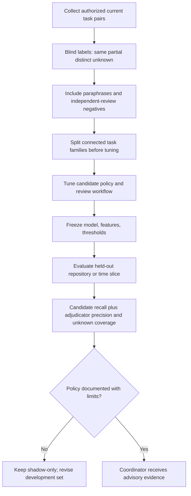

# R08 — Threshold calibration without leakage

```mermaid
flowchart TD
  C[Collect authorized current task pairs] --> L[Blind labels: same partial distinct unknown]
  L --> H[Include paraphrases and independent-review negatives]
  H --> DEV[Split connected task families before tuning]
  DEV --> T[Tune candidate policy and review workflow]
  T --> F[Freeze model, features, thresholds]
  F --> TEST[Evaluate held-out repository or time slice]
  TEST --> M[Candidate recall plus adjudicator precision and unknown coverage]
  M --> G{Policy documented with limits?}
  G -->|No| SH[Keep shadow-only; revise development set]
  G -->|Yes| ADV[Coordinator receives advisory evidence]
```
