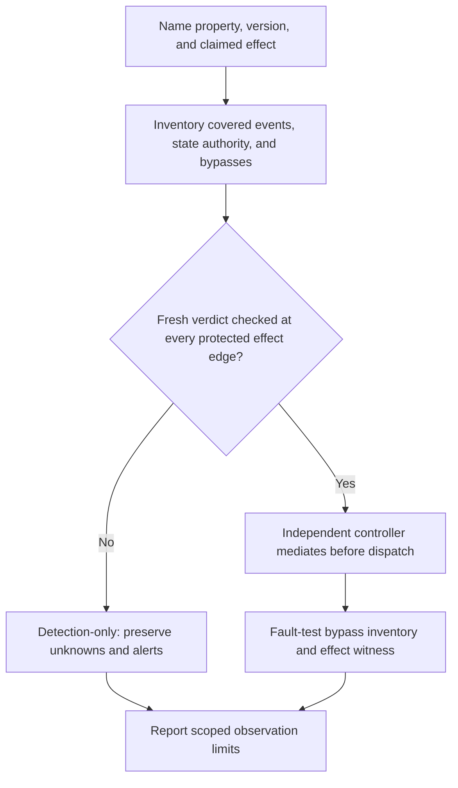

# Diagram 1: flowchart

```mermaid
flowchart TD
  A[Name property, version, and claimed effect] --> B[Inventory covered events, state authority, and bypasses]
  B --> C{Fresh verdict checked at every protected effect edge?}
  C -->|No| D[Detection-only: preserve unknowns and alerts]
  C -->|Yes| E[Independent controller mediates before dispatch]
  E --> F[Fault-test bypass inventory and effect witness]
  D --> G[Report scoped observation limits]
  F --> G
```
