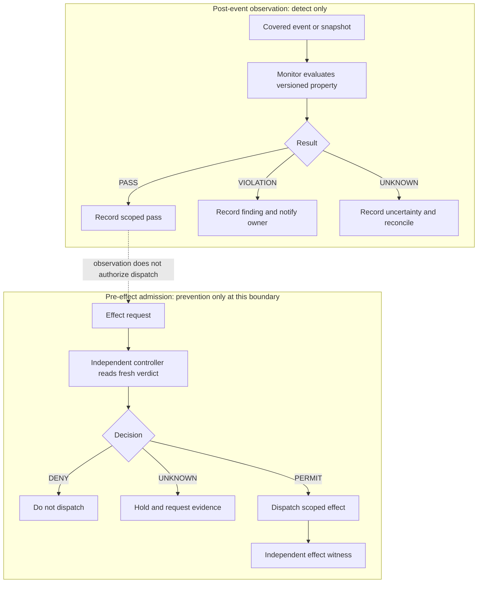

# R01 — Observe, decide, mediate, witness

The upper lane is post-event observation; the lower lane gates dispatch before
the effect. A `PASS` from observation does not authorize or prevent an effect.

