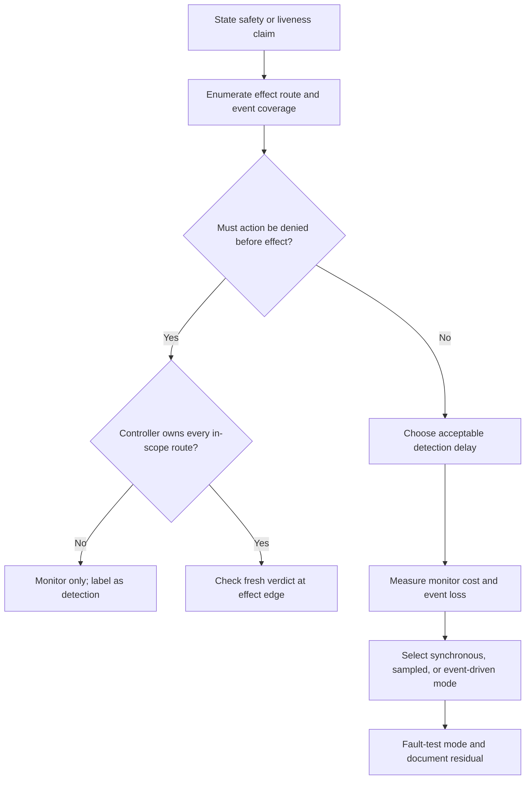

# R02 — Choose monitor mode from risk and boundary

```mermaid
flowchart TD
  Property[State safety or liveness claim] --> Route[Enumerate effect route and event coverage]
  Route --> Critical{Must action be denied before effect?}
  Critical -->|Yes| Custody{Controller owns every in-scope route?}
  Custody -->|No| Observe[Monitor only; label as detection]
  Custody -->|Yes| Gate[Check fresh verdict at effect edge]
  Critical -->|No| Delay[Choose acceptable detection delay]
  Delay --> Cost[Measure monitor cost and event loss]
  Cost --> Mode[Select synchronous, sampled, or event-driven mode]
  Mode --> Validate[Fault-test mode and document residual]
```
