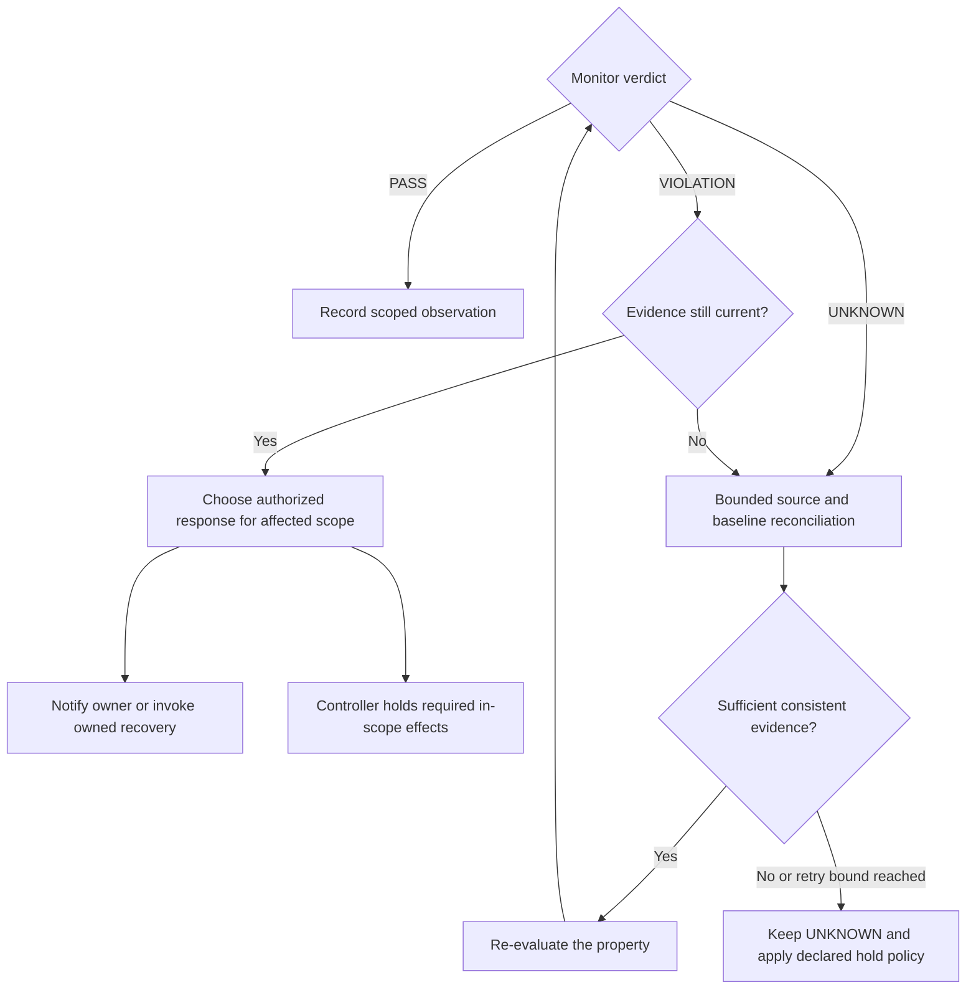

# R03 — Response follows the verified verdict

A recovered source is not itself a confirmed violation. Re-evaluate the property before selecting a separately authorized response. Reconciliation retries follow a declared bound; persistent uncertainty holds only effects whose controller policy requires a current verdict.

