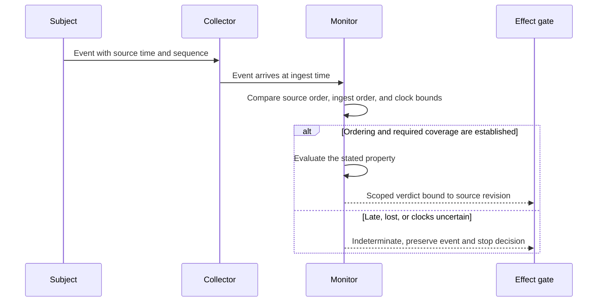

# R04 — Event time, ingest time, and late telemetry

```mermaid
sequenceDiagram
  participant Subject
  participant Collector
  participant Monitor
  participant Gate as Effect gate
  Subject->>Collector: Event with source time and sequence
  Collector->>Monitor: Event arrives at ingest time
  Monitor->>Monitor: Compare source order, ingest order, and clock bounds
  alt Ordering and required coverage are established
    Monitor->>Monitor: Evaluate the stated property
    Monitor-->>Gate: Scoped verdict bound to source revision
  else Late, lost, or clocks uncertain
    Monitor-->>Gate: Indeterminate, preserve event and stop decision
  end
```
