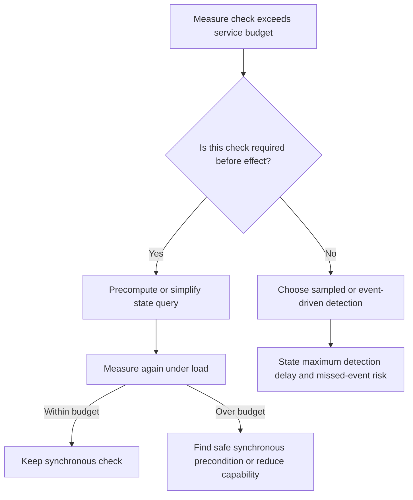

# R05 — Slow monitor remediation without weakening safety silently

```mermaid
flowchart TD
  Slow[Measure check exceeds service budget] --> Safety{Is this check required before effect?}
  Safety -->|Yes| Optimize[Precompute or simplify state query]
  Optimize --> Still[Measure again under load]
  Still -->|Within budget| Sync[Keep synchronous check]
  Still -->|Over budget| Hybrid[Find safe synchronous precondition or reduce capability]
  Safety -->|No| Delay[Choose sampled or event-driven detection]
  Delay --> Bound[State maximum detection delay and missed-event risk]
```
