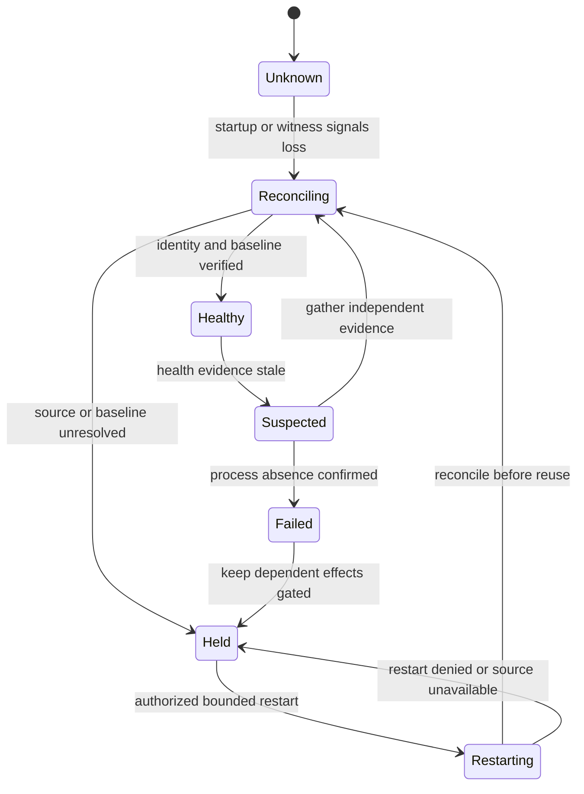

# R06 — Monitor crash and recovery contract

A monitor is not `Healthy` until its identity, source binding, state, and verified
baseline have been reconciled. A missed heartbeat alone is only suspicion.

