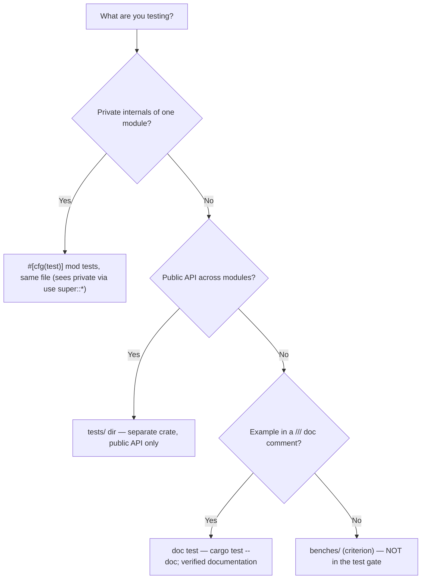
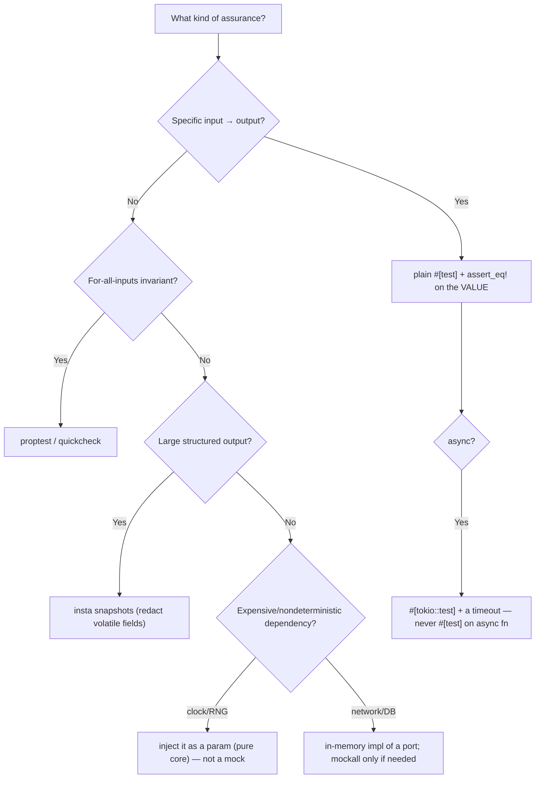

# Rust Code Testing

Write Rust tests that catch real bugs, run fast, and stay honest — and choose the
right tool from the broad Rust testing ecosystem instead of reaching for
`assert_eq!` and a mock every time.

## When to Use

✅ **Use for**:
- Writing unit / integration / doc tests; deciding *where* a test belongs
- Choosing a testing crate (proptest, insta, mockall, rstest, criterion, …)
- Testing `async` code, futures, channels, concurrency; chasing flaky tests
- Coverage (`llvm-cov`), faster runs (`nextest`), and test CI matrices
- Stronger assurance: `miri` (UB), `cargo-fuzz`, `cargo-mutants`, sanitizers
- Testing FFI boundaries (`extern "C"`, cdylib) and cross-language parity
- Making "hard to test" code testable (pure-core extraction, DI)

❌ **NOT for**:
- Non-Rust testing — JS/Python/Go test frameworks
- General Rust syntax / borrow-checker / toolchain help → `rust-with-claude-code`
- GPUI / pd-console-specific testing → `gpui-rust-console`
- Writing the production feature itself (this skill is about its tests)
- Designing the kernel/FFI boundary's ABI, ownership, or ffi-safety contract itself
  (once a `rust-kernel-ffi` skill exists, that owns the design) — this skill tests
  whatever Rust code sits on either side of that boundary, including asserting the
  native kernel actually loaded before trusting a cross-language parity test

## First move every session

Get fast signal before writing anything. The bundled script runs the full gate
matrix (fmt → clippy → test → doc tests → optional coverage), cheapest first:

```bash
scripts/run_test_matrix.sh                                   # whole workspace
scripts/run_test_matrix.sh --manifest core/foo/Cargo.toml --features ffi
scripts/run_test_matrix.sh --coverage -- --test-threads=1
```

State your status in one line before proceeding: "fmt clean, clippy clean, 22
tests green" — it anchors every later decision.

`run_test_matrix.sh` runs *real* tests against *real* code. Before that code
exists, audit the *plan* instead — `scripts/test_plan_audit.mjs` checks a JSON
test plan for this skill's shibboleths (coverage theater, `#[test]` on async
fn, mock echo, sleep-faked determinism, `/tmp` writes, an unasserted parity
kernel-load, dev-dependency misplacement) before you write a single test:

```bash
node scripts/test_plan_audit.mjs --input examples/sample-input.json
```

## Test taxonomy — where does this test go?



Full layout, the three-states rule (empty/populated/error), fixtures, and the
crate-type nuance (rlib vs cdylib vs bin) → `references/organization-and-fixtures.md`.

## Which testing tool for which need?



Crate-by-crate selection & idioms (proptest, insta, mockall, rstest, criterion,
test-case, serial_test) → `references/testing-crates.md`.

## Anti-Patterns (shibboleths)

### Coverage theater: asserting types, not values
**Novice**: "It returns `Ok`, so `assert!(result.is_ok())` proves it works — and
coverage is 95%."
**Expert**: `is_ok()`/`is_some()`/`len() > 0` pass regardless of correctness.
Assert the *specific* value, error variant, or shape. Line coverage measures
execution, not verification — 95% coverage with surviving mutants means the lines
run but nothing checks them. Prove it with `cargo-mutants`: a surviving mutant is
an unasserted behavior.
**Detection**: tests whose only assertions are `is_ok`/`is_some`/`is_empty`/`> 0`,
or that re-assert a value a mock was told to return (mock echo).

### `#[test]` on an `async fn`
**Novice**: "It's a test, so `#[test] async fn`."
**Expert**: `#[test]` can't drive a future — it won't compile, or the body never
runs. Use `#[tokio::test]` (or `#[async_std::test]`), and wrap anything that
could block in `tokio::time::timeout` so a hung future *fails* instead of wedging
the whole suite.
**Detection**: `#[test]` directly above `async fn`; suites that hang instead of
failing.

### The parity test that secretly tests nothing
**Novice**: "Rust and the TS fallback agree in my Jest parity test — parity
proven."
**Expert**: If the dylib didn't load in the harness, *both* sides ran the same
fallback and agreed trivially. Loaders frequently fail in the unit harness while
working in the real runtime (koffi under Jest's transformed ESM can't load a
`.dylib` that loads fine under Bun/tsx). Assert the kernel is loaded before
asserting parity, make "not loaded" a loud skip, and verify real parity under the
real runtime (a `tsx`/`bun` script or a Rust integration test that loads the
cdylib).
**Timeline**: pre-2023 FFI bindings were simpler; 2024-2026 multi-runtime
(Node/Bun/Deno) + transformed-ESM test harnesses made "passes in the harness,
breaks under the real loader (and vice-versa)" a routine trap.
**Detection**: a green cross-language parity test with no assertion that the
native impl is actually loaded. See `references/ffi-and-cross-language-parity.md`.

### "Hard to test" treated as a test problem
**Novice**: "This function is hard to unit-test, so I need a heavier mock / a real
DB in the test."
**Expert**: Hard-to-test is a *code-shape* signal. If the unit test needs a
running daemon, a DB, or the network, infrastructure has leaked into the logic.
Extract a pure core (inject clock/IO/readings as parameters) and unit-test that
exhaustively; leave a thin, barely-tested shell for the I/O. The pure core also
becomes reusable across a CLI, a daemon, and an FFI export.
**Detection**: tests that spin up servers/DBs to check business logic; functions
that call `Instant::now()` / `std::fs` / a socket *and* make decisions.

### Test-only crates in `[dependencies]`
**Novice**: "I added `proptest`/`criterion`/`mockall` to `[dependencies]`."
**Expert**: They belong in `[dev-dependencies]` — otherwise they compile into and
bloat (or break) the release binary. `#[cfg(test)]`-gate mock derives too
(`#[cfg_attr(test, automock)]`).
**Detection**: `proptest`, `criterion`, `mockall`, `insta`, `rstest`,
`tempfile` under `[dependencies]`.

### Mock echo: testing the mock, not the code
**Novice**: "The mock returns 42 and the test asserts 42 — green."
**Expert**: That asserts the mock framework works, not your logic. Prefer
injecting a real trivial impl (an in-memory repo, a fixed `now: u64`). Reach for
`mockall` only when the real dependency is genuinely expensive or
non-deterministic, and then assert on what your code *does with* the value, not
the value itself.
**Detection**: `expect_*().returning(|| X)` paired with `assert_eq!(result, X)`.

### Faking determinism with sleeps and retries
**Novice**: "The async test is flaky, so I added `sleep(200ms)` / a retry."
**Expert**: A sleep races the scheduler and a retry hides the bug while slowing
the suite. Await a real readiness signal (a channel recv), pause the clock
(`#[tokio::test(start_paused=true)]`), or isolate the shared resource (random
port, `tempfile`, `#[serial]`). Flakiness is a defect to root-cause, not smooth
over. See `references/async-and-concurrency.md`.
**Detection**: `thread::sleep`/`tokio::time::sleep` used to "let it finish";
retry wrappers around assertions; two tests binding the same fixed port.

### Writing test scratch to `/tmp`
**Novice**: "Tests need a temp file, so `/tmp/mytest.json`."
**Expert**: `/tmp` is purged out from under you and shared across parallel test
processes (cross-test clobber + vanishing fixtures). Use `tempfile::tempdir()`
(auto-cleaned) or a repo-local scratch dir. Honor `$TMPDIR`/an env override in
helpers rather than hardcoding a path.
**Detection**: string literals containing `/tmp/` in test code or fixtures.

## Stronger assurance (opt-in, per risky module)

Escalate beyond `cargo test` when warranted — run these as dedicated CI jobs, not
every commit:

| Tool | Catches | When |
|------|---------|------|
| `miri` | undefined behavior | any crate with `unsafe`/raw ptrs/FFI |
| `cargo-fuzz` | panics on untrusted input | parsers, decoders, FFI parse steps |
| `cargo-mutants` | tests that don't catch bugs | core logic modules; coverage-theater audit |
| ASan/TSan | heap corruption / data races | `unsafe`/FFI; concurrent code |

Details, commands, and the escalation order → `references/advanced-verification.md`.

## References

Lazy-load only the file relevant to the current step:

| File | Consult when |
|------|--------------|
| `references/testing-crates.md` | Choosing/using proptest, insta, mockall, rstest, criterion, etc. |
| `references/async-and-concurrency.md` | Testing `async`/futures/channels; `loom`; flaky-test root-causing |
| `references/coverage-ci-and-tooling.md` | `nextest`, `llvm-cov`, `RUST_MIN_STACK`, CI matrices, feature-gated runs |
| `references/ffi-and-cross-language-parity.md` | Testing `extern "C"`/cdylib, napi/PyO3, shared vectors, real-runtime parity |
| `references/advanced-verification.md` | `miri`, `cargo-fuzz`, `cargo-mutants`, sanitizers |
| `references/organization-and-fixtures.md` | Where tests live, fixtures/builders, three-states rule, pure-core testability |
| `scripts/run_test_matrix.sh` | Running the fmt→clippy→test→doc→coverage gate matrix against real code |
| `scripts/test_plan_audit.mjs` | Auditing a *planned* test suite (JSON) for this skill's shibboleths before writing any tests |
| `schemas/test-plan.schema.json` | Structure a test plan must match for `test_plan_audit.mjs` |
| `examples/sample-input.json` | A test plan that passes the audit clean, to copy from |
| `examples/expected-output.md` | What a finished audit report looks like |
| `templates/output-template.md` | Reusable test-suite-design template to fill in before writing tests |
| `agents/openai.yaml` | Subagent descriptor for delegated test-plan design/audit |

<!-- BEGIN BUNDLE INDEX (auto: index_references.py) -->

## Skill Bundle Index

*Every file in this skill, and when to open it. Auto-generated; run `scripts/index_references.py --fix`.*

**root**
- [`CHANGELOG.md`](CHANGELOG.md) — Changelog — rust-code-testing — General, expansive Rust testing skill.
- [`README.md`](README.md) — Rust Code Testing — Write Rust tests that catch real bugs, run fast, and stay honest — and choose the right tool from the broad Rust testing ecosystem instead o

**`agents/`**
- [`agents/openai.yaml`](agents/openai.yaml) — openai (data/schema)

**`examples/`**
- [`examples/expected-output.md`](examples/expected-output.md) — Example Output: Test Plan Audit — **Scenario**: Before writing tests for a launchd PATH-resolution fallback (`bin_resolver.rs`) and a daemon-restart integration test, the pla
- [`examples/sample-input.json`](examples/sample-input.json) — sample input (data/schema)

**`references/`**
- [`references/advanced-verification.md`](references/advanced-verification.md) — Advanced verification: miri, fuzzing, mutation, sanitizers — Consult when ordinary tests pass but you need stronger assurance — UB detection, input-space exploration, or proof your tests actually catch
- [`references/async-and-concurrency.md`](references/async-and-concurrency.md) — Testing async & concurrent Rust — Consult when testing `async fn`, futures, channels, shared-state concurrency, or chasing a flaky test.
- [`references/coverage-ci-and-tooling.md`](references/coverage-ci-and-tooling.md) — Coverage, runners & CI for Rust tests — Consult when measuring coverage, speeding up the suite, or wiring tests into CI.
- [`references/ffi-and-cross-language-parity.md`](references/ffi-and-cross-language-parity.md) — Testing FFI boundaries & cross-language parity — Consult when a Rust crate is called over a C ABI (from Node/Bun via koffi/napi, Python via cffi/PyO3, etc.), or when the same logic exists i
- [`references/organization-and-fixtures.md`](references/organization-and-fixtures.md) — Test organization, fixtures & the testability that precedes them — Consult when deciding where a test goes, building fixtures/helpers, or when code is "hard to test" (the real problem is usually the code's s
- [`references/testing-crates.md`](references/testing-crates.md) — Rust Testing Crates — selection & idioms — Consult when choosing a testing dependency or writing tests that need more than `assert_eq!`.

**`schemas/`**
- [`schemas/test-plan.schema.json`](schemas/test-plan.schema.json) — test plan.schema (data/schema)

**`scripts/`**
- [`scripts/run_test_matrix.sh`](scripts/run_test_matrix.sh) — !/usr/bin/env bash
- [`scripts/test_plan_audit.mjs`](scripts/test_plan_audit.mjs)

**`templates/`**
- [`templates/output-template.md`](templates/output-template.md) — Rust Test Suite Design Template — [One-sentence description of the module/feature under test.] - Unit tests (private internals, `#[cfg(test)] mod tests` in-file): [list] - In

<!-- END BUNDLE INDEX -->
