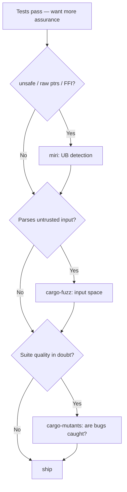

# Advanced verification: miri, fuzzing, mutation, sanitizers

Consult when ordinary tests pass but you need stronger assurance — UB detection,
input-space exploration, or proof your tests actually catch bugs.

## miri — undefined behavior interpreter

Runs your tests in an interpreter that detects UB the compiler can't: dangling
pointers, out-of-bounds, invalid alignment, data races, uninitialized reads,
Stacked-Borrows/Tree-Borrows aliasing violations, and many memory leaks.

```bash
rustup +nightly component add miri
cargo +nightly miri test            # runs the test suite under miri
cargo +nightly miri test --lib
```

- **Essential for any crate with `unsafe`** — raw pointers, `extern "C"`,
  `transmute`, manual `Vec`/`String` handling, custom allocators. If you wrote
  `unsafe`, run miri.
- Miri can't run code that does real I/O or FFI into a real C library (it's an
  interpreter, no syscalls/foreign code). Structure `unsafe` logic so the pointer
  arithmetic is in a pure function miri *can* run; keep the actual syscall thin.
- Slow (10-100×). Run as its own CI job on the `unsafe`-touching crates, not the
  whole workspace every push.
- `MIRIFLAGS="-Zmiri-strict-provenance"` tightens checks; `-Zmiri-ignore-leaks`
  if a known intentional leak (e.g. a `'static` you `Box::leak`) trips it.

## cargo-fuzz — coverage-guided fuzzing (libFuzzer)

For any function that parses untrusted/attacker-influenced bytes (deserializers,
protocol decoders, the parse step behind an FFI boundary):

```bash
cargo install cargo-fuzz
cargo fuzz init
cargo fuzz add parse_target
# fuzz/fuzz_targets/parse_target.rs:
#   libfuzzer_sys::fuzz_target!(|data: &[u8]| { let _ = my_crate::parse(data); });
cargo +nightly fuzz run parse_target -- -max_total_time=60
```

- The target must **never panic** on any input — a panic is a found bug. Combine
  with `arbitrary` to fuzz structured inputs, not just byte slabs.
- A crash is saved under `fuzz/artifacts/`; commit it as a regression seed and
  add a unit test reproducing it.
- `cargo fuzz cmin` minimizes the corpus; keep a seed corpus of real-world inputs
  in `fuzz/corpus/` for faster coverage.

## cargo-mutants — does your suite actually catch bugs?

Mutation testing edits your code (flips `<` to `<=`, replaces a body with
`Default`, deletes a `!`) and reruns the tests. A mutant that *survives* (tests
still pass) is a hole: behavior you don't actually assert.

```bash
cargo install cargo-mutants
cargo mutants                       # whole crate
cargo mutants -f src/assess.rs      # one file (fast, focused)
```

- This is the antidote to coverage theater: 95% line coverage with surviving
  mutants means the lines run but nothing checks the result.
- Start file-scoped on your core logic module — a full-crate run is slow.
- Triage: a surviving mutant is either a missing assertion (add it) or genuinely
  equivalent behavior (rare; annotate to skip). Don't chase 100% kill on glue.

## AddressSanitizer / LeakSanitizer

```bash
RUSTFLAGS="-Zsanitizer=address" cargo +nightly test --target aarch64-apple-darwin
RUSTFLAGS="-Zsanitizer=leak"    cargo +nightly test --target x86_64-unknown-linux-gnu
```

Catches heap corruption/use-after-free/leaks in `unsafe` or FFI code at runtime.
Nightly + explicit target triple. ThreadSanitizer (`=thread`) for data races —
see async-and-concurrency.md.

## When to reach for which



These are escalating, opt-in tools — run them on the modules that carry risk, as
dedicated CI jobs, not on every commit. The order above is also the cost order:
miri and mutants are the highest value-per-minute for typical logic crates;
fuzzing pays off specifically at parse boundaries.
