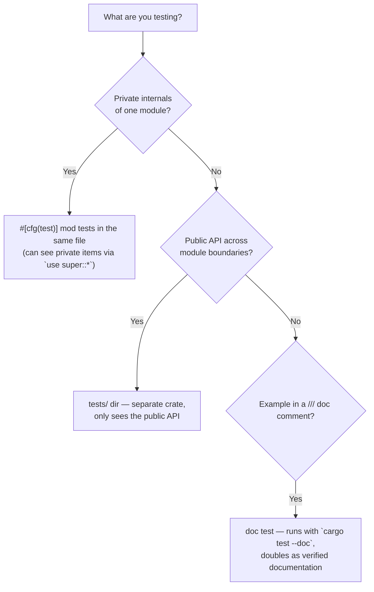

# Test organization, fixtures & the testability that precedes them

Consult when deciding where a test goes, building fixtures/helpers, or when code
is "hard to test" (the real problem is usually the code's shape, not the test).

## Where each test type lives



| Location | Sees | Compiled as | Use for |
|----------|------|-------------|---------|
| `#[cfg(test)] mod tests` (in `src/*.rs`) | private + public | part of the crate | unit tests of internal logic |
| `tests/*.rs` | public API only | separate crate per file | integration / black-box API tests |
| `/// ```` doc examples | public API | doc-test crate | examples that must stay correct |
| `benches/*.rs` | public API | criterion harness | performance (NOT in the test gate) |

A `tests/common/mod.rs` (note: `mod.rs`, not `common.rs`) holds shared <!-- cite-exempt: illustrative Rust convention, not a port-daddy repo path -->
integration helpers without itself being run as a test file.

## The three states rule

For any unit under test, cover **empty, populated, and error** at minimum:

```rust
#[test] fn view_empty()      { assert!(!Pane::default().view().is_empty()); } // renders something
#[test] fn view_populated()  { assert_eq!(Pane::with(rows).view().len(), rows.len()); }
#[test] fn view_error_state(){ let mut p = Pane::default(); p.err = Some("x".into());
                               assert!(p.view().iter().any(is_error_block)); }
```

Missing the error/empty branch is the most common real coverage gap — the happy
path is the one everybody writes.

## Fixtures: builders over giant literals

```rust
// A builder keeps each test focused on the ONE field it cares about.
fn agent(overrides: impl FnOnce(&mut Agent)) -> Agent {
    let mut a = Agent { id: "a".into(), status: Active, cursor: 0, /* sane defaults */ };
    overrides(&mut a); a
}
#[test] fn resets_cursor_on_stop() {
    let a = agent(|a| a.status = Stopping);
    assert_eq!(stop(a).cursor, 0);
}
```

- Prefer an in-memory implementation of a port over a mock for fixtures (a real
  `InMemoryRepo` reads truer than `MockRepo::expect_*`).
- Never write test scratch to `/tmp` — use `tempfile::tempdir()` (auto-cleaned)
  or a path under a repo-local scratch dir. `/tmp` is purged out from under you
  and shared across parallel test processes (cross-test clobber).
- Inject volatile inputs (clock, RNG, env) as parameters so tests are
  deterministic — see the pure-core pattern below.

## Testability is a code-shape property (the real fix for "hard to test")

If a unit test needs a running daemon, a real database, or the network, the
infrastructure has leaked into the logic. Extract a **pure core** and inject the
impure edges:

```rust
// HARD to test: reads the clock and the filesystem itself.
fn should_restart() -> bool {
    let hb = std::fs::read_to_string(path()).ok();
    Instant::now().duration_since(/* parse hb */) > THRESHOLD
}

// EASY to test: pure decision; caller passes the readings.
fn should_restart(now_ms: u64, written_at_ms: u64, threshold_ms: u64) -> bool {
    now_ms.saturating_sub(written_at_ms) > threshold_ms
}
#[test] fn stale_triggers_restart() { assert!(should_restart(100_000, 0, 30_000)); }
#[test] fn fresh_does_not()        { assert!(!should_restart(1_000, 0, 30_000)); }
```

The pure function gets exhaustive instant unit tests; a thin, barely-tested shell
does the I/O and calls it. This is the single highest-leverage move for a
"hard-to-test" codebase — and it makes the logic reusable (the same pure core can
back a CLI, a daemon, and an FFI export). Decision tables, state transitions, and
"given these readings, what should happen" logic should all be pure.

## Assert on values, not types (avoid coverage theater)

```rust
// THEATER: passes regardless of correctness.
#[test] fn it_works() { let r = compute(&input); assert!(r.is_ok()); }

// REAL: pins the actual behavior.
#[test] fn computes_total_with_member_discount() {
    assert_eq!(compute(&two_items_member()).unwrap().total_cents, 1_710);
}
```

A test that only checks `is_ok()`/`is_some()`/`.len() > 0` or re-asserts a mocked
return value proves almost nothing. Assert the specific value, the specific error
variant, the specific shape. `cargo-mutants` (see advanced-verification.md) finds
these holes mechanically.

## Naming & structure

- Name tests for the behavior + condition: `rejects_empty_purpose`,
  `prunes_starts_older_than_window` — not `test1`, `test_foo`.
- One logical assertion per test where practical; a test that checks five
  unrelated things hides which one broke.
- Put the `#[cfg(test)] mod tests` at the *bottom* of the file (convention), with
  `use super::*;` as its first line.
