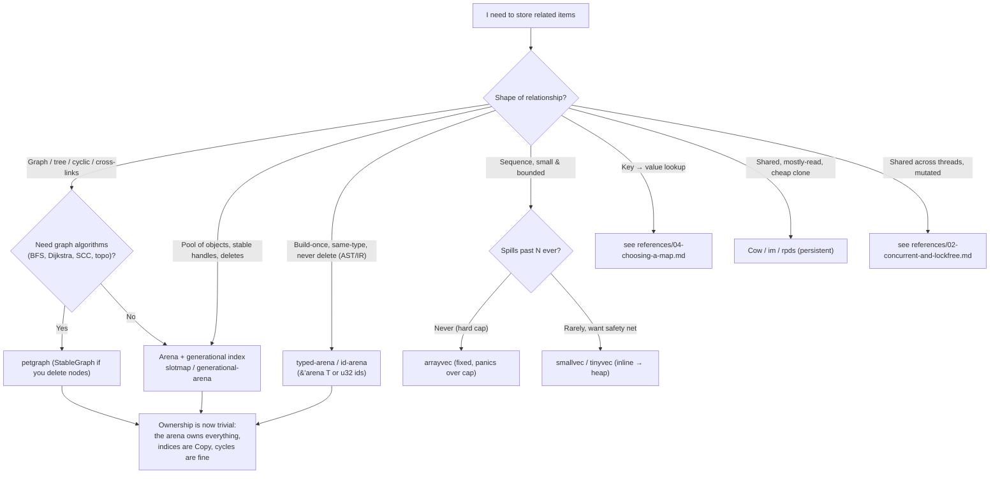

# rust-data-structures-advanced

The skill for when a Rust *ownership* problem is actually a *data-structure* problem.

**The throughline: choose the structure that makes ownership trivial.** Most "fighting the
borrow checker" pain on graphs, trees, caches, and shared state is self-inflicted by
reaching for `Rc<RefCell<T>>` (or worse, `Arc<Mutex<T>>`) to model relationships that an
**arena + indices** models with zero runtime borrow checking, zero cycles-as-leaks, and
better cache behavior. The borrow checker is not the obstacle; the wrong container is.

## When to Use

✅ **Use for**:
- Modeling a graph, tree, DAG, AST, or doubly-linked structure in Rust
- `Rc<RefCell<T>>` / `Arc<Mutex<T>>` is multiplying and ownership is spiraling
- A hot path needs cache locality (struct-of-arrays, inline vectors) or a faster map/hasher
- Concurrent producers/consumers: which channel, which concurrent map, lock-free vs lock
- Cheap-to-clone shared state (copy-on-write, persistent/immutable structures)
- Interning strings/symbols, dense ID sets (bitsets), or stable handles into a pool

❌ **NOT for**:
- Beginner Rust syntax or generic borrow-checker tutoring with no structural decision
- Choosing an async runtime (tokio vs smol) — orthogonal to container choice
- Algorithm design or complexity theory divorced from a concrete Rust crate
- Non-Rust languages (GC languages make most of this moot)

## The One Decision That Drives Everything



**Read the diagram as one claim:** the moment relationships are modeled as *indices into a
single owner* (an arena) instead of *pointers between owners* (`Rc`), the borrow checker
stops fighting you. Indices are `Copy`, cycles are just `usize`s, and deletion is safe
because a *generational* index detects a stale handle instead of dangling. Depth lives in
`references/01-arenas-and-graphs.md`.

## Core Capabilities

| Structure / crate | Wins for the access pattern | Replaces (the naive thing) | Intuition / benchmark |
|---|---|---|---|
| `slotmap` | Pool with stable `Copy` keys, fast iteration over holes | `Rc<RefCell<Node>>` graph; `Vec<Option<T>>` + manual reuse | Generation check is one `==`; secondary maps give ECS-style columns. Unsafe inside but safe API. |
| `generational-arena` | Same, zero-`unsafe`, simpler | hand-rolled free list | Slightly slower iteration than slotmap; pick when you want no `unsafe` in the dep |
| `id-arena` / `typed-arena` | Build-once same-type allocation (AST/IR) | `Box`-per-node with lifetime soup | `typed-arena` hands back `&'arena T` (no indices); `id-arena` hands back `Copy` `Id<T>` |
| `petgraph` | Real graph algorithms on a built graph | rolling your own adjacency + BFS | `Graph` is dense+fast but indices shift on delete; `StableGraph` keeps indices stable across removals |
| `smallvec`/`tinyvec` | Sequences that are *usually* tiny | `Vec` that allocates for 0–4 elements | Inline N on stack, spill to heap past N. `tinyvec` is 100% safe but needs `T: Default` |
| `arrayvec` | Hard-capped sequence, no heap ever | `Vec` with a known max | Fixed capacity; `push` past cap panics (or `try_push`). `no_std` friendly |
| `Rc/Arc` + `Weak` | Tree with child→parent backrefs | `Rc`↔`Rc` cycle that leaks | `Weak` for the up/back edge breaks the refcount cycle; arenas usually beat this anyway |
| `crossbeam-channel` / `flume` | MPMC pipelines, `select!` | `std::sync::mpsc` (SPMC-limited, slower) | Both MPMC, both clone Sender+Receiver, both beat std mpsc; flume is leaner, crossbeam has `select!` |
| `dashmap` | Concurrent map, many threads R/W | `Arc<Mutex<HashMap>>` (one big lock) | Sharded locks → contention drops; but a held `Ref` guards a shard (deadlock risk) |
| `crossbeam-epoch` / `-queue` | Lock-free structures, safe reclamation | raw atomics + "when do I free?" | Epoch GC solves use-after-free / ABA without hazard-pointer bookkeeping |
| `Cow<'a, T>` | Mostly-borrow, occasionally-own | always `.to_owned()` / `.clone()` | Clone-on-write: borrow until the first mutation, then own |
| `im` / `rpds` | Cheap-clone shared snapshots, undo | deep `clone()` of a big `Vec`/`HashMap` | Structural sharing: clone is pointer+refcount; edits copy only the touched path |
| struct-of-arrays / ECS (`hecs`/`slotmap`) | Iterate one field over millions | `Vec<BigStruct>` (cache-thrash) | Columns are contiguous → SIMD-friendly, no padding waste |
| string/symbol interner (`string-interner`/`lasso`) | Compare/copy strings by `u32` | `String` clones, `HashMap<String,_>` keys | Intern once → `Copy` symbol; equality is integer compare |
| `roaring` | Dense/sparse integer sets, set algebra | `HashSet<u32>` for millions of ids | Compressed bitmap; AND/OR/cardinality are blazing and memory-tiny |

Full per-structure tradeoffs, gotchas, and sourced benchmarks live in the four references.

## Failure Modes (Novice vs Expert)

### Reaching for `Rc<RefCell<T>>` to model a graph
**Novice**: "Nodes point at each other, so every node is `Rc<RefCell<Node>>` and edges are
`Vec<Rc<RefCell<Node>>>`." Then cycles leak, `borrow_mut()` panics at runtime, and threading
it means `Arc<Mutex<_>>` everywhere.
**Expert**: Put every node in one arena; edges are `Copy` keys (`NodeKey`). The arena owns
everything, so there is one owner and the borrow checker is satisfied trivially. Cycles are
just keys — no leak. A deleted node's stale key fails a generation check instead of dangling.
*The Rust standard reference ("Too Many Linked Lists") reaches the same conclusion: safe
linked/graph structures want indices, not pointer webs.*
**Detection**: `Rc<RefCell<` or `Arc<Mutex<` appearing on a *node* type; `.borrow_mut()` in
graph traversal; `Weak` sprinkled to "fix" leaks.

### Using plain `petgraph::Graph` and then deleting nodes
**Novice**: Stores `NodeIndex` values in their own structs, then calls `remove_node` — and
every index past the removed one silently shifts, corrupting all stored references.
**Expert**: If you delete, use `StableGraph`: it invalidates *only* the removed node's index,
never unrelated ones (it keeps a free list and tolerates gaps). Use plain `Graph` only when
the graph is build-once / append-only.
**Detection**: stored `NodeIndex` + any `remove_node`/`remove_edge` on a non-stable `Graph`.

### `Arc<Mutex<HashMap>>` as the default concurrent map
**Novice**: One global mutex around a `HashMap`; every thread serializes on it.
**Expert**: Reach for `dashmap` (sharded locks) or, for read-mostly, `arc-swap` / an
`RwLock`. But know `dashmap`'s gotcha: holding a `Ref`/`RefMut` locks that shard — taking a
second guard for a key on the same shard deadlocks. Keep guard lifetimes short.
**Detection**: `Arc<Mutex<HashMap` in a hot multi-thread path; long-lived `dashmap` guards.

### `SmallVec`/`ArrayVec` as a reflex "optimization"
**Novice**: Swaps every `Vec` for `SmallVec` "for speed," adding `unsafe` deps and bloating
struct sizes (inline capacity is *always* in the struct, even when spilled).
**Expert**: Inline vectors win only where the collection is *usually* below the inline cap
*and* lives in a hot path or in a `Vec<SmallVec<…>>` (cache locality). Otherwise it is
premature optimization that grows the type. Measure first.
**Detection**: `SmallVec` in cold/startup code; huge inline `N`; no benchmark justifying it.

### Lock-free by hand with raw atomics (and the ABA problem)
**Novice**: Builds a lock-free stack with `AtomicPtr` + CAS, frees popped nodes immediately.
A node freed and reallocated at the same address makes a stale CAS *succeed* (ABA), and
freeing while another thread holds the pointer is use-after-free.
**Expert**: Don't free immediately. Use `crossbeam-epoch` (epoch-based reclamation defers
frees until no thread can observe the pointer) or `crossbeam-queue` which already solved it.
Hand-rolled lock-free is a last resort, proven with Loom and Miri.
**Detection**: `AtomicPtr` + manual `Box::from_raw`/`drop` in a concurrent structure; no
epoch/hazard-pointer scheme; no Loom test.

### `String` keys and clones where a symbol would do
**Novice**: `HashMap<String, T>` keyed by identifiers, cloning `String`s to compare/store.
**Expert**: Intern once (`lasso`/`string-interner`) → a `Copy` `u32` symbol. Equality becomes
an integer compare; storage drops from N copies to one. Pairs with arenas: nodes hold symbols.
**Detection**: repeated `.to_string()`/`.clone()` of the same identifiers; `HashMap<String,_>`
in a hot lookup.

## Quality Gates

```
□ No Rc<RefCell<…>> / Arc<Mutex<…>> on a NODE type — relationships are arena keys/indices
□ Deletable graph uses StableGraph (or an arena), never plain Graph with stored indices
□ Generational index (slotmap/generational-arena) used wherever slots are reused — no bare usize
□ Hasher choice is deliberate: SipHash default kept ONLY if untrusted keys; else fxhash/ahash with a note
□ Map choice justified: HashMap vs BTreeMap (ordered/range) vs IndexMap (insertion order) — see ref 04
□ smallvec/arrayvec presence is backed by a benchmark and a "usually < N" claim, not reflex
□ Concurrent map is dashmap/RwLock/arc-swap with short guard lifetimes — not one global Mutex
□ Any hand-rolled lock-free code has epoch/hazard reclamation + Loom + Miri; otherwise use crossbeam
□ Cheap-clone snapshots use Cow / im / rpds (structural sharing), not deep clone()
□ examples/ compile: `cargo build` in examples/ is green (slotmap graph + crossbeam pipeline)
□ Every structural claim cites a real crate doc / benchmark (see References)
□ python3 scripts/validate_skill.py → 0 errors
```

## Worked Example: a Mutable Graph Without `Rc<RefCell>`

**Problem.** A dependency graph where nodes carry data, edges are added/removed at runtime,
and we traverse it. The reflex is `Rc<RefCell<Node>>` with `Vec<Rc<…>>` edges — which leaks
on cycles and panics on overlapping borrows.

**Structure choice.** A `slotmap` keyed by `NodeKey`. The slotmap *owns* every node; edges
are `Vec<NodeKey>` (just `Copy` keys). Ownership is trivial — one owner, the map. Deletion is
safe: a stale `NodeKey` fails the generation check and returns `None` instead of dangling.

```rust
use slotmap::{SlotMap, new_key_type};

new_key_type! { struct NodeKey; }

struct Node { name: String, edges: Vec<NodeKey> }

fn main() {
    let mut g: SlotMap<NodeKey, Node> = SlotMap::with_key();
    let a = g.insert(Node { name: "build".into(), edges: vec![] });
    let b = g.insert(Node { name: "test".into(),  edges: vec![] });
    g[a].edges.push(b);          // edge a -> b, no Rc, no RefCell

    // Delete a node; b's key is unaffected, a's key now reads as None.
    g.remove(a);
    assert!(g.get(a).is_none()); // stale key detected by generation, not a crash
    assert!(g.get(b).is_some());
}
```

No `Rc`, no `RefCell`, no `Weak`, no `unsafe` in *your* code, no borrow panics, no cycle
leak. The full runnable version (with traversal and a secondary map for per-node metadata)
is `examples/slotmap_graph.rs`; a lock-free producer/consumer pipeline is
`examples/crossbeam_pipeline.rs`. Both compile under `examples/Cargo.toml`.

**When this choice is wrong:** if you actually need Dijkstra / SCC / topological sort, don't
re-implement them on the slotmap — hand the graph to `petgraph` (`StableGraph` if you delete).
If the graph is build-once and never mutated (an AST), `typed-arena` (`&'arena Node`) or
`id-arena` is even simpler. See `references/01-arenas-and-graphs.md`.

## References

| File | Consult when |
|------|--------------|
| `references/01-arenas-and-graphs.md` | Arena/generational-index deep dive, slotmap vs generational-arena vs id-arena vs typed-arena, petgraph & StableGraph, Rc/Arc + Weak, intrusive-collections, the "Too Many Linked Lists" lesson |
| `references/02-concurrent-and-lockfree.md` | crossbeam (channel/epoch/queue) vs flume vs std mpsc, dashmap, atomics & memory ordering, the ABA problem, epoch reclamation, Loom/Miri verification |
| `references/03-small-and-cache-friendly.md` | smallvec/tinyvec/arrayvec, struct-of-arrays & ECS, Cow, im/rpds persistent structures, string/symbol interning, roaring bitsets |
| `references/04-choosing-a-map.md` | BTreeMap vs HashMap vs hashbrown vs fxhash/ahash vs IndexMap, hasher security (SipHash/HashDoS), when ordered/range/insertion-order matters |

## Examples

| File | Walks through |
|------|---------------|
| `examples/slotmap_graph.rs` | A mutable, deletable graph with `slotmap` + a secondary map — the no-`Rc<RefCell>` pattern, with traversal |
| `examples/crossbeam_pipeline.rs` | A bounded multi-stage `crossbeam-channel` pipeline (MPMC), scoped threads, graceful shutdown |
| `examples/Cargo.toml` | Pins the exact crate versions both examples compile against |

## Scripts

| Script | Purpose |
|--------|---------|
| `skills/rust-data-structures-advanced/scripts/validate_skill.py` | Self-check: frontmatter, required references/examples, mermaid present, SKILL.md line budget, example Cargo.toml sanity. Run `python3 scripts/validate_skill.py` from the skill directory. |

## Interface

UI/catalog metadata for this first-party skill lives in `agents/openai.yaml` (display name,
short description, recommended context, and `quality_gates`). Update it alongside the skill
purpose so chips and skill lists stay accurate.
